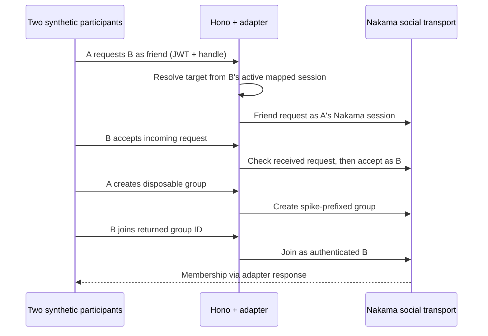

# WORLD-NAKAMA-01 — SPIKE / NOT PRODUCTION AUTHORITY

Issue #565 · parent #48 · branch `spike/world-nakama-565` · draft PR #566.
This is an isolated, reversible social transport experiment. **HOLD for live-stack
acceptance; no production activation, Unity activation, or merge authorization.**

## Observed base and decision

Inspected seed `f82adde9a5b68ba4a8def5b07541230750b73739`, both issues and comments,
the execution brief, AGENTS/CLAUDE, root context gate and architecture, and canonical
auth middleware/routes/security/session services and tests. At that commit, auth
register/login/refresh are implemented and the root Compose is PostgreSQL-only.
Older architecture/issue prose calling them stubs or a Python deployment is stale.
This spike neither changes that deployment path nor repairs unrelated documentation.

One `WorldRealtimeAdapter` under `backend/api/services/world-spike` owns transport
sessions, operation deadlines, bounded events, and lifecycle. Routes use the existing
Hono `authMiddleware`; there is no Next.js prototype auth or client identity fallback.
Nakama's official JS SDK 2.8.0 supplies REST calls and session decoding. A narrow Node
WebSocket implementation uses the official JSON envelopes for presence/group chat.
The SDK socket heartbeat references browser `window`; the Node implementation instead
closes connecting sockets, rejects pending operations and clears its own timers.
Node >=22 is required only when enabling this optional spike; tested here on Node 24.

Bootstrap derives `emopet:world-spike:v1:<lowercase canonical UUID>` from the verified
EMOPET actor. A runtime-key-authenticated server RPC calls `authenticateCustom` and
`authenticateTokenGenerate`. The returned Nakama UUID is stable while its isolated DB
survives; reset can change it. The custom ID provides an auditable mapping, not a
second identity authority. No mapping migration or canonical DB writes are needed.
Public custom authentication/link/unlink are rejected. Device/email/social-provider
authentication hooks are denied. User-token calls to the bootstrap RPC are rejected.
No Nakama refresh credential is issued; SDK automatic refresh is disabled.

The backend retains Nakama tokens and socket ownership. Callers receive only an
opaque handle, expiry and connection state. Every operation requires a valid EMOPET
JWT and matching actor/handle. Body actor/owner fields are rejected; `targetUserId`
selects another allowlisted synthetic participant, not the caller. Protected-domain
commands are absent and unknown fields fail validation. A configured allowlist of at
most ten synthetic UUIDs gates backend access; the runtime has the same allowlist.
Production/unspecified environment activation is rejected; the feature flag defaults off.

## State ownership

| State | Authority / location | Spike disposition |
|---|---|---|
| EMOPET identity and access/refresh sessions | Existing Hono/JWT and canonical auth storage | Reused, never replaced by Nakama |
| Consent/privacy, visibility/sharing | Canonical EMOPET policy | No reads/writes or inferred consent; real-user activation blocked |
| Moderation, reports, blocks, audit truth | Canonical EMOPET backend | No authoritative Nakama decisions; production propagation unresolved |
| Dog ownership, ELI/science, billing/subscription | Canonical EMOPET domains | No repository imports, payload fields or write paths |
| Keepsakes/personal-space and other durable product state | Canonical EMOPET, separately gated | No implementation |
| Custom-ID ↔ Nakama UUID | Disposable Nakama account metadata | Derived from verified actor; resettable projection |
| Friends/groups/membership | Disposable Nakama spike DB | Synthetic experiment only; not canonical social graph or privacy policy |
| Presence and chat | Nakama realtime transport | Status limited to online/away; chat persistence disabled |
| Tokens, sockets, subscriptions, handles | Hono process memory | Expire, disconnect, restart or replacement clears them |
| Received events | Bounded Hono memory buffer | 100 events per session; drain-on-poll; overflow signals resynchronization |

No EMOPET database credentials are mounted into Nakama. Its separate PostgreSQL
volume persists transport metadata, not durable product authority. Chat text must be
synthetic test content; nonpersistent delivery is not a general retention guarantee
for all Nakama metadata, operator logs, memory, or backups.

## Sequences

```mermaid
sequenceDiagram
  participant C as Synthetic harness
  participant H as Hono JWT boundary
  participant A as WorldRealtimeAdapter
  participant N as Nakama runtime
  C->>H: POST bootstrap + EMOPET access JWT
  H->>H: Verify signature, issuer, audience, use, UUID and expiry
  H->>A: Verified actor + access expiry
  A->>A: Require synthetic allowlist
  A->>N: Server-only bootstrap RPC + derived custom ID
  N->>N: Runtime key + allowlist; reject user-session RPC
  N-->>A: Transport UUID + short-lived token
  A->>N: Connect server-held socket
  A-->>C: Opaque actor-bound handle, bounded expiry
```



```mermaid
sequenceDiagram
  participant C as Synthetic harness
  participant H as Hono + adapter
  participant N as Nakama socket
  C->>H: Follow B / update own status (JWT + handle)
  H->>N: status_follow / status_update
  C->>H: Join group chat
  H->>N: channel_join, group type, persistence=false
  C->>H: Send synthetic text to joined group
  H->>N: channel_message_send
  N-->>H: Presence and chat events
  H->>H: Bound queue to 100; mark overflow
  C->>H: Authenticated events poll
  H-->>C: Drain events + resyncRequired
```

```mermaid
sequenceDiagram
  participant C as Synthetic harness
  participant H as Hono + adapter
  participant N as Nakama
  N--xH: Disconnect / heartbeat failure / timeout
  H->>H: Close socket; mark degraded; reject pending work
  C->>H: Bootstrap previous handle + valid EMOPET JWT
  H->>H: Reverify canonical auth; invalidate old handle
  loop At most 3 attempts; 250ms then 500ms backoff
    H->>N: Fresh server-only bootstrap and socket
  end
  H->>N: Restore follows/status/chat subscriptions only
  H-->>C: New handle or controlled 503
  Note over H,N: Never replay chat or uncertain social mutations
```

## Failure and authority gates

- Operations have five-second deadlines. Bootstrap HTTP is aborted; sockets close on
  timeouts and pending requests reject. REST writes may already have committed when a
  deadline fires: report failure/uncertainty, reconcile reads, never blindly replay.
- One active handle per synthetic actor; concurrent bootstrap/commands fail with 409.
  Handles expire at the earlier of canonical JWT expiry and the five-minute Nakama
  token. Every request rechecks authentication; expiry timers also close idle sockets.
- Reconnect is initiated by an authenticated caller, not a background identity refresh.
  A valid previous handle restores subscriptions; an expired handle requires a new
  empty bootstrap and explicit re-subscription. Failed renewal invalidates the old handle.
- Response errors are bounded codes: 400 invalid request, 401 invalid session, 403
  forbidden actor, 409 busy, 503 unavailable/timeout with degraded state. No credentials,
  raw upstream error details or fabricated offline success are returned.
- Existing EMOPET access JWTs do not carry refresh-family revocation state. Logout
  revokes canonical refresh credentials but does not instantly invalidate an existing
  access JWT. This spike does not silently change that contract. Immediate revocation,
  account deletion propagation and production session lifecycle remain release blockers.
- Consent, invitation eligibility, visibility, moderation/audit, block/report propagation,
  retention/deletion and real-user group rules need controlled product/backend decisions.
  Their implementation is stopped: no decision is inferred from Nakama defaults.
- Lists are deliberately bounded to the first 100 records. This is sufficient for the
  two-user fixture, not a complete product social API. No durable offline event replay,
  multiprocess routing, scaling, or production authorization is claimed.

Kill gate: keep World activation disabled. Review the live acceptance evidence first;
even a green local slice does not close product/privacy/moderation or Unity #567 gates.

## Validation evidence — 2026-09-25

Windows, Node `v24.19.0`, pnpm `10.33.0`. The host's default `pnpm` was 11.19.0;
its initial install was interrupted. Subsequent commands used the exact repository
version through `node ../tooling/package/bin/pnpm.cjs` (an untracked workspace tool).
Below, `pnpm10` means that exact executable invocation from the checkout root.

| Exact command | Observed result |
|---|---|
| `pnpm10 --filter @emopet/api add --save-exact @heroiclabs/nakama-js@2.8.0` | Exit 0; SDK plus three new transitives added; fourth transitive already present; existing resolutions unchanged |
| `pnpm10 install --frozen-lockfile --filter '@emopet/api...'` | Exit 0; 4 workspaces; existing supply-chain policy retained; Scarf install script not approved/executed |
| `pnpm10 --filter '@emopet/api^...' build` | Exit 0; shared, privileged-auth and eli-engine |
| `pnpm10 --filter @emopet/api build` | Exit 0 |
| `pnpm10 --filter @emopet/api typecheck` | Exit 0 |
| `node --test backend/test/world-spike*.test.mjs` | 19 passed, 1 live test skipped, 0 failed |
| `pnpm10 --filter @emopet/api test` | 392 tests: 357 passed, 35 skipped, 0 failed |
| `node --check infra/nakama/runtime/world.js` | Exit 0 |
| `node --check infra/nakama/configure.mjs` | Exit 0 |
| Git-bundled `sh.exe -n infra/nakama/start.sh` | Exit 0 |
| `git diff --check` | Exit 0 |
| `docker compose --env-file infra/nakama/.env -f infra/nakama/compose.yml config --quiet` | Blocked, exit 1: Docker command unavailable |

Initial builds ran before dependency links were complete and failed with missing modules;
installing the complete backend dependency closure resolved those errors. An initial full
test run had one unrelated generated-catalogue comparison failure because Git for Windows
checked out CRLF. Restoring that untouched file's exact HEAD bytes fixed it without a
source change. The new body-size test also caught and fixed an error-handler translation
from 413 to 503 before final validation.
Pinned Nakama source review also corrected the node name to meet its 16-character
limit and verified runtime hook names and CLI environment handling. These static
checks do not replace a real server start.

**Not proven:** container image pull, Docker Compose validation/start/health, Nakama VM
execution, real PostgreSQL migrations, real social delivery and interruption/recovery.
Docker is absent from PATH and its standard installation location. The opt-in test is
provided but was not run here. Existing database-dependent test skips remain skips.

**Mocked:** adapter unit tests inject connections/clock/backoff; transport tests replace
fetch and native WebSocket while exercising real SDK REST/JSON socket translation;
runtime tests execute the ES5 module in Node VM with fake Nakama functions. They establish
contract/lifecycle behavior, not a live-stack pass. The live harness additionally uses
synthetic canonical JWT issuance, not real account registration and refresh persistence.

See [local runbook](../../infra/nakama/README.md) for reproducible commands and reset scope.

## Official sources used

- [Docker Compose installation](https://heroiclabs.com/docs/nakama/getting-started/install/docker/)
  for pinned images, migration startup and healthchecks.
- [Server-to-server RPC](https://heroiclabs.com/docs/nakama/server-framework/runtime-examples/server-to-server/)
  and [v3.37.0 HTTP RPC implementation](https://github.com/heroiclabs/nakama/blob/v3.37.0/server/api_rpc.go)
  for runtime-key auth, rejection of user-session calls, and unwrapped JSON.
- [TypeScript runtime reference](https://heroiclabs.com/docs/nakama/server-framework/typescript-runtime/function-reference/)
  and [runtime types](https://github.com/heroiclabs/nakama-common/blob/master/index.d.ts)
  for account mapping, token generation and registered hooks.
- [JavaScript client guide](https://heroiclabs.com/docs/nakama/client-libraries/javascript/),
  [official SDK](https://github.com/heroiclabs/nakama-js), and
  [chat concepts](https://heroiclabs.com/docs/nakama/concepts/chat/) for friend/group REST,
  status envelopes, group chat and nonpersistent joins. Installed SDK source was inspected.
