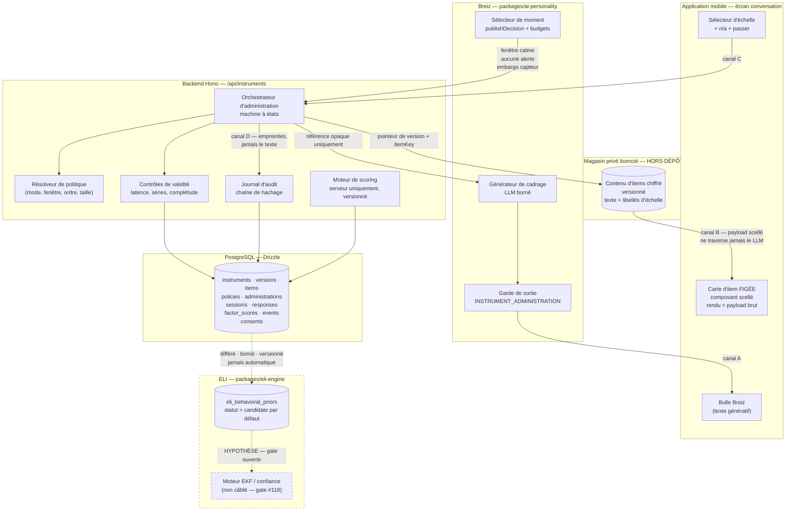
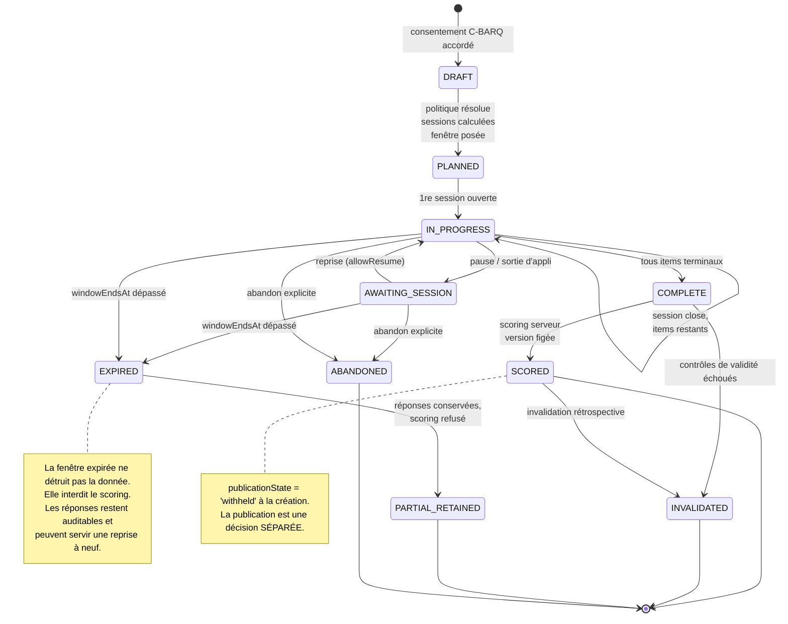
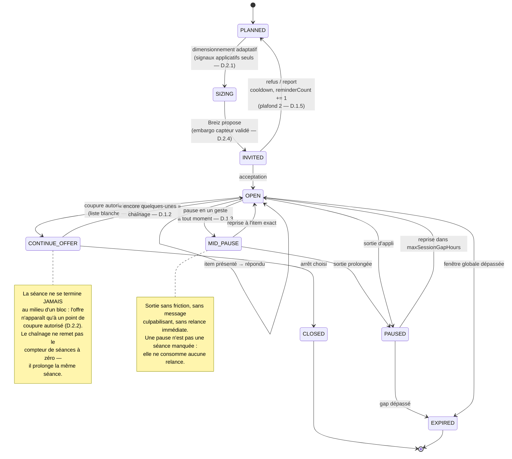
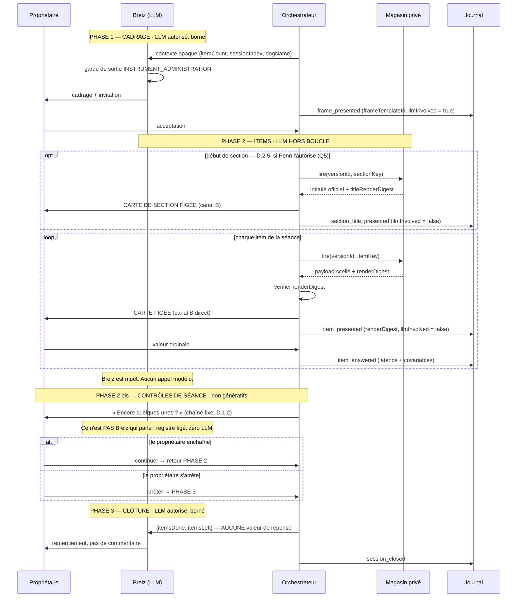
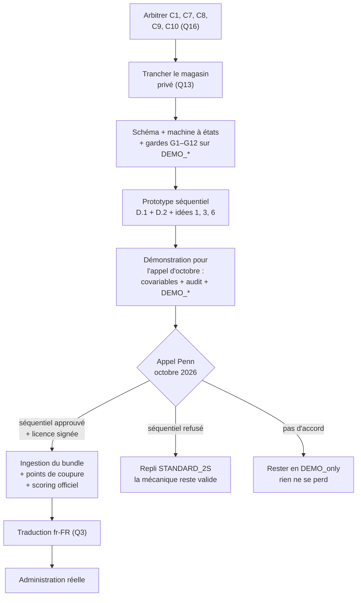

# Intégration du C-BARQ dans le backend EMOPET et dans la conversation Breiz

**Date :** 2026-09-21
**Révision :** 2026-09-22 — intégration des décisions produit du fondateur (§ *Décisions produit du 22/09/2026*) et correction du statut de communication Penn (§8.1).
**Statut du document :** `CONCEPTION / PROPOSITION` — aucune implémentation, aucun code de production.
**Périmètre :** modèle de données, moteur d'administration, orchestration Breiz, garde-fous, idées d'expérience, plan de tests.
**Autorités appliquées :** `CLAUDE.md`, `docs/product/EMOPET_CARE_PRODUCT_MASTER_v0.1.md`, `docs/research/CBARQ_PROJECT_IMPACT_2026-09-06.md`, `docs/records/communications/science/SERPELL_UPENN_COMMUNICATIONS.md`, `docs/research/SCIENTIFIC_FRAMEWORK_REGISTER.md`, `docs/brand/BRAND-AUTHORITY-001_…_2026-08-25.md`.

### Convention de maturité utilisée dans tout le document

| Marqueur | Signification |
|---|---|
| `[ÉTABLI]` | Vérifié dans le dépôt ou dans un record contrôlé, à la date ci-dessus. |
| `[DÉCIDÉ 22/09]` | Décision produit du fondateur, 2026-09-22. Autorité produit ; pas une preuve scientifique ni une autorisation de licence. |
| `[PROPOSÉ]` | Conception de ce document. Non décidé, non implémenté. |
| `[HYPOTHÈSE]` | Dépend d'une réponse externe (Penn, Serpell) ou d'une validation absente. |
| `[BLOQUÉ-LICENCE]` | Ne peut pas être implémenté avant preuve écrite de licence. |

---

## Décisions produit du 22/09/2026

**Source :** décision du fondateur, 2026-09-22. **Autorité :** produit et expérience.
**Ce que ces décisions ne font pas :** elles ne débloquent aucune dépendance de licence, n'établissent aucune validité psychométrique et ne préjugent pas de la réponse de Penn. Une décision produit fixe *ce que nous voulons construire* ; elle ne fixe pas *ce que nous avons le droit de scorer*.

### D.1 Administration séquentielle, pilotée par le propriétaire

| Réf | Décision |
|---|---|
| `D.1.1` | Micro-séances de **2 à 3 minutes** par défaut, soit une dizaine d'items. |
| `D.1.2` | En fin de séance, Breiz propose d'enchaîner. Le propriétaire peut continuer **autant qu'il veut**. |
| `D.1.3` | **Pause possible à tout moment**, y compris au milieu d'une séance, en un geste, sans message culpabilisant. Reprise à l'item exact. |
| `D.1.4` | **Détection de fatigue** : une série de réponses anormalement rapides ou identiques déclenche une proposition de pause. Le propriétaire reste libre de continuer. |
| `D.1.5` | **Deux relances maximum** par séance manquée. Aucune série (*streak*), aucune récompense, aucune mise sous pression. |
| `D.1.6` | **Alerte d'échéance** : à l'approche de la fin de la fenêtre de complétion, Breiz prévient clairement, pour qu'aucune administration ne soit invalidée à l'insu du propriétaire. |

### D.2 Découpage adaptatif selon l'engagement

| Réf | Décision |
|---|---|
| `D.2.1` | La **taille des séances s'adapte** au comportement du propriétaire dans l'application : temps disponible, rythme, pauses. |
| `D.2.2` | Les coupures tombent aux **frontières de section** du C-BARQ, ou à des **points de coupure prédéfinis** à l'intérieur d'une section. Jamais n'importe où. |
| `D.2.3` | L'**ordre des items est identique pour tous** les propriétaires. Seuls les points de coupure varient. |
| `D.2.4` | **INTERDIT** : utiliser une donnée capteur (MAT, TAG, ELI) pour choisir une coupure, le moment d'une section ou son contexte. Garde-fou technique et test obligatoires. |
| `D.2.5` | Breiz annonce le thème de la section suivante en reprenant son **intitulé officiel** (contenu licencié, chargé au runtime), jamais une formulation libre générée par le LLM. |

### D.3 Restitution

| Réf | Décision |
|---|---|
| `D.3.1` | **Portrait à révélation différée** : chaque séance terminée débloque un élément visuel neutre. **Aucun score partiel** avant la fin de l'administration. |
| `D.3.2` | Restitution finale **non clinique**, puis réévaluation proposée après quelques mois. |

### D.4 Ce que ces décisions changent dans la conception

`D.2.4` est la décision la plus structurante et elle **durcit** la conception initiale : l'embargo capteur de §5.2 ne portait que sur l'*affichage* d'une observation avant un item. Il devient un **embargo de pilotage** : aucune donnée capteur ne peut entrer dans la boucle de décision de l'administration, ni pour l'affichage, ni pour le découpage, ni pour le minutage. C'est plus simple à tester et plus facile à défendre devant Penn.

`D.2.3` apporte une propriété précieuse : l'ordre étant fixe et les coupures variables, **la variabilité de l'administration est réductible à une seule dimension mesurable**. Le document propose donc d'enregistrer le contexte de coupure de chaque item (position dans la séance, items depuis la dernière pause, franchissement de frontière de section) comme **covariable auditable** plutôt que comme bruit non contrôlé — voir §3.2.5. C'est l'argument technique qui rend la question Q1 à Penn répondable.

### D.5 Conflits à arbitrer

Onze conflits ou tensions ont été identifiés entre ces décisions, la conception antérieure de ce document et les autorités contrôlées du dépôt. **Aucun n'est tranché ici.** Chacun porte une option recommandée, mais la décision appartient au fondateur — et, pour C1, C2 et C5, à Penn.

---

#### `C1` — La proposition de pause « fatigue » commente les réponses

**Nature :** conflit **frontal** entre `D.1.4` et la contrainte 2 (neutralité), ainsi qu'avec le principe posé en §4.3 : *« un drapeau de validité n'est jamais montré au propriétaire pendant l'administration »*.

Une proposition de pause déclenchée par des réponses rapides ou identiques **est** un retour sur les réponses. Même sans mot explicite, le propriétaire peut apprendre la corrélation : *« quand je réponds vite, Breiz me propose une pause »*, puis ralentir ou diversifier ses réponses pour éviter le signal. C'est une caractéristique de demande introduite par le système lui-même, et elle touche précisément les items où la mesure est déjà la plus fragile.

**Options :**

| | Option | Conséquence |
|---|---|---|
| a | Découpler le déclencheur du signal : les propositions de pause surviennent aussi sur des minuteries neutres, de sorte que la corrélation ne soit pas apprenable | Préserve `D.1.4` ; réduit sans annuler le risque ; coût : propositions de pause parfois inutiles |
| b | Ne proposer une pause que **sur frontière de séance**, jamais au milieu d'une séquence d'items | Supprime le conflit ; affaiblit `D.1.4` (la fatigue peut survenir au milieu) |
| c | Conserver la détection de fatigue comme **drapeau serveur uniquement**, invisible, et ne rien proposer | Neutralité intacte ; `D.1.4` non implémenté |

**Recommandé :** `a` + `b` combinées — proposition de pause sur frontière de séance, avec cadence partiellement aléatoire. **À arbitrer par le fondateur, et à soumettre à Penn** (Q6).

---

#### `C2` — Annoncer le thème d'une section est une amorce

**Nature :** tension entre `D.2.5` et la contrainte 2.

Deux questions distinctes se cachent ici :

1. **Fidélité.** L'intitulé de section étant du contenu licencié, il relève du canal B (§2.1) : il doit être rendu par un composant figé, avec empreinte, exactement comme un item. `D.2.5` dit déjà « jamais une formulation libre du LLM », ce qui est cohérent. Mais l'expression « Breiz annonce » suggère une bulle de conversation ; l'architecture impose une **carte de section figée**, adjacente à Breiz, pas prononcée par lui. Conflit de formulation, résolution technique simple.
2. **Validité.** Annoncer un thème **avant** les items de la section introduit un cadrage qui n'existe peut-être pas dans l'instrument validé. Si le questionnaire papier imprime ses intitulés de section, l'annoncer est fidèle. S'il ne les imprime pas, ou si l'ordre de lecture papier ne les met pas en avant, l'annonce **ajoute** quelque chose à l'administration.

**On ne peut pas trancher le point 2 depuis le dépôt** : cela dépend de la mise en page de l'instrument licencié, que nous n'avons pas. → Penn, Q5.

**Recommandé :** implémenter comme carte figée issue du canal B ; conditionner l'affichage à un drapeau `sectionTitlesArePartOfInstrument`, désactivé par défaut jusqu'à réponse de Penn.

---

#### `C3` — « Encore quelques-unes ? » viole mon propre garde-fou G5

**Nature :** incohérence interne de ce document, révélée par `D.1.2`.

La règle G5 (§5.5) interdisait à Breiz **toute** forme interrogative pendant une administration — règle volontairement brutale, dont l'intérêt était de rendre impossible qu'un item soit posé en contrebande. Or `D.1.2` (« Encore quelques-unes ? ») et `D.1.4` (proposition de pause) sont toutes deux des questions, la seconde au milieu d'une séquence d'items.

**La règle G5 telle que rédigée était trop large.** Elle confondait deux choses : *le LLM ne doit pas produire de question* (juste) et *aucune question ne doit apparaître à l'écran* (excessif).

**Correction proposée** — voir §5.5 révisée : introduction d'un troisième registre, les **contrôles de séance**. Ce sont des chaînes fixes, non génératives, issues d'un registre versionné, sans lexique comportemental, rendues par le client. Le LLM reste interdit de question en toutes circonstances ; l'interface, elle, peut proposer deux boutons.

**Recommandé :** adopter la correction. C'est une clarification, pas un assouplissement.

---

#### `C4` — Le « rituel du seuil » (idée 6.5) est annulé par `D.2.4`

**Nature :** conflit **frontal**. L'idée 6.5, recommandée dans la version du 21/09, proposait que Breiz invite à une séance quand le MAT indique un repos validé en cours. `D.2.4` interdit explicitement l'usage d'une donnée capteur pour choisir « le moment d'une section ».

**La décision du fondateur prime.** L'idée 6.5 niveau 3 est **retirée**. Les niveaux 1 (plage horaire déclarée) et 2 (rythme applicatif) survivent et fournissent l'essentiel de l'effet.

**Note d'honnêteté :** la version du 21/09 argumentait que « déclencher » n'est pas « dire » et que le propriétaire ne peut pas être orienté par une information qu'il ne reçoit pas. L'argument reste valable sur le plan de l'amorçage, mais il ignorait un second risque, que `D.2.4` traite : **la défendabilité devant Penn**. Un instrument dont le minutage d'administration dépend d'un capteur propriétaire est beaucoup plus difficile à faire approuver qu'un instrument dont le minutage dépend du seul propriétaire. `D.2.4` échange un gain d'expérience contre un gain de licence. C'est le bon arbitrage.

---

#### `C5` — Taille de séance variable : ce qui reste à faire valider

**Nature :** `[HYPOTHÈSE]` non résolvable en interne, au cœur de Q1.

`D.2.1` + `D.2.3` produisent une administration dont l'ordre est constant mais dont la segmentation varie d'un propriétaire à l'autre. Conséquence psychométrique : un même item peut être répondu juste après une reprise chez un propriétaire, et en milieu de flux chez un autre. Les effets de position et de contexte sont une préoccupation connue des instruments longs.

**Le dépôt ne peut pas trancher.** Ce que le dépôt peut faire, et que ce document propose : **enregistrer la segmentation réellement subie par chaque item**, afin que la variabilité soit analysable a posteriori plutôt que perdue. → §3.2.5.

---

#### `C6` — « Enchaîner autant qu'il veut » casse `maxSessions` — et c'est une bonne nouvelle

**Nature :** conflit de conception avec §3.2.3, qui figeait `resultingScientificUseStatus` sur la ligne de politique.

Si le propriétaire peut enchaîner librement, la **forme réelle** de l'administration n'est connue qu'à la clôture. Un propriétaire qui enchaîne tout d'une traite réalise, de fait, une administration en une séance — c'est-à-dire potentiellement la forme la plus proche de l'administration standard. Fixer le statut scientifique *a priori* sur la politique le condamnerait à `research_only` alors même qu'il a produit la forme la plus défendable.

**Correction proposée** — §3.2.3 révisée : la politique ne fixe plus un statut, elle fixe un **plafond** (`maxScientificUseStatus`). Le statut effectif est **calculé à la clôture** à partir de la forme réellement observée (nombre de séances, durée totale, dispersion), puis borné par ce plafond.

**Recommandé :** adopter. C'est la décision `D.1.2` qui rend cette amélioration possible ; elle récompense les propriétaires qui vont au bout d'une traite sans pénaliser les autres.

---

#### `C7` — Deux relances contre le budget quotidien Breiz existant

**Nature :** conflit de ressources avec `DAILY_CHANNEL_BUDGET` `[ÉTABLI]` (`push: 1`, `chat_message: 1` par jour).

`D.1.5` autorise deux relances par séance manquée. Avec plusieurs séances manquées, le total dépasserait le budget quotidien global de Breiz, ou entrerait en concurrence avec les autres contenus (Care, saisonnier, communauté).

**Recommandé :** le budget de relance d'instrument est un **sous-budget à l'intérieur** du budget existant, jamais en supplément. En cas de concurrence, la relance d'instrument cède la priorité — elle n'est jamais urgente. À arbitrer : faut-il au contraire lui donner la priorité sur le contenu communautaire ?

---

#### `C8` — L'alerte d'échéance est une pression

**Nature :** tension interne entre `D.1.6` (prévenir clairement) et `D.1.5` (aucune mise sous pression).

Une alerte d'échéance est, par construction, un levier d'urgence. Mal formulée, c'est de l'aversion à la perte — un *dark pattern*, incompatible avec la doctrine relationship-first.

**Ce qui désamorce le conflit :** la conception §4.1 prévoit qu'une fenêtre expirée **ne détruit rien** (état `PARTIAL_RETAINED` : réponses conservées, audit conservé, scoring refusé, reprise à neuf possible). L'alerte peut donc être strictement factuelle et sans perte : *ce qui expire, c'est la possibilité de scorer cette administration-ci ; les réponses restent, une nouvelle administration reste possible*. Aucune urgence fabriquée, aucune perte annoncée.

**Recommandé :** formulation factuelle imposée par gabarit, vérifiée par test, et alerte d'échéance **comptée dans** le plafond de relances de `D.1.5`. À arbitrer : une alerte d'échéance doit-elle consommer le quota de relances, ou être hors quota ?

---

#### `C9` — Le portrait à granularité variable

**Nature :** conséquence mineure de `D.2.1` sur `D.3.1`.

Si la taille des séances varie, le nombre de séances varie, donc le nombre d'éléments visuels débloqués varie d'un propriétaire à l'autre. Un portrait en mosaïque à nombre d'éléments fixe est donc impossible.

**Recommandé :** indexer le déblocage sur les **sections franchies** (constantes pour tous, puisque l'ordre est fixe) plutôt que sur les séances (variables). Le rythme de révélation devient identique pour tous, et le portrait redevient comparable dans le temps — ce qui sert aussi l'idée 6.3. À arbitrer : cela découple le déblocage de l'effort par séance, ce qui peut affaiblir le ressort de `D.3.1`.

---

#### `C10` — « Temps disponible » : d'où vient l'information ?

**Nature :** ambiguïté de `D.2.1`, avec une implication RGPD.

`D.2.1` cite « temps disponible » parmi les entrées de l'adaptation. Si cela signifie *durée des sessions applicatives passées*, c'est de la télémétrie d'usage, licite sous réserve d'information et de base légale. Si cela signifie *agenda, localisation ou inférence de disponibilité*, le périmètre change entièrement. Et si cela venait d'un signal capteur, ce serait interdit par `D.2.4`.

**Recommandé :** restreindre explicitement les entrées d'adaptation à trois signaux applicatifs — durée médiane des séances précédentes, taux de complétion, fréquence de pause — et l'inscrire comme liste fermée dans la politique. À arbitrer : liste fermée ou modèle ouvert ?

---

#### `C11` — Qui définit les points de coupure intra-section ?

**Nature :** `[HYPOTHÈSE]` de licence.

`D.2.2` suppose l'existence de points de coupure prédéfinis à l'intérieur des sections. Deux cas :

- **Penn les fournit** → ce sont des métadonnées licenciées, elles vivent dans le magasin privé, et la fidélité est acquise.
- **EMOPET les définit** → c'est une décision EMOPET sur la structure d'administration d'un instrument validé, qui doit être soumise à Penn et tracée comme telle.

Le second cas est le plus probable. Il exige que les points de coupure soient **versionnés, justifiés et auditables**, au même titre qu'une version de scoring. → §3.2.2 révisée, et Penn Q1.

---

### D.6 Récapitulatif des conflits

| Réf | Tension | Nature | Tranché par |
|---|---|---|---|
| `C1` | Pause « fatigue » ↔ neutralité | **Frontal** | Fondateur + Penn (Q6) |
| `C2` | Annonce de section ↔ amorçage | Validité | Penn (Q5) |
| `C3` | « Encore quelques-unes ? » ↔ G5 | Incohérence interne | Fondateur — correction proposée |
| `C4` | Rituel du seuil ↔ `D.2.4` | **Frontal** | **Déjà tranché** : idée 6.5 niveau 3 retirée |
| `C5` | Segmentation variable ↔ psychométrie | **Hypothèse** | Penn (Q1) |
| `C6` | Enchaînement libre ↔ `maxSessions` | Conception | Fondateur — correction proposée |
| `C7` | Relances ↔ budget Breiz | Ressource | Fondateur |
| `C8` | Alerte d'échéance ↔ zéro pression | Formulation | Fondateur |
| `C9` | Portrait ↔ séances variables | Expérience | Fondateur |
| `C10` | « Temps disponible » ↔ RGPD | Périmètre | Fondateur + juridique |
| `C11` | Points de coupure ↔ autorité | **Hypothèse** | Penn (Q1) |

---

## 1. Résumé

### 1.1 Ce que l'exploration a réellement trouvé

L'exploration en lecture seule du dépôt a produit un résultat qui change la nature de la mission : **une grande partie de la fondation demandée existe déjà** et a été conçue précisément pour ce cas d'usage.

`[ÉTABLI]` `backend/db/schema/behavioral-assessments.ts` (197 lignes, migration `0005_behavioral_assessment_provenance.sql`) contient déjà cinq tables : `behavioral_assessments`, `behavioral_responses`, `behavioral_factor_scores`, `eli_behavioral_priors`, `research_data_consents`. Son en-tête porte déjà la règle centrale de la contrainte 4 :

> *« Do not store licensed questionnaire wording here. `itemKey` is an opaque identifier supplied by the licensed instrument implementation. »*

`[ÉTABLI]` Le champ `administrationMode` accepte déjà `standardized | progressive | research | unknown`, et `scientificUseStatus` accepte déjà `unreviewed | scoring_allowed | research_only | not_equivalent`. La contrainte 3 (modes paramétrables) a donc déjà son point d'ancrage en base — il lui manque la **table de politique** qui la rend configurable sans toucher au code.

`[ÉTABLI]` `packages/ai-personality` dispose déjà d'un pare-feu sémantique de publication : `BleizSemanticAuthority` (`OBSERVATION_ONLY`, `EDUCATION_ONLY`, `CONTEXT_ONLY`, `SUGGESTION_ONLY`, `COMMUNITY_ONLY`), un garde de sortie fail-closed (`bleiz-release-output.ts`) qui rejette les assertions diagnostiques, de certitude, de lecture d'intention et de qualité de lien, et un ordonnanceur avec budgets journaliers par canal, cooldowns et portes de confiance (`publishDecision`).

`[ÉTABLI]` **Contrainte architecturale majeure découverte :** `backend/db/schema/ai.ts` porte `check('chk_ai_messages_no_durable_persistence', sql`false`)`, renforcé au niveau PostgreSQL par `0012_ai_zero_durable_write_guard.sql`. Décision fondateur AI-A / R4 : **aucune écriture durable de contenu conversationnel IA n'est autorisée.** Cette contrainte n'était pas dans l'énoncé de la mission et elle contraint fortement la conception du journal d'audit (voir §5.4).

`[ÉTABLI]` `apps/mobile/src/screens/ChatScreen.tsx` est une maquette : messages en dur, type `Message = { from, text, sources?, disclaimer? }`, aucun appel LLM, aucun backend. Il n'existe donc **aucun flux conversationnel runtime à modifier** — il y a un flux à concevoir. C'est une bonne nouvelle : le canal figé peut être natif plutôt que rétro-ajusté.

`[ÉTABLI]` `packages/eli-engine` n'est importé par aucun module runtime (gate #118, `CLAUDE.md`). Toute conception qui suppose un couplage C-BARQ ↔ ELI vivant est donc aujourd'hui **théorique**.

`[ÉTABLI]` La recommandation « renommer le bloc *C-BARQ simplified* » du document d'impact du 2026-09-06 **a été appliquée** : `backend/db/schema/freemium.ts` porte désormais le commentaire *« Breed-level behavioral context heuristics only. These are NOT C-BARQ scores… »*. Le pare-feu race ↔ instrument est en place.

### 1.2 Ce que ce document ajoute

Sept briques manquantes, toutes `[PROPOSÉ]` :

1. un **registre d'instrument et de version** (aujourd'hui `instrumentCode` est une chaîne libre non contrainte) ;
2. un **registre d'items** référençant du contenu privé par pointeur, jamais par texte ;
3. une **table de politique d'administration** versionnée (contrainte 3, « sans changer le code ») ;
4. une **table de sessions** — aujourd'hui l'administration est monolithique, il n'y a pas de découpage en sessions ni de fenêtre ;
5. un **journal d'audit de fidélité** à chaînage de hachage, compatible avec la règle AI zéro-durable ;
6. un **consentement C-BARQ spécifique** et un **consentement de renvoi à Penn** distinct (`research_data_consents` couvre la recherche, pas la transmission à un tiers nommé) ;
7. l'**autorité sémantique `INSTRUMENT_ADMINISTRATION`** dans le pare-feu Breiz, avec sa règle structurante : *pendant une séquence d'items, le LLM est hors boucle.*

`[DÉCIDÉ 22/09]` La révision du 22 septembre ajoute quatre briques issues des décisions produit : un **registre de sections et de points de coupure** (§3.2.2 bis), un **dimensionnement de séance adaptatif** borné par une liste fermée de signaux applicatifs (§3.2.3), des **covariables de segmentation** au journal d'audit (§3.2.5), et un **canal de contrôles de séance** non génératif (§5.4). Elle corrige également deux éléments de la version du 21/09 : la règle G5, trop large, et l'idée 6.5, dont le niveau 3 est annulé par l'interdiction de pilotage capteur.

### 1.3 La thèse de conception en une phrase

Les trois contraintes les plus dures — fidélité mot pour mot, neutralité, zéro texte licencié dans le dépôt — ne sont pas des obstacles à l'expérience mémorable : **ce sont les matériaux de l'expérience mémorable**, à condition de déplacer l'émerveillement du *moment de la question* vers le *rituel qui l'entoure* et la *révélation différée* qui la suit.

---

## 2. Architecture

### 2.1 Principe des quatre canaux

La contrainte 1 (fidélité) et la contrainte 2 (neutralité) se ramènent à une seule discipline d'ingénierie : **le texte licencié et le texte génératif ne partagent jamais ni un tuyau, ni un composant de rendu, ni une fenêtre de contexte.**

| Canal | Contenu | Producteur | LLM ? | Persisté ? |
|---|---|---|---|---|
| `A — CONVERSATION` | Cadrage, accueil, transition, remerciement | Breiz (LLM + templates) | Oui, borné | **Non** (AI-A/R4) |
| `B — INSTRUMENT` | Texte d'item, libellés d'échelle, intitulés de section | Magasin privé licencié | **Jamais** | Non (jamais dans le dépôt ni dans la base produit) |
| `C — RÉPONSE` | Valeur ordinale, statut, horodatage | Propriétaire | Non | Oui (`behavioral_responses`) |
| `D — AUDIT` | Empreintes, séquence, latences, covariables, chaîne | Serveur | Non | Oui (`instrument_administration_events`) |
| `E — CONTRÔLES DE SÉANCE` | Continuer, s'arrêter, faire une pause, reprendre | Registre fixe versionné | **Jamais** | Non (identifiants de gabarit seuls) |

`[DÉCIDÉ 22/09]` Le canal E a été ajouté en révision : les décisions `D.1.2` et `D.1.4` exigent que des choix soient proposés au propriétaire en pleine séquence d'items, ce que ni le canal A (génératif, donc interdit de question) ni le canal B (licencié, donc intouchable) ne peuvent porter. Voir §5.4, phase 2 bis, et le conflit `C3`.

Le canal B ne traverse jamais le canal A. Concrètement : **le texte d'un item n'entre jamais dans le prompt envoyé au modèle.** Le LLM reçoit au maximum une référence opaque (`itemKey`, `DEMO_ITEM_01`), un compteur de progression et une sous-échelle anonymisée. Un modèle qui n'a jamais vu le texte ne peut pas le reformuler.

### 2.2 Diagramme



**Lecture du diagramme :** la seule flèche entrante de `CARD` vient de `CONTENT`. Aucune flèche ne relie `AI` à `CARD`. C'est la garantie architecturale de la contrainte 1 — elle est topologique, pas comportementale, donc elle ne dépend pas de la bonne volonté d'un modèle.

### 2.3 Où vit le contenu licencié

`[PROPOSÉ]` Trois options, par ordre de préférence :

| Option | Mécanisme | Avantage | Inconvénient |
|---|---|---|---|
| **A — Secret store** | Bundle JSON chiffré en secret managé (AWS Secrets Manager / Vault), chargé en mémoire au démarrage, jamais écrit sur disque | Aucune trace en base, rotation simple, périmètre d'audit minimal | Taille des secrets (~100 items), rechargement = redéploiement |
| **B — Table chiffrée** | Table `instrument_item_content` hors schéma produit, chiffrement applicatif par enveloppe (clé KMS), accès restreint à un rôle SQL dédié | Versionnable, requêtable, rotation de version sans redéploiement | Surface de fuite plus large ; exige une discipline de sauvegarde |
| **C — Hybride** | Métadonnées (clés, ordre, sous-échelle, bornes) en base ; texte en secret store | Sépare structure et propriété intellectuelle | Deux sources à synchroniser |

`[PROPOSÉ]` Recommandation : **option C**. La structure (quel item, quelle sous-échelle, quel ordre, quelle borne) n'est pas le contenu protégé et gagne à être en base pour l'audit ; seul le texte affichable et les libellés d'échelle partent en secret store.

`[ÉTABLI]` Le dépôt ne contient aujourd'hui aucun mécanisme de chiffrement applicatif — seulement des secrets HMAC/JWT (`backend/api/middleware/auth.ts`, `backend/api/services/vet-report.ts`). L'option B exigerait donc une brique nouvelle ; l'option A et la partie « secret » de C réutilisent le pattern existant de résolution de secret à l'appel.

**Dans le dépôt, uniquement des items factices.** Un fichier `packages/shared/src/instruments/demo-items.ts` `[PROPOSÉ]` contenant `DEMO_ITEM_01 … DEMO_ITEM_12`, avec un préfixe `DEMO_` obligatoire et un test qui échoue si une clé d'item de production apparaît dans un fichier versionné.

---

## 3. Schéma de données

### 3.1 Ce qui existe déjà et qu'il ne faut pas réécrire

`[ÉTABLI]` Les cinq tables de `behavioral-assessments.ts` sont conservées telles quelles. Leurs contraintes `CHECK` sont bien construites — notamment `chk_behavioral_response_scale`, qui impose déjà qu'une réponse `answered` ait une valeur dans les bornes et qu'une réponse `not_applicable | skipped | missing` ait une valeur `NULL`. C'est exactement la préservation explicite de la manquance demandée par le document d'impact. Rien à corriger.

La migration `0006_privacy_detachable_provenance.sql` `[ÉTABLI]` rend déjà `respondent_user_id` détachable à la suppression d'un compte (RGPD, droit à l'effacement) tout en préservant la donnée d'instrument. `backend/api/services/subject-discovery.ts` compte déjà les lignes comportementales par sujet, avec séparation produit / recherche.

### 3.2 Tables proposées

Extraits illustratifs, style Drizzle du dépôt (`pgTable`, `check`, `uniqueIndex`).

#### 3.2.1 Registre d'instrument et de version

```ts
// [PROPOSÉ] backend/db/schema/instruments.ts
export const instruments = pgTable('instruments', {
  id: uuid('id').primaryKey().defaultRandom(),
  code: varchar('code', { length: 50 }).notNull().unique(),      // 'CBARQ'
  ownerOrganisation: varchar('owner_organisation', { length: 255 }).notNull(),
  // Texte d'attribution exigé par la licence, affiché tel quel. Ce n'est pas
  // du contenu d'item : c'est la mention légale, elle peut vivre en base.
  attributionText: text('attribution_text'),
  createdAt: timestamp('created_at', { withTimezone: true }).defaultNow().notNull(),
});

export const instrumentVersions = pgTable('instrument_versions', {
  id: uuid('id').primaryKey().defaultRandom(),
  instrumentId: uuid('instrument_id').notNull().references(() => instruments.id),
  version: varchar('version', { length: 100 }).notNull(),
  locale: varchar('locale', { length: 10 }).notNull(),           // 'fr-FR'

  // Pointeur vers le magasin privé. JAMAIS le contenu lui-même.
  contentStoreRef: varchar('content_store_ref', { length: 255 }).notNull(),
  // Empreinte du bundle complet : prouve quelle révision exacte a servi.
  contentDigest: varchar('content_digest', { length: 64 }).notNull(), // sha256 hex

  licenseReference: varchar('license_reference', { length: 255 }),
  licenseStatus: varchar('license_status', { length: 30 }).notNull().default('not_proven'),
  translationStatus: varchar('translation_status', { length: 30 }).notNull().default('unreviewed'),
  expectedItemCount: integer('expected_item_count').notNull(),
  activatedAt: timestamp('activated_at', { withTimezone: true }),
  retiredAt: timestamp('retired_at', { withTimezone: true }),
}, (t) => [
  uniqueIndex('uq_instrument_version_locale').on(t.instrumentId, t.version, t.locale),
  check('chk_instrument_version_license',
    sql`${t.licenseStatus} IN ('not_proven','granted','expired','revoked','demo_only')`),
  check('chk_instrument_version_translation',
    sql`${t.translationStatus} IN ('unreviewed','official','back_translated','not_equivalent')`),
]);
```

**Pourquoi `licenseStatus` en base et pas en config :** une administration doit pouvoir être refusée au runtime si la licence expire, sans redéploiement, et l'audit doit pouvoir répondre à *« sous quelle licence cette réponse a-t-elle été collectée ? »* des années plus tard. Valeur par défaut `not_proven` — le système démarre fermé. `demo_only` est la valeur des versions factices du dépôt.

**`translationStatus` :** point souvent oublié. Serpell a écrit `[ÉTABLI, 2 juillet 2026]` que *changer le libellé d'un item risque d'invalider l'item*. Une traduction française non officielle **est** un changement de libellé. Une version `fr-FR` marquée `back_translated` ou `not_equivalent` ne peut pas produire un score comparable aux normes. Ce champ doit exister avant la première administration francophone.

#### 3.2.2 Registre d'items

```ts
// [PROPOSÉ] Structure uniquement. Aucun texte.
export const instrumentItems = pgTable('instrument_items', {
  id: uuid('id').primaryKey().defaultRandom(),
  versionId: uuid('version_id').notNull().references(() => instrumentVersions.id),

  itemKey: varchar('item_key', { length: 100 }).notNull(),  // opaque : 'DEMO_ITEM_01'
  subscaleKey: varchar('subscale_key', { length: 100 }),    // opaque : 'DEMO_SUBSCALE_A'
  canonicalPosition: integer('canonical_position').notNull(),

  scaleType: varchar('scale_type', { length: 30 }).notNull(),
  scaleMin: integer('scale_min').notNull(),
  scaleMax: integer('scale_max').notNull(),
  allowsNotApplicable: boolean('allows_not_applicable').notNull().default(false),
  reverseScored: boolean('reverse_scored').notNull().default(false),

  // Empreinte du texte rendu + libellés, calculée à l'ingestion du bundle.
  // Permet de prouver la fidélité sans jamais stocker le texte.
  renderDigest: varchar('render_digest', { length: 64 }).notNull(),
}, (t) => [
  uniqueIndex('uq_instrument_item').on(t.versionId, t.itemKey),
  uniqueIndex('uq_instrument_item_position').on(t.versionId, t.canonicalPosition),
  check('chk_instrument_item_scale', sql`${t.scaleMin} < ${t.scaleMax}`),
]);
```

`renderDigest` est la pièce centrale de la preuve de fidélité. Défini comme :

```
sha256( versionId ‖ itemKey ‖ texteItem ‖ "\u001F".join(libellésÉchelle) )
```

Il est calculé **une fois**, à l'ingestion du bundle licencié, puis recalculé à chaque présentation côté serveur juste avant l'envoi. Si les deux diffèrent, la présentation est refusée et l'administration invalidée. On prouve ainsi *« l'item exact de la version X a été affiché »* sans qu'aucun octet de texte licencié ne quitte le magasin privé pour la base produit ou les journaux.

#### 3.2.2 bis Sections et points de coupure — `D.2.2`, `D.2.3`, `D.2.5`

Le découpage adaptatif exige deux objets que la version du 21/09 n'avait pas : les **sections** de l'instrument et les **points de coupure autorisés**.

```ts
// [PROPOSÉ] Structure et métadonnées. Le libellé officiel de section est du
// contenu licencié : il vit dans le magasin privé, jamais ici.
export const instrumentSections = pgTable('instrument_sections', {
  id: uuid('id').primaryKey().defaultRandom(),
  versionId: uuid('version_id').notNull().references(() => instrumentVersions.id),
  sectionKey: varchar('section_key', { length: 100 }).notNull(),   // 'DEMO_SECTION_A'
  ordinal: integer('ordinal').notNull(),
  firstPosition: integer('first_position').notNull(),  // bornes dans canonicalPosition
  lastPosition: integer('last_position').notNull(),

  // Empreinte de l'intitulé officiel rendu (D.2.5), même mécanique que les items.
  titleRenderDigest: varchar('title_render_digest', { length: 64 }).notNull(),
  // D.2.5 / C2 : l'intitulé ne s'affiche que si l'instrument validé le porte
  // réellement. Fermé par défaut, ouvert seulement sur réponse de Penn (Q5).
  titleIsPartOfInstrument: boolean('title_is_part_of_instrument').notNull().default(false),
}, (t) => [
  uniqueIndex('uq_section_version_key').on(t.versionId, t.sectionKey),
  uniqueIndex('uq_section_version_ordinal').on(t.versionId, t.ordinal),
  check('chk_section_bounds', sql`${t.firstPosition} <= ${t.lastPosition}`),
]);

// D.2.2 : on ne coupe jamais n'importe où. Une coupure n'est légale que si elle
// figure ici. C'est une liste blanche, donc fail-closed par construction.
export const instrumentBreakpoints = pgTable('instrument_breakpoints', {
  id: uuid('id').primaryKey().defaultRandom(),
  versionId: uuid('version_id').notNull().references(() => instrumentVersions.id),

  // Coupure AUTORISÉE APRÈS cet item (position canonique).
  afterPosition: integer('after_position').notNull(),
  breakpointKind: varchar('breakpoint_kind', { length: 30 }).notNull(),
  // 'section_boundary' | 'intra_section'

  // C11 : qui a décidé de ce point de coupure ? Question d'autorité, pas de style.
  authority: varchar('authority', { length: 30 }).notNull().default('emopet_proposed'),
  // 'licensed'        → fourni par Penn, fidélité acquise
  // 'emopet_proposed' → décision EMOPET, à soumettre (Q1)
  // 'emopet_approved' → décision EMOPET validée par écrit
  approvalReference: varchar('approval_reference', { length: 255 }),
  rationale: jsonb('rationale').default({}),
  breakpointSetVersion: integer('breakpoint_set_version').notNull().default(1),
}, (t) => [
  uniqueIndex('uq_breakpoint').on(t.versionId, t.breakpointSetVersion, t.afterPosition),
  check('chk_breakpoint_kind',
    sql`${t.breakpointKind} IN ('section_boundary','intra_section')`),
  check('chk_breakpoint_authority',
    sql`${t.authority} IN ('licensed','emopet_proposed','emopet_approved')`),
]);
```

**Trois propriétés obtenues :**

1. **`D.2.2` devient une liste blanche.** Le moteur ne peut pas produire une coupure absente de la table. Une segmentation illégale n'est pas « un bug à éviter » : elle est inexprimable.
2. **`D.2.3` devient une invariante vérifiable.** L'ordre vient de `canonicalPosition`, qui n'est jamais fonction du propriétaire. Aucune colonne de cette table ni de `instrument_items` ne référence un utilisateur, un chien ou un capteur — c'est vérifiable par inspection du schéma, pas seulement par test.
3. **`C11` devient traçable.** Le champ `authority` force à dire, point de coupure par point de coupure, si EMOPET a décidé ou si Penn a fourni. `breakpointSetVersion` permet de faire évoluer le jeu de coupures sans rendre incomparables les administrations passées : une administration référence le jeu qu'elle a réellement subi.

`[PROPOSÉ]` Règle de sûreté complémentaire : tant qu'aucun point de coupure `intra_section` n'est `licensed` ou `emopet_approved`, le moteur ne coupe qu'aux frontières de section. Le mode le plus conservateur est l'état par défaut.

#### 3.2.3 Politique d'administration — la contrainte 3

```ts
// [PROPOSÉ] Contrainte 3 : deux modes, configuration serveur, zéro changement de code.
export const instrumentAdministrationPolicies = pgTable('instrument_administration_policies', {
  id: uuid('id').primaryKey().defaultRandom(),
  versionId: uuid('version_id').notNull().references(() => instrumentVersions.id),
  policyKey: varchar('policy_key', { length: 100 }).notNull(),
  policyVersion: integer('policy_version').notNull().default(1),

  administrationMode: varchar('administration_mode', { length: 30 }).notNull(),
  // ↑ aligné sur l'énumération EXISTANTE de behavioral_assessments :
  //   'standardized' | 'progressive' | 'research' | 'unknown'

  orderStrategy: varchar('order_strategy', { length: 40 }).notNull(),
  // 'canonical' | 'subscale_blocked' | 'licensed_randomized'
  // D.2.3 : en pratique 'canonical'. Toute autre valeur rend l'ordre dépendant
  // du propriétaire et contredit la décision du 22/09.

  // ── Taille de séance adaptative — D.1.1, D.2.1 ──────────────────────
  // Un entier fixe ne suffit plus. La séance vise une DURÉE, pas un compte.
  targetSessionMinutes: integer('target_session_minutes').notNull().default(3),
  minItemsPerSession: integer('min_items_per_session').notNull().default(5),
  maxItemsPerSession: integer('max_items_per_session').notNull().default(15),
  adaptiveSizing: boolean('adaptive_sizing').notNull().default(true),
  // C10 : liste FERMÉE des signaux d'adaptation autorisés. Toute entrée absente
  // de cette liste est refusée par le moteur. Aucun champ sensor.*/computed.*
  // n'est admissible ici — D.2.4.
  adaptiveSignals: jsonb('adaptive_signals').notNull()
    .default(['median_session_duration', 'completion_rate', 'pause_frequency']),

  // ── Enchaînement libre — D.1.2 ──────────────────────────────────────
  allowChaining: boolean('allow_chaining').notNull().default(true),
  maxSessions: integer('max_sessions'),  // nullable : null = non plafonné
  maxWindowHours: integer('max_window_hours').notNull(),
  maxSessionGapHours: integer('max_session_gap_hours'),
  minInterItemMs: integer('min_inter_item_ms').notNull().default(800),
  allowResume: boolean('allow_resume').notNull().default(true),
  allowRevision: boolean('allow_revision').notNull().default(false),

  // ── Rythme et pression — D.1.3 à D.1.6 ──────────────────────────────
  allowMidSessionPause: boolean('allow_mid_session_pause').notNull().default(true),
  maxRemindersPerMissedSession: integer('max_reminders_per_missed_session')
    .notNull().default(2),
  deadlineWarningHoursBefore: integer('deadline_warning_hours_before')
    .notNull().default(48),
  // C8 : l'alerte d'échéance consomme-t-elle le quota de relances ?
  deadlineWarningCountsAsReminder: boolean('deadline_warning_counts_as_reminder')
    .notNull().default(true),
  // C1 : comportement de la détection de fatigue. 'silent_flag' est le seul
  // mode sans risque de neutralité ; il est donc la valeur par défaut.
  fatigueResponseMode: varchar('fatigue_response_mode', { length: 30 })
    .notNull().default('silent_flag'),
  // 'silent_flag' | 'boundary_offer' | 'immediate_offer'

  // ── Statut scientifique — C6 : PLAFOND, plus une valeur figée ────────
  maxScientificUseStatus: varchar('max_scientific_use_status', { length: 30 }).notNull(),

  approvedBy: varchar('approved_by', { length: 255 }),
  approvalReference: varchar('approval_reference', { length: 255 }),
  activatedAt: timestamp('activated_at', { withTimezone: true }),
}, (t) => [
  uniqueIndex('uq_policy_key_version').on(t.versionId, t.policyKey, t.policyVersion),
  check('chk_policy_mode',
    sql`${t.administrationMode} IN ('standardized','progressive','research','unknown')`),
  check('chk_policy_use_status',
    sql`${t.maxScientificUseStatus} IN ('unreviewed','scoring_allowed','research_only','not_equivalent')`),
  check('chk_policy_fatigue_mode',
    sql`${t.fatigueResponseMode} IN ('silent_flag','boundary_offer','immediate_offer')`),
  check('chk_policy_window', sql`
    ${t.maxWindowHours} > 0
    AND ${t.minItemsPerSession} > 0
    AND ${t.minItemsPerSession} <= ${t.maxItemsPerSession}
    AND (${t.maxSessions} IS NULL OR ${t.maxSessions} > 0)
  `),
]);
```

Trois lignes de politique couvrent désormais la contrainte 3 et les décisions du 22/09 :

| `policyKey` | mode | séances | items/séance | fenêtre | `maxScientificUseStatus` |
|---|---|---|---|---|---|
| `STANDARD_2S` | `standardized` | 2 | 40–60 | 48 h | `scoring_allowed` `[HYPOTHÈSE]` |
| `SEQUENTIAL_OWNER_PACED` | `progressive` | non plafonné | 5–15, cible 3 min | 336 h (14 j) | `research_only` `[HYPOTHÈSE]` |
| `DEMO_DEV` | `unknown` | non plafonné | 3–5 | 24 h | `not_equivalent` |

`SEQUENTIAL_OWNER_PACED` est la politique qui implémente les décisions `D.1` et `D.2`.

#### Le statut scientifique devient un calcul, pas une constante — `C6`

`D.1.2` autorise le propriétaire à enchaîner librement. La forme réelle de l'administration n'est donc connue **qu'à la clôture**. La version du 21/09 figeait le statut sur la politique ; c'était juste tant que le découpage était imposé, c'est devenu faux dès que le propriétaire le pilote.

```ts
// [PROPOSÉ] Illustratif — évalué à la clôture, jamais à l'ouverture.
function effectiveScientificUseStatus(
  shape: { sessionCount: number; spanHours: number; longestGapHours: number },
  policy: { maxScientificUseStatus: UseStatus },
): UseStatus {
  // La forme observée propose un statut…
  const observed: UseStatus =
    shape.sessionCount <= 2 && shape.spanHours <= 48
      ? 'scoring_allowed'      // forme équivalente à l'administration standard
      : shape.longestGapHours <= 72
        ? 'research_only'
        : 'not_equivalent';

  // …que le plafond de politique peut seulement RESTREINDRE, jamais élargir.
  return min(observed, policy.maxScientificUseStatus);
}
```

Un propriétaire qui répond d'une traite obtient la forme la plus défendable, quelle que soit la politique sous laquelle il a commencé. Un propriétaire qui étale sur deux semaines obtient `research_only`. **Aucun des deux n'est pénalisé dans l'expérience** — seule l'étiquette scientifique diffère, et elle est honnête.

Le plafond garde son rôle de verrou : tant que Penn n'a rien écrit, aucune politique ne porte `scoring_allowed` et **aucune forme, même parfaite, ne peut produire un score présenté comme équivalent**. Changer de mode reste une insertion de ligne ; requalifier un mode reste une insertion de ligne portant `approvalReference`. Aucun déploiement dans les deux cas.

> `[ÉTABLI]` Cette structure respecte la frontière d'attribution exigée par `SERPELL_UPENN_COMMUNICATIONS.md` : la valeur `scoring_allowed` pour `STANDARD_2S` est elle-même une hypothèse tant qu'aucun écrit ne l'établit. Le système ne doit pas partir du principe que le mode standard est automatiquement licencié — il n'est que *le moins discutable des deux*.

#### 3.2.4 Sessions

`behavioral_assessments` est aujourd'hui `[ÉTABLI]` monolithique : un `startedAt`, un `completedAt`, aucun découpage. Une table de sessions est nécessaire.

```ts
// [PROPOSÉ]
export const administrationSessions = pgTable('administration_sessions', {
  id: uuid('id').primaryKey().defaultRandom(),
  assessmentId: uuid('assessment_id').notNull()
    .references(() => behavioralAssessments.id, { onDelete: 'cascade' }),
  sessionIndex: integer('session_index').notNull(),
  state: varchar('state', { length: 30 }).notNull().default('planned'),

  plannedItemKeys: jsonb('planned_item_keys').notNull(),  // clés opaques
  openedAt: timestamp('opened_at', { withTimezone: true }),
  closedAt: timestamp('closed_at', { withTimezone: true }),

  // ── Découpage : ce qui a réellement déterminé cette séance — D.2.1, D.2.2 ──
  plannedItemCount: integer('planned_item_count').notNull(),
  breakpointSetVersion: integer('breakpoint_set_version').notNull(),
  openedAtBreakpointId: uuid('opened_at_breakpoint_id')
    .references(() => instrumentBreakpoints.id),
  closedAtBreakpointId: uuid('closed_at_breakpoint_id')
    .references(() => instrumentBreakpoints.id),
  // C10 : les valeurs de signaux applicatifs ayant servi au dimensionnement.
  // Aucun champ sensor.*/computed.* ne peut y figurer — vérifié à l'écriture.
  sizingSignals: jsonb('sizing_signals').default({}),
  sizingDecision: varchar('sizing_decision', { length: 30 }),
  // 'default' | 'adapted_shorter' | 'adapted_longer' | 'owner_chained'

  // ── Reprise et rythme — D.1.2, D.1.3 ───────────────────────────────
  chainedFromSessionId: uuid('chained_from_session_id'),
  resumedAtItemKey: varchar('resumed_at_item_key', { length: 100 }),
  midSessionPauseCount: integer('mid_session_pause_count').notNull().default(0),

  // ── Relances et échéance — D.1.5, D.1.6, C7, C8 ────────────────────
  reminderCount: integer('reminder_count').notNull().default(0),
  deadlineWarningSentAt: timestamp('deadline_warning_sent_at', { withTimezone: true }),

  // Preuve d'embargo capteur — contrainte 2 et D.2.4. Atteste qu'aucune donnée
  // capteur n'est entrée dans la décision d'inviter, de dimensionner ou de couper.
  quietWindowProof: jsonb('quiet_window_proof').default({}),
  invitationChannel: varchar('invitation_channel', { length: 30 }),
}, (t) => [
  uniqueIndex('uq_session_assessment_index').on(t.assessmentId, t.sessionIndex),
  check('chk_session_state',
    sql`${t.state} IN ('planned','invited','open','paused','closed','expired','abandoned')`),
  check('chk_session_sizing',
    sql`${t.sizingDecision} IS NULL OR ${t.sizingDecision} IN
        ('default','adapted_shorter','adapted_longer','owner_chained')`),
  // D.1.5 : le plafond de relances est une contrainte de base, pas une
  // politesse applicative. Le dépassement est rejeté par PostgreSQL.
  check('chk_session_reminder_cap', sql`${t.reminderCount} <= 2`),
]);
```

`chk_session_reminder_cap` mérite un mot. `D.1.5` (« deux relances maximum ») pourrait se traiter en couche applicative. En faire une contrainte `CHECK` a un effet précis : **aucune évolution ultérieure du moteur de notification ne peut, par inadvertance, rendre Breiz insistant.** C'est la même logique que `chk_ai_messages_no_durable_persistence` `[ÉTABLI]` — une promesse faite au propriétaire devient une invariante de base de données. La valeur littérale `2` y est inscrite en dur ; si le plafond doit devenir configurable, la contrainte doit être révisée explicitement, ce qui est précisément le comportement recherché.

`[PROPOSÉ]` Deux colonnes à ajouter à `behavioral_assessments` existante (migration additive, sans réécriture) :

```ts
policyId:   uuid('policy_id').references(() => instrumentAdministrationPolicies.id),
windowEndsAt: timestamp('window_ends_at', { withTimezone: true }),
```

`instrumentCode` / `instrumentVersion` existants restent en place pour compatibilité ; un `versionId` référentiel peut être ajouté en parallèle et les chaînes libres dépréciées progressivement.

#### 3.2.5 Journal d'audit de fidélité

```ts
// [PROPOSÉ] Append-only. Aucun texte d'item. Aucun texte généré par Breiz.
export const instrumentAdministrationEvents = pgTable('instrument_administration_events', {
  id: uuid('id').primaryKey().defaultRandom(),
  assessmentId: uuid('assessment_id').notNull()
    .references(() => behavioralAssessments.id, { onDelete: 'cascade' }),
  sessionId: uuid('session_id').references(() => administrationSessions.id),
  sequenceIndex: integer('sequence_index').notNull(),

  eventType: varchar('event_type', { length: 40 }).notNull(),
  itemKey: varchar('item_key', { length: 100 }),

  // Fidélité : empreinte de ce qui a RÉELLEMENT été rendu au client.
  renderDigest: varchar('render_digest', { length: 64 }),
  // Neutralité : empreinte du cadrage Breiz affiché avant l'item. Le texte
  // lui-même n'est PAS persisté (AI-A / R4 : zéro durable pour le contenu IA).
  frameDigest: varchar('frame_digest', { length: 64 }),
  frameTemplateId: varchar('frame_template_id', { length: 100 }),

  // Preuve de séparation des canaux.
  llmInvolved: boolean('llm_involved').notNull().default(false),

  occurredAt: timestamp('occurred_at', { withTimezone: true }).defaultNow().notNull(),
  clientLatencyMs: integer('client_latency_ms'),

  // ── Covariables de segmentation — D.2.1 à D.2.3, réponse technique à C5 ──
  // L'ordre est fixe pour tous ; seule la segmentation varie. En enregistrant
  // la segmentation réellement subie par CHAQUE item, la variabilité devient
  // une covariable analysable plutôt qu'un bruit non contrôlé.
  positionInSession: integer('position_in_session'),
  itemsSinceResume: integer('items_since_resume'),
  hoursSincePreviousItem: real('hours_since_previous_item'),
  crossedSectionBoundary: boolean('crossed_section_boundary'),
  isFirstItemAfterPause: boolean('is_first_item_after_pause'),

  // Inviolabilité : chaînage.
  prevEventHash: varchar('prev_event_hash', { length: 64 }),
  eventHash: varchar('event_hash', { length: 64 }).notNull(),
}, (t) => [
  uniqueIndex('uq_event_assessment_sequence').on(t.assessmentId, t.sequenceIndex),
  check('chk_event_type', sql`${t.eventType} IN (
    'assessment_opened','session_planned','session_invited','session_opened',
    'frame_presented','section_title_presented','item_presented','item_answered','item_revised',
    'session_paused','session_resumed','session_closed','window_expired',
    'validity_flag_raised','assessment_completed','assessment_invalidated','scored',
    -- Décisions du 22/09 : rythme, pression et découpage deviennent auditables.
    'mid_session_pause','continue_offered','continue_accepted','continue_declined',
    'fatigue_flag_raised','pause_offered','reminder_sent','deadline_warning_sent',
    'session_size_decided'
  )`),
  // Un item présenté prouve toujours sa fidélité et prouve toujours
  // qu'aucun LLM n'était dans la boucle à cet instant.
  check('chk_event_item_presentation', sql`(
    ${t.eventType} <> 'item_presented'
    OR (${t.renderDigest} IS NOT NULL AND ${t.itemKey} IS NOT NULL AND ${t.llmInvolved} = false)
  )`),
  // D.2.5 : l'intitulé officiel de section obéit à la même règle que l'item.
  // Le LLM ne peut pas l'avoir produit, et son rendu est prouvé.
  check('chk_event_section_title', sql`(
    ${t.eventType} <> 'section_title_presented'
    OR (${t.renderDigest} IS NOT NULL AND ${t.llmInvolved} = false)
  )`),
]);
```

Le `CHECK` `chk_event_item_presentation` est la contrainte 1 exprimée **au niveau de la base de données**. Il est impossible d'écrire dans le journal une présentation d'item qui aurait impliqué un LLM ou dont l'empreinte de rendu serait absente. C'est le même esprit que `chk_ai_messages_no_durable_persistence` `[ÉTABLI]` : la règle produit devient une contrainte SQL, pas une convention d'équipe.

**Compatibilité avec AI-A / R4.** La règle interdit la persistance durable de contenu conversationnel IA. Le journal n'en persiste aucun : il stocke `frameTemplateId` (identifiant de gabarit, pas de prose) et `frameDigest` (empreinte non réversible). On peut donc prouver *« un cadrage issu du gabarit `FRAME_OPEN_03` a été affiché, et c'était exactement celui-ci »* sans conserver une seule phrase générée. `[PROPOSÉ]` Si même l'empreinte est jugée trop proche d'une persistance de contenu IA, la position de repli est `frameTemplateId` seul — la traçabilité baisse mais la règle fondateur prime.

**Les covariables de segmentation sont la réponse technique à `C5`.** C'est le point le plus important ajouté par les décisions du 22/09.

Une administration séquentielle à découpage variable inquiète légitimement un détenteur d'instrument : *deux propriétaires n'ont pas subi la même administration.* La réponse faible serait de promettre que l'effet est négligeable — promesse invérifiable. La réponse forte est de **mesurer la différence** :

- l'ordre étant fixe `D.2.3`, la seule dimension qui varie est la segmentation ;
- chaque item enregistre la segmentation exacte qu'il a subie (`positionInSession`, `itemsSinceResume`, `hoursSincePreviousItem`, `crossedSectionBoundary`, `isFirstItemAfterPause`) ;
- donc, sur un corpus suffisant, EMOPET peut **tester empiriquement** si la réponse à un item dépend de sa position dans la séance, et fournir ce résultat à Penn.

Cela transforme la posture : EMOPET ne demande pas à Penn d'accepter une hypothèse sur parole, mais propose un dispositif qui **produit la preuve** — et qui, si l'effet existe, le rendra visible plutôt que de le dissimuler. `[HYPOTHÈSE]` Cette analyse suppose un volume de données que le projet n'a pas encore ; c'est une capacité de conception, pas un résultat.

#### 3.2.6 Scores et consentements

`behavioral_factor_scores` existante `[ÉTABLI]` couvre déjà la contrainte 5 : `scoringMethod`, `scoringVersion`, `eligibleForEliPrior` à `false` par défaut, `provenance` en JSONB. `[PROPOSÉ]` Trois ajouts :

```ts
itemsUsed:        integer('items_used').notNull(),
itemsMissing:     integer('items_missing').notNull(),
publicationState: varchar('publication_state', { length: 30 }).notNull().default('withheld'),
// 'withheld' | 'narrative_only' | 'full' — aligné sur la doctrine Care §4 (point 9)
```

`publicationState` par défaut à `withheld` implémente la contrainte 6 et la règle d'abstention de `CLAUDE.md` §5 : un score calculé n'est pas un score publiable. `narrative_only` est l'état qui autorise la restitution Breiz sans exposer de nombre — c'est l'application directe du **no naked number**.

`[PROPOSÉ]` Consentements — `research_data_consents` existante ne couvre pas les deux consentements demandés par la contrainte 7. Deux valeurs de `scope` supplémentaires plutôt qu'une table nouvelle :

```ts
check('chk_research_consent_scope', sql`${t.scope} IN (
  'aggregate','deidentified','study_specific',
  'instrument_administration',      // [PROPOSÉ] consentement C-BARQ explicite
  'instrument_owner_transmission'   // [PROPOSÉ] renvoi des réponses à Penn
)`),
```

**Les deux sont strictement indépendants.** `instrument_administration` est nécessaire pour ouvrir une administration ; `instrument_owner_transmission` n'est nécessaire que pour un renvoi à Penn et son absence ne bloque rien d'autre. Un refus du second ne doit dégrader ni l'expérience ni le score — sinon le consentement n'est pas libre au sens du RGPD. `[PROPOSÉ]` Un test doit vérifier exactement cette non-dégradation.

### 3.3 Base légale RGPD

`[PROPOSÉ]` Analyse indicative, à valider juridiquement.

| Traitement | Base légale | Note |
|---|---|---|
| Administration + scoring | Consentement explicite (`instrument_administration`) | Donnée comportementale déclarative sur un animal, mais rattachée à une personne identifiée et potentiellement révélatrice d'habitudes de vie du foyer |
| Restitution à Breiz | Même consentement | Pas de base distincte |
| Renvoi à Penn | Consentement distinct (`instrument_owner_transmission`) | Transfert hors UE → clauses contractuelles types à prévoir `[BLOQUÉ-LICENCE]` |
| Alimentation ELI | Consentement + `eligibleForEliPrior = true` | Double verrou déjà présent `[ÉTABLI]` |
| Conservation | Durée alignée sur la licence, pas sur la rétention produit | Une licence révoquée peut imposer une purge que la rétention produit n'anticipe pas `[HYPOTHÈSE]` |

Le retrait du consentement `instrument_administration` doit déclencher l'effacement des `behavioral_responses` **et** des `behavioral_factor_scores`, tout en conservant le journal d'audit dépersonnalisé si la licence exige une preuve de conformité d'administration. Cette tension — droit à l'effacement contre obligation de preuve contractuelle — est une question ouverte (§10, Q7).

---

## 4. Machine à états

### 4.1 Niveau administration



`[ÉTABLI]` Les trois états `status` déjà en base (`in_progress`, `complete`, `abandoned`) restent la projection publique de cette machine ; les états additionnels sont portés par une colonne `lifecycleState` `[PROPOSÉ]`, pour ne pas casser la contrainte `CHECK` existante ni les services de découverte RGPD qui la lisent.

### 4.2 Niveau session — révisé pour `D.1.1` à `D.1.6`



**Quatre règles de rythme, toutes issues des décisions du 22/09 :**

1. **Non-pénalité.** Un refus d'invitation n'est jamais un échec. Il applique un cooldown et replace la séance en `PLANNED`. `[ÉTABLI]` `DAILY_CHANNEL_BUDGET` et `cooldownHours` fournissent déjà le mécanisme ; `D.1.5` y ajoute le plafond dur de deux relances, porté par `chk_session_reminder_cap`.
2. **Une pause n'est pas une absence.** `MID_PAUSE` `D.1.3` ne déclenche aucune relance et ne consomme aucun quota. Seule une séance **invitée puis non ouverte** est une « séance manquée » au sens de `D.1.5`. Sans cette distinction, un propriétaire qui met souvent le questionnaire en pause recevrait beaucoup plus de relances qu'un propriétaire qui ne l'ouvre jamais — l'exact inverse de l'intention.
3. **Le chaînage prolonge, il ne multiplie pas.** `D.1.2` : accepter « encore quelques-unes » garde la même `administrationSessions` et incrémente `plannedItemCount`, avec `sizingDecision = 'owner_chained'`. C'est ce qui permet au calcul de `C6` de reconnaître une administration d'une traite.
4. **L'offre de continuation ne tombe qu'à une coupure légale.** `CONTINUE_OFFER` n'est atteignable que depuis un point de coupure de la liste blanche `D.2.2`. Une séance ne peut donc pas se terminer au milieu d'un bloc, même si le propriétaire ferme l'application : dans ce cas la séance passe en `PAUSED`, pas en `CLOSED`, et la reprise se fait à l'item exact.

#### Alerte d'échéance — `D.1.6`, `C8`

`[PROPOSÉ]` L'alerte est émise à `deadlineWarningHoursBefore` de `windowEndsAt` (48 h par défaut), au plus une fois par administration, et — sous réserve d'arbitrage `C8` — décomptée du plafond de relances.

Sa formulation est contrainte par gabarit, et elle est **factuelle sans perte** :

> Ce qui expire est la possibilité de scorer **cette** administration. Les réponses déjà données sont conservées. Une nouvelle administration reste possible à tout moment.

C'est vrai par construction : l'état `PARTIAL_RETAINED` (§4.1) garantit qu'une fenêtre expirée ne détruit rien. `[PROPOSÉ]` Un test doit vérifier qu'aucun gabarit d'alerte ne contient de lexique de perte (`perdre`, `perdu`, `effacé`, `dernière chance`, `il ne reste plus que`) — l'aversion à la perte est un levier efficace et c'est précisément pourquoi il est exclu.

### 4.3 Contrôles de validité

`[PROPOSÉ]` Quatre familles, toutes calculées **côté serveur**, toutes enregistrées comme `validity_flag_raised` dans le journal.

| Contrôle | Signal | Seuil proposé | Effet |
|---|---|---|---|
| **Complétude** | items terminaux < requis par sous-échelle | dépend de la règle officielle `[BLOQUÉ-LICENCE]` | Scoring refusé pour la sous-échelle concernée uniquement |
| **Latence anormalement courte** | `clientLatencyMs < minInterItemMs` | 800 ms par défaut, configurable par politique | Drapeau ; invalidation si > 25 % des items |
| **Réponses en série** | même valeur sur N items consécutifs | N = 10, avec correction sur items inversés | Drapeau ; jamais d'invalidation automatique seule |
| **Incohérence d'items inversés** | corrélation positive entre items censés s'opposer | `[HYPOTHÈSE]` — exige les règles officielles | Drapeau pour revue |

**Trois principes non négociables sur la validité :**

1. **Un drapeau n'est jamais montré *comme tel* au propriétaire.** Dire « vous répondez trop vite » est un commentaire sur les réponses — cela viole la contrainte 2 et modifie le comportement de réponse. `D.1.4` introduit une exception partielle, traitée ci-dessous.
2. **Aucune invalidation sur un seul signal.** La latence courte est ambiguë : un propriétaire qui connaît très bien son chien répond vite et juste.
3. **L'invalidation ne détruit rien.** Elle fait passer `publicationState` à `withheld` et `scientificUseStatus` à `not_equivalent`. Les réponses restent, l'audit reste.

Le seuil de 800 ms est un point de départ, pas un résultat : `[HYPOTHÈSE]` il faudra le calibrer sur des données réelles, et la calibration elle-même devrait faire partie des questions posées à Penn (§10.1, Q6).

#### 4.3 bis Détection de fatigue — `D.1.4` et le conflit `C1`

`D.1.4` demande qu'une série de réponses anormalement rapides ou identiques déclenche une **proposition de pause**. C'est une bonne intention de soin : un propriétaire fatigué produit de mauvaises données et une mauvaise expérience. Mais cela rend visible, indirectement, un drapeau de validité — voir `C1`.

Le champ `fatigueResponseMode` de la politique (§3.2.3) rend les trois postures configurables et donc arbitrables sans redéploiement :

| Mode | Comportement | Neutralité | `D.1.4` |
|---|---|---|---|
| `silent_flag` | Drapeau serveur, aucune proposition | Intacte | Non implémenté |
| `boundary_offer` | Proposition de pause **au prochain point de coupure**, avec cadence partiellement aléatoire | Risque résiduel faible | Largement satisfait |
| `immediate_offer` | Proposition immédiate au milieu de la séquence | **Risque élevé** | Pleinement satisfait |

`[PROPOSÉ]` Valeur par défaut : `silent_flag`. Recommandation d'arbitrage : `boundary_offer`.

**Ce qui rend `boundary_offer` défendable** : trois mécanismes combinés.

1. **Décorrélation.** Des propositions de pause surviennent aussi sans signal de fatigue, selon une cadence partiellement aléatoire. Le propriétaire ne peut pas apprendre la règle *« quand je réponds vite, on me propose une pause »*, puisqu'elle est fausse une partie du temps.
2. **Délai.** La proposition n'arrive pas sur l'item suspect mais au prochain point de coupure autorisé, ce qui casse l'association entre une réponse précise et le signal.
3. **Formulation aveugle.** Le gabarit ne mentionne ni rythme, ni régularité, ni qualité des réponses. Il parle du moment, pas de la personne.

**Ce que ces mécanismes ne suppriment pas** : un propriétaire très attentif, sur plusieurs administrations, pourrait encore percevoir une corrélation résiduelle. `C1` reste ouvert et doit être soumis à Penn (Q6), y compris parce que la question inverse se pose : *un instrument administré à un répondant visiblement fatigué est-il préférable à un instrument dont le rythme a été influencé par le système ?* Ce n'est pas à EMOPET d'en décider seul.

`[PROPOSÉ]` Quel que soit le mode retenu, la détection de fatigue produit **toujours** l'événement `fatigue_flag_raised` dans le journal, et `pause_offered` n'est écrit que si une proposition a effectivement eu lieu. L'audit permet ainsi de mesurer après coup combien de propositions ont été déclenchées par un signal et combien par la cadence neutre — donc de vérifier que la décorrélation fonctionne réellement.

---

## 5. Orchestration Breiz et garde-fous

### 5.1 Choisir le bon moment

`[ÉTABLI]` La machinerie existe déjà dans `bleiz-content-scheduler.ts` : `publishDecision()` renvoie une `ConfidenceGate`, `DAILY_CHANNEL_BUDGET` plafonne les canaux, `cooldownHours` et `maxPerDay` par gabarit, `evaluateTrigger()` évalue des conditions sur des champs déclarés.

`[PROPOSÉ]` Une invitation d'administration est un cas particulier avec **quatre verrous supplémentaires**, évalués dans cet ordre et tous bloquants :

```ts
// [PROPOSÉ] Illustratif.
interface InvitationGate {
  consentGranted: boolean;        // scope 'instrument_administration' actif
  licenseActive: boolean;         // instrumentVersions.licenseStatus === 'granted'
  noActiveAlert: boolean;         // aucune alerte produit ouverte, quel qu'en soit le type
  sensorEmbargoClear: boolean;    // §5.2
  quietContext: boolean;          // §5.3
  budgetAvailable: boolean;       // DAILY_CHANNEL_BUDGET non consommé
  cooldownElapsed: boolean;       // refus précédent respecté
}
```

### 5.2 L'embargo capteur — durci par `D.2.4`

La contrainte 2 disait : *« ne montre aucune donnée capteur juste avant un item »*. C'était un embargo **d'affichage**. `D.2.4` va plus loin et interdit d'utiliser une donnée capteur pour choisir une coupure, le moment d'une section ou son contexte. L'embargo devient un embargo **de pilotage** :

> `[DÉCIDÉ 22/09]` **Règle d'embargo, version révisée.** Aucune donnée MAT, TAG ou ELI ne peut entrer dans la boucle de décision d'une administration — ni pour inviter, ni pour dimensionner une séance, ni pour placer une coupure, ni pour cadrer une section. Et, comme précédemment, aucune invitation ni cadrage ne peut être émis dans une fenêtre de `E` heures suivant l'affichage d'une observation capteur saillante ; pendant une séance ouverte, tout contenu capteur est retiré du fil.

`E = 6 h` `[PROPOSÉ]`, à calibrer. La preuve est écrite dans `administrationSessions.quietWindowProof` et dans `sizingSignals`, qui ne peut contenir que des signaux de la liste fermée `adaptiveSignals` (§3.2.3).

**Pourquoi le durcissement est une bonne nouvelle.** La version du 21/09 tenait un raisonnement défendable — « déclencher n'est pas dire », donc un minutage piloté par le MAT n'amorce personne. Ce raisonnement reste valable **sur le plan de l'amorçage**. Mais il traitait mal un second enjeu : la **défendabilité**. Un instrument dont l'administration est pilotée par un capteur propriétaire est beaucoup plus difficile à faire approuver qu'un instrument piloté par le seul propriétaire, et la frontière « déclencher / dire » est exactement le genre de nuance qu'un accord de licence ne voudra pas avoir à arbitrer. `D.2.4` échange un peu d'expérience contre beaucoup de clarté contractuelle.

Le durcissement a en outre un bénéfice de vérifiabilité : une règle qui dit *« aucun champ capteur n'entre nulle part »* se teste par inspection statique du graphe de dépendances. Une règle qui dit *« les capteurs peuvent minuter mais pas parler »* exige de raisonner sur les chemins d'exécution.

**Conséquence assumée :** l'embargo reste en tension avec l'idée n° 4 (§6.4), qui relie profil comportemental et contexte ELI. La résolution est inchangée et se renforce : ELI peut *suivre* le C-BARQ, jamais le *précéder*.

### 5.3 Le contexte calme — révisé

`[PROPOSÉ]` Une séance ne s'invite que si le contexte est calme. Deux définitions restent admissibles après `D.2.4` :

1. **Horaire** — plage déclarée par le propriétaire. Sans capteur, disponible immédiatement.
2. **Rythme applicatif** — aucune interaction fébrile récente, aucune séance interrompue dans l'heure, signaux de la liste fermée `adaptiveSignals` uniquement.

~~3. **Ancrée au repos réel** — le MAT indique un repos validé en cours.~~ **Retiré par `D.2.4`** (conflit `C4`). Le niveau 3 utilisait un signal MAT pour choisir le moment d'une séance, ce que la décision du 22/09 interdit explicitement. L'idée 6.5 est révisée en conséquence.

`[PROPOSÉ]` Le test correspondant se renforce : aucun gabarit de cadrage, **aucune entrée de dimensionnement et aucun sélecteur de coupure** ne peut référencer un champ `sensor.*` ou `computed.*`. `[ÉTABLI]` Le mécanisme existe déjà sous la forme de `FORBIDDEN_TRIGGER_FIELD_PATTERNS` et `usesSensorOrComputedEvidence()` dans `bleiz-release-templates.ts` ; il suffit de l'appliquer au nouveau périmètre.

### 5.4 Introduire, puis s'effacer

La séquence conversationnelle `[PROPOSÉ]` comporte trois phases dont **une seule** autorise le modèle de langage.



**Phase 2 : le silence de Breiz est la fonctionnalité.** L'intuition naturelle serait de faire commenter chaque réponse par Breiz pour « maintenir la conversation ». C'est précisément ce que la contrainte 2 interdit, et c'est aussi ce qui détruirait le rythme : un questionnaire où l'on est félicité toutes les dix secondes est plus fatigant, pas moins. Le vrai confort d'un instrument long est la **cadence régulière et silencieuse**. Breiz ouvre la porte, tient la porte, referme la porte.

**Phase 2 bis : les contrôles de séance — correction du conflit `C3`.** `D.1.2` (« Encore quelques-unes ? ») et `D.1.4` (proposition de pause) sont des questions posées en pleine séquence d'items. La version du 21/09 les aurait interdites, car sa règle G5 bannissait **toute** forme interrogative pendant une administration.

Cette règle était trop large. Elle confondait *le LLM ne doit pas produire de question* — juste, et maintenu — avec *aucune question ne doit apparaître à l'écran* — excessif. Un bouton « continuer / faire une pause » n'est pas un item déguisé, et le distinguer coûte peu.

`[PROPOSÉ]` D'où un **troisième registre**, à côté du canal A (conversation générative) et du canal B (contenu licencié) :

| | Canal A — conversation | **Contrôles de séance** | Canal B — instrument |
|---|---|---|---|
| Producteur | LLM borné | Registre fixe versionné | Magasin privé licencié |
| LLM | Oui | **Non** | Jamais |
| Forme interrogative | **Interdite** | Autorisée, liste blanche | Selon l'item |
| Lexique comportemental | Interdit | **Interdit** | Selon l'item |
| Phase | 1 et 3 | 2, 2 bis | 2 |

Les contrôles de séance sont des chaînes fixes, écrites une fois, revues une fois, versionnées, et couvrant un vocabulaire strictement limité : continuer, s'arrêter, faire une pause, reprendre. Ils ne mentionnent jamais un comportement canin, jamais une réponse donnée, jamais un terme d'échelle. `[PROPOSÉ]` Un test vérifie que le registre entier passe les motifs `instrument-scale-language`, `instrument-answer-commentary` et `instrument-suggestion` — seul `instrument-interrogative` leur est inapplicable, par construction et par exception explicite.

`[PROPOSÉ]` En phase 3, l'orchestrateur ne transmet à Breiz **aucune valeur de réponse** — seulement des compteurs. Breiz ne peut donc pas commenter une réponse même s'il le voulait : il ne la connaît pas.

### 5.5 Les garde-fous techniques, par couche

| # | Couche | Garde-fou | Échoue si | Vérifiable par |
|---|---|---|---|---|
| G1 | Topologie | Le texte d'item n'entre dans aucun appel modèle | — (impossible par construction) | Revue d'architecture + G2 |
| G2 | Constructeur de prompt | `buildInstrumentPrompt()` n'accepte que `{ itemKey, subscaleKey, counters }` — types opaques | Compilation TypeScript | Test de type + test de propriété |
| G3 | Base de données | `chk_event_item_presentation` : `item_presented ⇒ llmInvolved = false` | `INSERT` rejeté par PostgreSQL | Test d'intégration SQL |
| G4 | Intégrité de rendu | `renderDigest` recalculé avant chaque envoi | Présentation refusée, session invalidée | Test avec bundle altéré |
| G5 | Sortie Breiz | Autorité `INSTRUMENT_ADMINISTRATION` : aucune forme interrogative **produite par le LLM**, aucun lexique comportemental, aucun terme d'échelle | Sortie rejetée (fail-closed) | Tests de motifs, comme `UNIVERSAL_PATTERNS` |
| G6 | Collision de contenu | Détecteur de n-grammes : sortie Breiz vs corpus privé | Sortie rejetée + alerte | Test avec paraphrase délibérée |
| G7 | Client | Composant `<InstrumentItemCard>` scellé : rend `payload.text` brut, aucune interpolation, aucun markdown | Test de rendu | Test d'instantané + test de non-interpolation |
| G8 | Dépôt | Aucune clé d'item de production, aucun texte licencié dans un fichier versionné | CI échoue | Test de scan (§9) |
| **G9** | **Pilotage — `D.2.4`** | **Aucun champ `sensor.*` / `computed.*` dans le dimensionnement, la sélection de coupure ou le minutage de séance** | **Analyse statique + rejet runtime** | **Test de graphe de dépendances (§9.2)** |
| **G10** | **Découpage — `D.2.2`** | **Une coupure n'est légale que si elle figure dans `instrument_breakpoints`** | **Segmentation refusée** | **Test de liste blanche** |
| **G11** | **Ordre — `D.2.3`** | **`canonicalPosition` ne dépend d'aucun identifiant de propriétaire, de chien ou de contexte** | **Inspection de schéma + test** | **Test d'invariance inter-propriétaires** |
| **G12** | **Registre de contrôles — `C3`** | **Les contrôles de séance sont des chaînes fixes versionnées, jamais générées** | **Chaîne absente du registre → refusée** | **Test d'exhaustivité du registre** |

**G5 en détail.** `[PROPOSÉ]` Une nouvelle valeur de `BleizSemanticAuthority`, suivant exactement le pattern `[ÉTABLI]` de `bleiz-release-output.ts`. Le motif `instrument-interrogative` **s'applique aux sorties du modèle, pas aux contrôles de séance** du registre figé (§5.4, phase 2 bis) :

```ts
// [PROPOSÉ] Illustratif — motifs fail-closed pendant une administration.
const INSTRUMENT_ADMINISTRATION_PATTERNS: SemanticPattern[] = [
  {
    id: 'instrument-interrogative',
    description: 'Breiz pose une question pendant une administration',
    pattern: /\?|\b(est-ce que|diriez-vous|à quelle fréquence|combien de fois)\b/i,
  },
  {
    id: 'instrument-scale-language',
    description: 'vocabulaire d\'échelle produit par le modèle',
    pattern: /\b(jamais|rarement|parfois|souvent|toujours|note[zr]|sur une échelle)\b/i,
  },
  {
    id: 'instrument-answer-commentary',
    description: 'commentaire sur une réponse fournie',
    pattern: /\b(bonne réponse|c'est normal|rassurant|inquiétant|intéressant que vous)\b/i,
  },
  {
    id: 'instrument-suggestion',
    description: 'suggestion de réponse',
    pattern: /\b(la plupart des (propriétaires|chiens)|généralement on (répond|observe)|à votre place)\b/i,
  },
];
```

`instrument-interrogative` est volontairement brutal : **le modèle n'a pas le droit de produire la moindre question pendant une administration**, même anodine. Un modèle qui ne pose aucune question ne peut pas poser un item déguisé. Le coût est une petite rigidité conversationnelle sur quelques tours ; le bénéfice est qu'une classe entière de violations devient impossible.

`[DÉCIDÉ 22/09]` — correction du conflit `C3`. La règle porte désormais sur le **producteur**, pas sur la surface : le LLM ne pose jamais de question ; l'interface, elle, peut afficher « Encore quelques-unes ? » depuis le registre figé de contrôles de séance. C'est ce qui rend `D.1.2` et `D.1.4` implémentables sans affaiblir la garantie de fidélité.

`[ÉTABLI]` `GLOBAL_BLACKLIST` contient déjà `stress`, `agressif`, `traumatis`, `maladie` — c'est-à-dire du vocabulaire qui apparaît aussi dans le champ sémantique d'un instrument comportemental. Le filtre lexical existant travaille donc déjà partiellement dans le bon sens ; il faut vérifier `[PROPOSÉ]` qu'il ne s'applique **pas** au canal B, sous peine de censurer un item licencié — ce qui serait une violation de la contrainte 1 par excès de prudence. **Le canal B ne traverse aucun filtre. C'est délibéré et c'est la seule exception.**

---

## 6. Idées innovantes

Sept idées. Pour chacune : l'effet recherché, le risque réel, et ce qui la rend compatible.

### 6.1 Le portrait à révélation différée

**L'idée.** Pendant l'administration, le propriétaire voit une forme se construire — l'**ouverture** de la marque EMOPET `[ÉTABLI, BRAND-AUTHORITY-001]`, dont les segments s'illuminent par territoire exploré. Mais cette forme ne dit **rien du contenu** : elle ne montre que la géométrie de la couverture. Le portrait interprété n'existe pas tant que l'administration n'est pas close et scorée côté serveur. À la clôture, l'ouverture s'ouvre pour de bon, en une seule fois.

**L'effet « waouh ».** L'inversion de l'attente. Tous les questionnaires longs montrent une barre de progression, qui rappelle surtout combien il en reste. Ici, l'effort produit un objet visuel qui se densifie, et la récompense est tenue jusqu'au bout — le ressort narratif du développement photographique.

**Le risque.** Une révélation progressive du **contenu** créerait un effet de retour : un propriétaire qui voit émerger « territoire de la sociabilité : peu marqué » ajustera, consciemment ou non, ses réponses suivantes. C'est une caractéristique de demande classique, et elle contaminerait l'instrument.

**Ce qui la rend compatible.** Le **verrou de neutralité** : pendant l'administration, seule la *couverture* est visible, jamais l'*interprétation*. Implémentation : `publicationState` reste `withheld` jusqu'à `SCORED`, et l'API de progression ne renvoie que `{ subscaleKey, itemsDone, itemsTotal }` — aucune valeur, aucun score. La contrainte scientifique produit ici directement le meilleur design narratif.

**Révision `D.3.1` / conflit `C9`.** La décision du 22/09 confirme l'idée et précise le rythme : *chaque séance terminée débloque un élément visuel neutre, aucun score partiel avant la fin*. La seconde moitié est exactement le verrou de neutralité ci-dessus, donc acquise.

La première moitié pose une difficulté née de `D.2.1` : si la taille des séances s'adapte, leur nombre varie d'un propriétaire à l'autre, et une mosaïque à nombre d'éléments fixe devient impossible — deux propriétaires n'auraient ni le même nombre de fragments, ni le même rythme de révélation, ni un portrait comparable d'une réévaluation à l'autre.

`[PROPOSÉ]` Indexer le déblocage sur les **sections franchies** plutôt que sur les séances. L'ordre étant fixe `D.2.3`, le nombre de sections est identique pour tous : le portrait retrouve une granularité stable, comparable entre propriétaires et entre administrations successives — ce qui sert directement l'idée 6.3. Le coût est que le déblocage se découple de l'effort par séance : un propriétaire qui fait trois courtes séances à l'intérieur d'une même section n'obtient rien avant la fin de celle-ci. **À arbitrer** (`C9`) : fidélité au ressort de `D.3.1` contre comparabilité du portrait.

### 6.2 La restitution narrative sans nombre

**L'idée.** À la clôture, Breiz raconte le chien en langue non clinique. Pas « score de peur non sociale : 1,8 / 4 », mais une description située, avec contexte, limites et provenance — exactement les neuf éléments de la doctrine d'observation Care `[ÉTABLI, §4]`.

**L'effet « waouh ».** Le propriétaire reconnaît son chien. C'est le critère de réussite et il est exigeant : la restitution doit être assez spécifique pour être reconnaissable, et assez prudente pour ne rien affirmer.

**Le risque.** Triple. *Anthropomorphisation* — la narration est précisément le registre où elle s'infiltre. *Licence* — une restitution dérivée des scores est probablement une œuvre dérivée `[BLOQUÉ-LICENCE]`. *Dérive de validité* — un vocabulaire qui promet plus que la mesure.

**Ce qui la rend compatible.** Trois verrous. (a) **Lexique contrôlé** : la restitution est composée à partir d'un registre de formulations approuvées, indexées par `(subscaleKey, band, version)`, et non générée librement — Breiz assemble et relie, il n'invente pas la caractérisation. (b) **Autorité sémantique** `INSTRUMENT_RESTITUTION`, avec les motifs interdits existants (`latent-emotion`, `causal-claim`, `motivation-mind-reading` `[ÉTABLI]`). (c) **Bandes, pas valeurs** : Breiz reçoit `{ subscaleKey, band, confidence, itemsMissing }` et jamais un nombre — il lui est donc matériellement impossible d'afficher un score nu.

### 6.3 La capsule temporelle en aveugle

**L'idée.** À la réévaluation (12 mois `[HYPOTHÈSE]`), le propriétaire répond **sans voir ses réponses précédentes**. La comparaison n'apparaît qu'après la clôture : « voici ce que vous décriviez il y a un an, voici ce que vous décrivez aujourd'hui ».

**L'effet « waouh ».** Il vient d'une asymétrie émotionnelle réelle. Les gens ne se souviennent pas de ce qu'ils ont répondu il y a un an, et la confrontation à son propre regard passé sur son chien est un moment fort — parfois parce que le chien a changé, souvent parce que le regard a changé.

**Le risque.** Quasi nul. C'est le seul cas où l'exigence psychométrique et l'effet narratif pointent **exactement** dans la même direction : un re-test doit être aveugle pour être interprétable.

**Ce qui la rend compatible.** L'aveuglement n'est pas une contrainte subie, c'est le mécanisme. Implémentation : l'API d'administration ne peut pas lire les `behavioral_responses` d'une administration antérieure — séparation au niveau du service, testée. Réserve : `[HYPOTHÈSE]` l'intervalle acceptable et la comparabilité de deux administrations séparées de douze mois sont des questions pour Penn — voir `CBARQ_PROJECT_IMPACT_2026-09-06.md` §10, Q5 sur les administrations répétées dans le temps — et certaines sous-échelles mesurent des traits stables dont la variation attendue est faible — présenter une variation non significative comme un changement serait une faute.

### 6.4 Le contrepoint : quand le rapport et le tapis divergent

**L'idée.** Le C-BARQ est un rapport du propriétaire. Le MAT est une observation physique. Quand les deux divergent, la plupart des systèmes choisiraient un gagnant. EMOPET fait l'inverse : **la divergence devient l'observation**, présentée comme intéressante et non comme une erreur.

**L'effet « waouh ».** C'est la promesse la plus singulière du produit. « Vous décrivez un chien qui dort paisiblement ; le tapis observe un repos plus fragmenté que vos références. Les deux peuvent être vrais — vous n'êtes pas là quand il dort le plus. » Aucun questionnaire seul, aucun capteur seul ne peut dire cela.

**Le risque.** Le plus élevé des sept. Un « vous vous trompez sur votre chien » est destructeur de confiance et scientifiquement indéfendable : le rapport du propriétaire n'est pas un bruit à corriger. Et la tentation d'en faire une *conclusion* est forte.

**Ce qui la rend compatible.** Quatre conditions strictes. (a) **Asymétrie temporelle** : ELI peut commenter le C-BARQ, jamais l'inverse — c'est la règle d'embargo §5.2. (b) **Aucune résolution** : le système n'arbitre pas, il juxtapose. `[ÉTABLI]` le document d'impact l'exige déjà : *« disagreement does not get silently resolved by forcing one source to become truth »*. (c) **Portes de confiance** : la divergence ne s'affiche que si l'évidence capteur est `CONF_PUBLISH` `[ÉTABLI, ≥ 0,70]` — une divergence entre un rapport et un signal dégradé n'est pas une divergence, c'est du bruit. (d) **Aucun prior automatique** : `eligibleForEliPrior` reste `false` `[ÉTABLI]`, le couplage reste `candidate` dans `eli_behavioral_priors`. **Statut réel : `[HYPOTHÈSE]` forte** — `packages/eli-engine` n'est câblé à rien `[ÉTABLI, gate #118]`, donc cette idée n'est pas implémentable aujourd'hui.

### 6.5 Le rituel du seuil — ~~niveau 3 retiré~~, révisé par `D.2.4`

> **`[DÉCIDÉ 22/09]` Conflit `C4` — tranché.** La version du 21/09 proposait que Breiz invite à une séance lorsque le MAT indique un repos validé en cours. `D.2.4` interdit explicitement d'utiliser une donnée capteur pour choisir « le moment d'une section ». **Le niveau 3 est retiré.** Ce qui suit conserve l'idée sous sa forme admissible.

**L'idée, révisée.** Le rituel ne vient plus d'un capteur mais du **propriétaire lui-même** : plage horaire qu'il déclare, rythme applicatif qu'il a montré par le passé (`adaptiveSignals`, liste fermée). Le rituel reste — *on parle de lui à un moment choisi pour ça* — mais c'est le propriétaire qui en fixe le seuil, pas le tapis.

**L'effet « waouh ».** Atténué mais réel. La justesse du timing vient désormais de la mémoire du rythme de la personne : des séances courtes proposées à l'heure où elle a l'habitude d'ouvrir l'application, jamais pendant une alerte, jamais après une observation capteur saillante. C'est moins spectaculaire qu'un déclenchement par le sommeil du chien ; c'est aussi beaucoup moins intrusif.

**Le risque, après révision.** Faible. Aucune donnée capteur n'entre dans la boucle. Reste la question `C10` : la télémétrie d'usage utilisée pour l'adaptation doit rester une liste fermée et déclarée, sous peine de glisser vers un profilage comportemental du propriétaire qui n'a pas été annoncé.

**Ce que le retrait du niveau 3 nous apprend.** L'argument du 21/09 — « déclencher n'est pas dire », donc aucun amorçage — reste correct sur le plan de l'amorçage. Il manquait un second critère : la **défendabilité devant le détenteur de l'instrument**. Une administration dont le minutage dépend d'un capteur propriétaire est nettement plus difficile à faire approuver qu'une administration pilotée par le seul propriétaire. `D.2.4` échange un gain d'expérience contre un gain de licence, et c'est le bon arbitrage tant que la licence n'est pas acquise.

### 6.6 Le générique — l'attribution comme objet de design

**L'idée.** La licence exigera une attribution. Plutôt que de la reléguer en petits caractères, en faire une **carte de provenance** composée : instrument, version, auteurs, institution, version de scoring, date d'administration, mode, statut d'usage scientifique — en JetBrains Mono `[ÉTABLI, BRAND-AUTHORITY-001 : typographie technique/données/métadonnées]`, sur fond sable, traitée comme un générique de fin.

**L'effet « waouh ».** Il est de nature morale et il est rare. Dans un marché saturé de « scores IA » opaques, montrer *d'où vient exactement cette mesure et qui l'a construite* est un signal de sérieux que presque personne n'émet. Cela transforme une obligation contractuelle en preuve de rigueur.

**Le risque.** Aucun, à une nuance près : la formulation d'attribution devra être **exactement** celle imposée par la licence, ni embellie ni raccourcie. D'où `instruments.attributionText` stocké et rendu tel quel, jamais recomposé par un modèle.

**Ce qui la rend compatible.** C'est la contrainte 5 (« avec l'attribution exigée par la licence ») et la doctrine Care (« provenance, modèle/version, état de publication ») rendues visibles au lieu d'être cachées.

### 6.7 Le paysage de référence, jamais le classement

**L'idée.** `[BLOQUÉ-LICENCE]` Si la licence donne accès aux données de référence du C-BARQ, ne jamais afficher de rang ni de percentile. Afficher un **paysage** : une distribution comme un relief, où le chien occupe une position, sans axe gradué, sans « mieux » ni « moins bien ».

**L'effet « waouh ».** Situer sans juger. Le propriétaire comprend que son chien est peu commun sur une dimension, sans recevoir de note.

**Le risque.** Double et sérieux. *Licence* : l'accès aux données de référence est un droit distinct de celui d'administrer l'instrument, et rien n'indique aujourd'hui qu'il serait accordé. *Doctrine* : Care §6 `[ÉTABLI]` dit que le produit compare le chien **à ses propres références** et ne classe pas contre un percentile de race ou un « chien normal » universel. Une comparaison normative est donc en tension directe avec l'autorité produit actuelle.

**Ce qui la rend compatible.** Honnêtement : **rien, pour l'instant**. C'est la seule des sept idées qui nécessite à la fois une clause de licence non acquise et une révision de la doctrine Care. Elle est listée parce qu'elle est tentante et qu'il vaut mieux l'avoir explicitement cadrée que la voir réapparaître sans cadre. `[PROPOSÉ]` Si elle est un jour reprise : derrière un drapeau désactivé par défaut, en positionnement qualitatif sans nombre, et après décision Care explicite.

### 6.8 Récapitulatif

| # | Idée | Effet | Risque dominant | Implémentable aujourd'hui ? |
|---|---|---|---|---|
| 1 | Portrait à révélation différée | Attente inversée | Contamination si révélé trop tôt | Oui — granularité à arbitrer (`C9`) |
| 2 | Restitution narrative | Reconnaissance | Anthropomorphisation + œuvre dérivée | Partiellement `[BLOQUÉ-LICENCE]` |
| 3 | Capsule temporelle en aveugle | Confrontation à soi | Quasi nul | Oui, effet différé de 12 mois |
| 4 | Contrepoint rapport ↔ tapis | Singularité produit | Confiance + validité | Non — gate #118 |
| 5 | Rituel du seuil | Justesse du timing | `C10` — périmètre de télémétrie | **Niveau 3 retiré par `D.2.4`** ; niveaux 1–2 oui |
| 6 | Générique d'attribution | Rigueur visible | Aucun | Oui |
| 7 | Paysage de référence | Situer sans juger | Licence + doctrine Care | Non |
| **8** | **Micro-séances pilotées par le propriétaire — `D.1`** | **La corvée devient un rendez-vous court** | **`C1`, `C5` — neutralité et psychométrie** | **Oui sur `DEMO_*`** |

**L'idée 8 est celle du fondateur**, et c'est probablement la plus décisive du lot. Les sept premières rendent l'expérience mémorable *autour* du questionnaire ; `D.1` agit sur le questionnaire lui-même, en remplaçant une épreuve d'endurance par une suite de rendez-vous de trois minutes que le propriétaire contrôle. Aucune des autres idées ne compense un instrument long mal rythmé.

---

## 7. Avantages et inconvénients

### 7.1 Avantages

**La fondation existe.** `[ÉTABLI]` Cinq tables, une migration appliquée, les bonnes énumérations, le bon commentaire d'en-tête, le pare-feu race ↔ instrument déjà posé. Ce document ajoute des briques à une architecture qui a déjà pris les bonnes décisions.

**Les contraintes sont mécaniques, pas comportementales.** La fidélité tient à une topologie (le texte ne traverse pas le modèle) et à une contrainte `CHECK` PostgreSQL, pas à une consigne de prompt. C'est la différence entre un système sûr et un système qui se comporte bien tant que rien ne change.

**Les contraintes scientifiques produisent le meilleur design.** Le verrou de neutralité donne la révélation différée. L'aveuglement psychométrique donne la capsule temporelle. L'obligation d'attribution donne le générique. Ce n'est pas un hasard : le sérieux est ici une ressource narrative.

**Le couplage politique → statut scientifique.** Une seule colonne rend impossible de présenter une administration distribuée comme équivalente à la validée sans acte explicite et tracé.

**Compatibilité avec les décisions fondateur existantes.** La conception respecte AI-A/R4 (zéro durable IA) sans renoncer à l'audit, en séparant preuve structurelle et contenu conversationnel.

### 7.2 Inconvénients

**Le chemin critique est externe.** Rien de licencié ne peut être implémenté avant la réponse de Penn. Le risque réel est le travail conçu pour une réponse qui n'arrive pas, ou qui arrive différente. Atténuation : tout construire contre les items `DEMO_*`, ce qui est de toute façon exigé par la contrainte 4.

**La traduction française est un angle mort.** `[ÉTABLI]` Serpell a écrit que changer un libellé risque d'invalider l'item. Une version `fr-FR` est un changement de libellé. Si une traduction officielle validée n'existe pas, ou n'est pas incluse dans la licence, le produit francophone est devant un choix difficile : administrer en anglais, ou administrer une traduction dont la comparabilité aux normes n'est pas établie. **C'est le point le plus sous-estimé de tout ce dossier.**

**Un instrument d'une centaine d'items reste long.** Aucun design ne supprime cela. `[DÉCIDÉ 22/09]` Les micro-séances de `D.1` changent la nature de l'effort — une suite de rendez-vous de trois minutes plutôt qu'une épreuve d'endurance — mais le nombre total d'items est le même, et un propriétaire qui abandonne après trois séances a produit une administration incomplète. Prétendre le contraire serait malhonnête, et la voie de la réduction reste fermée comme direction produit `[ÉTABLI]`.

**Le mode séquentiel est probablement `research_only`.** `[HYPOTHÈSE]` La réponse rapportée de Penn indique que la présentation distribuée exige une approbation ou des conditions spécifiques. Sans elle, le mode le plus agréable produit des scores non équivalents. Il faudra alors soit assumer une expérience moins fluide (`STANDARD_2S`), soit assumer des scores explicitement non comparables — et le dire. Le calcul de `C6` atténue partiellement ce risque : un propriétaire qui enchaîne d'une traite atteint la forme standard sans changer de politique.

**Le découpage adaptatif crée une variabilité qu'il faut assumer.** `D.2.1` fait que deux propriétaires ne subissent pas la même segmentation. Le dispositif de covariables (§3.2.5) rend cette variabilité mesurable, ce qui est le mieux qu'on puisse faire — mais mesurer un effet n'est pas l'annuler. Si l'analyse révèle un jour un effet de position significatif, il faudra en tirer les conséquences sur le produit, pas seulement le documenter.

**Onze conflits restent ouverts.** Les décisions du 22/09 sont bonnes pour l'expérience, et plusieurs d'entre elles frottent contre les contraintes de neutralité ou contre la conception antérieure. Cinq relèvent du fondateur, trois de Penn, trois sont des corrections proposées ici. Tant qu'ils ne sont pas arbitrés, une partie de la mécanique reste sous-spécifiée — notamment le mode de réponse à la fatigue, qui change le code du client.

**Le double consentement ajoute de la friction.** Deux demandes distinctes avant un questionnaire long. C'est la conséquence directe et non contournable de la contrainte 7.

**Coût de maintenance du magasin privé.** Rotation de clés, versionnement du bundle, ingestion, vérification d'empreintes, accès d'urgence. `[ÉTABLI]` Aucune brique de chiffrement applicatif n'existe dans le dépôt : c'est du travail neuf.

**Dette de maquette côté mobile.** `[ÉTABLI]` `ChatScreen.tsx` est statique, sans backend ni LLM. Le type `Message` doit devenir une union discriminée (`{kind: 'breiz'} | {kind: 'user'} | {kind: 'instrument_item'}`) où seule la variante `instrument_item` rend le payload brut. Simple, mais à faire avant toute administration réelle.

---

## 8. Dépendances licence

### 8.1 État factuel au 2026-09-22 — mis à jour

La version du 21/09 de ce document signalait que le dépôt ne contenait aucun record postérieur au 2026-09-07 et que la porte d'évidence du 8 septembre n'avait pas été franchie. **Le fondateur a depuis apporté l'information manquante.**

#### Ce qui est désormais renseigné — `[DÉCLARATION FONDATEUR 22/09]`

Neetu Singh Amin (**Penn Center for Innovation**) a répondu à la demande de licence commerciale. Les éléments rapportés sont :

- une **licence commerciale peut couvrir** l'intégration complète du C-BARQ dans un produit grand public ;
- la licence **impose des exigences** d'administration, d'affichage, de scoring et d'attribution ;
- la **présentation distribuée nécessite une approbation ou des conditions spécifiques** ;
- le **prix dépend** de la taille de l'entreprise, du périmètre, du nombre d'utilisateurs, de la durée, du territoire et du plan commercial ;
- un **appel est prévu en octobre 2026**.

Le record contrôlé `docs/records/communications/science/SERPELL_UPENN_COMMUNICATIONS.md` est mis à jour en conséquence, en indiquant explicitement que la source est une **déclaration du fondateur** et qu'**aucune preuve Gmail n'est présente dans le dépôt** à ce point de contrôle.

#### Ce que cela ne change pas

**Le statut de licence reste `NON ACQUIS`.** Un échange qui établit qu'une licence *peut* exister n'est pas une licence. Aucune ligne marquée `[BLOQUÉ-LICENCE]` dans ce document ne se débloque :

- aucun texte d'item réel ne peut être ingéré ;
- aucune règle de scoring officielle ne peut être écrite ;
- aucune politique ne peut porter `maxScientificUseStatus = 'scoring_allowed'` ;
- `instrumentVersions.licenseStatus` reste `not_proven`, donc la porte `licenseActive` de §5.1 reste fermée et **aucune administration réelle ne peut s'ouvrir**.

#### Ce que cela change réellement

Trois points de conception sont confirmés par la réponse rapportée, et c'est précieux :

| Élément rapporté | Effet sur la conception |
|---|---|
| « exigences d'**administration**, d'**affichage**, de **scoring** et d'**attribution** » | Les quatre axes anticipés par ce document sont exactement les quatre axes de la licence. La politique versionnée (§3.2.3), la carte figée (§2.1), le scoring serveur (contrainte 5) et `attributionText` (§3.2.1) sont les bons réceptacles. |
| « la **présentation distribuée nécessite une approbation ou des conditions spécifiques** » | Confirme la conception la plus prudente : le mode séquentiel `D.1`/`D.2` **est** une présentation distribuée. Le plafond `maxScientificUseStatus` et le calcul `C6` sont donc le bon mécanisme — et il faudra un accord écrit pour le relever. |
| « prix selon **périmètre, utilisateurs, durée, territoire** » | Ces paramètres doivent être traçables au runtime. `[PROPOSÉ]` Ajouter à `instrumentVersions` les bornes contractuelles effectives (territoire, plafond d'utilisateurs, date d'expiration) afin que le dépassement soit détectable et non découvert à l'audit. |

`[PROPOSÉ]` **Préparation de l'appel d'octobre 2026.** Les questions de §10.1 constituent l'ordre du jour technique. Les trois livrables les plus utiles à présenter sont : (a) le dispositif de covariables de segmentation (§3.2.5), qui répond à Q1 par la mesure plutôt que par l'assertion ; (b) le journal d'audit à empreintes, qui répond à Q2 sur la preuve de fidélité ; (c) la démonstration sur items `DEMO_*`, qui montre une mécanique complète sans avoir manipulé un seul item licencié.

> **Action restante `[PROPOSÉ]`, indépendante de ce document :** consigner la preuve Gmail de la réponse de Penn (horodatage, expéditeur, contenu exact) dans le record de communication et dans `SCIENTIFIC_FRAMEWORK_REGISTER.md`. Tant que la déclaration du fondateur n'est pas adossée à une preuve de correspondance, elle reste au niveau `DÉCLARATION`, et non `ÉTABLI`.

### 8.2 Frontière d'attribution à ne pas franchir

`[ÉTABLI]` Rappel explicite des records contrôlés. Ce document ne doit jamais être cité comme établissant que :

- Serpell aurait exigé le C-BARQ complet — il a formulé un retour méthodologique ; la direction conservatrice « instrument complet » est une **décision EMOPET postérieure** ;
- il existerait un partenariat, une validation ou un soutien UPenn ;
- **une licence serait acquise, accordée ou négociée** — un échange établissant qu'une licence *peut* couvrir l'usage envisagé n'est ni un accord, ni un prix, ni une autorisation. Formulation sûre au 2026-09-22 : *« un échange de licence commerciale est engagé avec le Penn Center for Innovation ; un appel est prévu en octobre 2026 »* ;
- **la présentation séquentielle serait autorisée** — la réponse rapportée dit l'inverse : elle exige une approbation ou des conditions spécifiques.

### 8.3 Matrice de dépendance

| Élément de conception | Dépend de | Sans licence signée |
|---|---|---|
| Schéma (tables, contraintes, audit) | Rien | **Implémentable** avec items `DEMO_*` |
| Machine à états + contrôles de validité | Rien | **Implémentable** |
| Séparation des canaux + gardes G1–G12 | Rien | **Implémentable** |
| Sections, points de coupure, taille adaptative | Rien pour la mécanique | **Implémentable** sur `DEMO_*` ; jeu de coupures réel bloqué (`C11`) |
| Covariables de segmentation | Rien | **Implémentable** — et c'est l'argument à présenter en octobre |
| Politique `STANDARD_2S` | Licence + confirmation du mode | Bloqué |
| Politique `SEQUENTIAL_OWNER_PACED` | **Approbation explicite** de la présentation distribuée | Bloqué ; plafond figé à `research_only` au mieux |
| Règles de scoring officielles | Licence | Bloqué — aucune approximation ne doit être écrite |
| Texte d'attribution | Licence | Bloqué |
| Intitulés officiels de section (`D.2.5`) | Licence + réponse Q5 | Bloqué ; `titleIsPartOfInstrument` reste `false` |
| Version `fr-FR` | Traduction officielle ou accord sur back-translation | Bloqué — **risque majeur** |
| Aides à la compréhension (Q6) | Clause explicite | Bloqué — aucune aide rédigée par EMOPET |
| Données de référence (idée 7) | Clause distincte | Bloqué, et en tension avec Care §6 |
| Renvoi des réponses à Penn | Clause + consentement + clauses contractuelles types | Bloqué |
| Idées 1, 3, 5, 6, 8 (expérience) | Rien de licencié | **Prototypables** sur `DEMO_*` |

**Lecture utile :** environ 70 % de la conception est implémentable dès maintenant contre des items factices, et les décisions du 22/09 n'ont pas déplacé ce ratio — elles ont ajouté de la mécanique (sections, coupures, dimensionnement, rythme) qui se construit entièrement sur `DEMO_*`. Le chemin critique reste contractuel, pas technique.

---

## 9. Plan de tests

### 9.1 Fidélité — contrainte 1

| Test | Nature | Assertion |
|---|---|---|
| `item_text_never_reaches_llm` | Propriété | Sur 500 administrations simulées, aucun texte `DEMO_*` n'apparaît dans un payload d'appel modèle capturé |
| `prompt_builder_rejects_content` | Type + runtime | `buildInstrumentPrompt()` refuse toute structure portant un champ texte |
| `render_digest_mismatch_aborts` | Intégration | Bundle altéré d'un caractère → présentation refusée, administration invalidée |
| `card_renders_payload_verbatim` | Instantané | Le rendu est identique octet pour octet au payload ; pas de markdown, pas d'interpolation, pas de troncature |
| `db_rejects_llm_item_presentation` | SQL | `INSERT` d'un `item_presented` avec `llm_involved = true` rejeté par `chk_event_item_presentation` |
| `audit_chain_is_tamper_evident` | Unitaire | Modifier un événement passé casse la chaîne de hachage |

### 9.2 Neutralité — contrainte 2

| Test | Nature | Assertion |
|---|---|---|
| `no_invitation_after_sensor_display` | Intégration | Observation saillante à T → aucune invitation avant T + E |
| `frame_templates_declare_no_sensor_fields` | Statique | Aucun gabarit de cadrage ne déclare de champ `sensor.*` ou `computed.*` |
| `llm_produces_no_question_during_session` | Adversarial | 1 000 générations sous `INSTRUMENT_ADMINISTRATION` : zéro forme interrogative **produite par le modèle** (les contrôles de séance du registre figé sont hors périmètre — `C3`) |
| `breiz_never_receives_response_values` | Unitaire | Le payload de clôture ne contient que des compteurs |
| `validity_flags_invisible_to_owner` | Intégration | Aucune réponse d'API destinée au client n'expose un drapeau de validité |
| `ngram_collision_detector` | Adversarial | Une sortie contenant une paraphrase proche d'un item `DEMO_*` est rejetée (G6) |

#### 9.2 bis Embargo de pilotage — `D.2.4`, garde-fou G9

La décision du 22/09 exige un « garde-fou technique et un test ». Quatre tests, du plus statique au plus dynamique :

| Test | Nature | Assertion |
|---|---|---|
| `sizing_inputs_are_a_closed_list` | Unitaire | Le dimensionnement refuse toute clé absente de `adaptiveSignals` ; un signal `sensor.restQuality` déclenche une erreur, pas un repli silencieux |
| `no_sensor_field_in_administration_graph` | **Statique, CI bloquant** | Analyse du graphe de dépendances du module d'administration : aucun chemin n'atteint un module capteur/ELI. C'est G9 et c'est le test central de `D.2.4` |
| `breakpoint_selection_is_sensor_blind` | Propriété | Pour un même historique applicatif, faire varier **toute** la donnée capteur ne change aucune coupure produite. 500 tirages, segmentation identique |
| `sizing_signals_column_rejects_sensor_keys` | SQL + service | Écrire une clé `sensor.*` dans `administrationSessions.sizingSignals` est rejeté |

`no_sensor_field_in_administration_graph` mérite d'être bloquant en CI plutôt que simplement présent. `D.2.4` est une interdiction d'architecture : elle ne se viole pas par une ligne de logique fautive mais par un `import` ajouté un jour par commodité. Un test de graphe attrape l'import ; un test de comportement peut le manquer.

`breakpoint_selection_is_sensor_blind` est le test le plus fort des quatre, parce qu'il ne dépend d'aucune convention de nommage : il prouve l'indépendance par variation, même si un chemin d'influence avait été introduit sous un nom non suspect.

### 9.3 Modes d'administration et rythme — contrainte 3, décisions `D.1` / `D.2`

| Test | Assertion |
|---|---|
| `policy_change_requires_no_code_change` | Bascule `STANDARD_2S` → `SEQUENTIAL_OWNER_PACED` par insertion de ligne uniquement |
| `policy_caps_scientific_use_status` | Le statut effectif calculé à la clôture ne dépasse **jamais** `maxScientificUseStatus` (`C6`) |
| `chained_administration_can_reach_standard_shape` | Un propriétaire qui enchaîne tout obtient la forme « ≤ 2 séances / ≤ 48 h », sous réserve du plafond |
| `window_expiry_blocks_scoring_not_data` | Après expiration : scoring refusé, réponses intactes, audit intact |
| `resume_respects_session_gap` | Reprise au-delà de `maxSessionGapHours` → `EXPIRED` |
| `resume_returns_to_exact_item` | `D.1.3` — la reprise restitue l'item exact, jamais le début de séance |
| `order_is_identical_across_owners` | `D.2.3` — 100 propriétaires simulés, profils d'engagement différents : séquence de `canonicalPosition` strictement identique |
| `cuts_only_at_whitelisted_breakpoints` | `D.2.2` / G10 — aucune séance ne se ferme sur une position absente de `instrument_breakpoints` |
| `intra_section_cuts_require_approval` | Tant qu'aucun point `intra_section` n'est approuvé, seules les frontières de section sont utilisées |
| `session_size_stays_within_policy_bounds` | `D.1.1` / `D.2.1` — la taille adaptée reste dans `[minItemsPerSession, maxItemsPerSession]` |
| `reminder_cap_is_enforced_by_db` | `D.1.5` — une 3ᵉ relance est rejetée par `chk_session_reminder_cap` |
| `pause_does_not_consume_reminder_quota` | `D.1.3` — une pause en cours de séance n'incrémente jamais `reminderCount` |
| `deadline_warning_is_sent_before_expiry` | `D.1.6` — alerte émise à `deadlineWarningHoursBefore`, au plus une fois |
| `deadline_warning_has_no_loss_lexicon` | `C8` — aucun gabarit d'alerte ne contient `perdre`, `perdu`, `effacé`, `dernière chance`, `il ne reste plus que` |
| `no_streak_or_reward_surface` | `D.1.5` — aucune surface de série, badge, score d'assiduité ou récompense dans le parcours d'administration |
| `fatigue_mode_is_respected` | `C1` — en `silent_flag`, aucune proposition de pause n'atteint le client, quel que soit le profil de réponses |
| `pause_offers_are_decorrelated` | `C1` — en `boundary_offer`, la proportion de propositions déclenchées sans signal de fatigue reste au-dessus du seuil de décorrélation configuré |

### 9.4 Droit d'auteur — contrainte 4

| Test | Nature | Assertion |
|---|---|---|
| `repo_contains_no_licensed_content` | CI, bloquant | Scan de l'arbre : aucune clé d'item de production, aucune chaîne du corpus licencié |
| `demo_items_are_labelled` | CI | Toute clé d'item versionnée porte le préfixe `DEMO_` |
| `logs_never_contain_item_text` | Intégration | Journaux applicatifs et journal d'audit ne contiennent que des empreintes |
| `error_payloads_are_redacted` | Intégration | Une exception pendant une présentation ne fait pas fuir le payload dans la trace |
| `db_dump_contains_no_item_text` | Intégration | Un export de la base produit ne contient aucun texte d'item |
| `section_titles_follow_item_rules` | CI + SQL | `D.2.5` — aucun intitulé de section dans un fichier versionné ; `section_title_presented` exige `renderDigest` et `llm_involved = false` |

`repo_contains_no_licensed_content` doit s'exécuter **avant** toute ingestion du bundle réel, sinon il n'a pas d'objet de comparaison. `[PROPOSÉ]` Le scan compare contre le corpus chargé depuis le magasin privé en CI, jamais contre une liste versionnée — sinon le test lui-même deviendrait la fuite.

### 9.5 Scoring, garde-fous et RGPD

| Test | Assertion |
|---|---|
| `scoring_is_server_side_only` | Aucun coefficient de scoring dans un bundle client |
| `scoring_version_is_recorded` | Tout score porte `scoringMethod` + `scoringVersion` |
| `missing_items_are_not_imputed` | Une sous-échelle incomplète est refusée, pas complétée |
| `publication_state_defaults_withheld` | Un score créé n'est jamais publiable par défaut |
| `no_naked_number_in_restitution` | Aucune sortie de restitution ne contient de valeur numérique de score |
| `eli_prior_requires_double_unlock` | `eligibleForEliPrior = true` **et** statut `active` requis |
| `consents_are_independent` | Refuser `instrument_owner_transmission` ne dégrade ni l'administration, ni le scoring, ni la restitution |
| `consent_withdrawal_erases_responses` | Retrait → réponses et scores effacés, audit dépersonnalisé conservé |
| `expired_license_blocks_new_administration` | `licenseStatus ≠ 'granted'` → ouverture refusée |

### 9.6 Ce que les tests ne couvrent pas

Aucun test ne peut établir que l'administration distribuée préserve l'interprétation psychométrique. Cela relève de la revue scientifique, pas de la CI. `[PROPOSÉ]` Les tests doivent donc vérifier que le système **se déclare** correctement (`research_only` tant que rien ne l'autorise), jamais qu'il est valide.

---

## 10. Questions ouvertes

### 10.1 Pour Penn / Prof. Serpell

`[ÉTABLI]` `CBARQ_PROJECT_IMPACT_2026-09-06.md` §10 contient déjà dix questions scientifiques. Elles restent valides. Quatre questions **spécifiquement soulevées par cette conception** s'y ajoutent :

Liste révisée le 22/09 et réordonnée par priorité pour **l'appel d'octobre 2026**. La réponse rapportée de Penn indique que la présentation distribuée exige une approbation ou des conditions spécifiques : Q1 devient donc la question centrale de l'appel.

---

**Q1 — Présentation séquentielle.** *(Question n° 1 de l'appel.)*

Penn accepte-t-il une **présentation séquentielle** du C-BARQ complet, dans laquelle :

1. l'**ordre des items est strictement identique pour tous les propriétaires** — aucune adaptation, aucune randomisation, aucune sélection ;
2. seule la **segmentation varie** : le propriétaire répond par micro-séances de 2 à 3 minutes et choisit librement d'enchaîner ou de s'arrêter ;
3. les coupures ne surviennent qu'à des **points prédéfinis** — frontières de section, ou points de coupure intra-section fixés à l'avance ;
4. la **segmentation réellement subie par chaque item est enregistrée** (position dans la séance, items depuis la reprise, délai depuis l'item précédent, franchissement de frontière), de sorte que l'effet éventuel de la segmentation soit mesurable a posteriori et non dissimulé ?

Sous-questions :

- `Q1.a` Si oui, sous quelles conditions : nombre maximal de séances, durée minimale, écart maximal entre deux séances ?
- `Q1.b` Une administration séquentielle achevée d'une traite (≤ 2 séances, ≤ 48 h) peut-elle être traitée comme équivalente à l'administration standard ?
- `Q1.c` **Les points de coupure intra-section : Penn peut-il les fournir, ou EMOPET doit-il les proposer pour approbation ?** *(Conflit `C11` — détermine le champ `authority` de `instrument_breakpoints`.)*
- `Q1.d` Le dispositif de covariables de segmentation décrit en §3.2.5 constitue-t-il une contrepartie acceptable — c'est-à-dire : Penn accepterait-il une présentation séquentielle **à condition** que son effet soit mesuré et rapporté ?

> `Q1.d` est l'argument le plus fort du dossier. Il déplace la discussion de *« faites-nous confiance »* vers *« voici comment nous saurons, et vous aussi »*.

---

**Q2 — Fenêtre maximale de complétion.** Quelle durée maximale Penn considère-t-il comme acceptable entre le premier et le dernier item d'une même administration ? Au-delà, l'administration doit-elle être invalidée, requalifiée, ou recommencée ? *(Détermine `maxWindowHours` et le comportement de l'état `EXPIRED`. La valeur de 14 jours proposée pour `SEQUENTIAL_OWNER_PACED` est une hypothèse EMOPET sans fondement externe.)*

---

**Q3 — Traduction française officielle.** Existe-t-il une version française **officiellement validée** du C-BARQ, et est-elle couverte par la licence commerciale ? Si non : quelle procédure de traduction Penn exige-t-il, et quel statut de comparabilité aux normes en résulte ? *(Bloquant pour tout produit francophone. `[ÉTABLI]` Serpell a écrit le 2 juillet 2026 que changer le libellé d'un item risque d'invalider l'item ; une traduction non validée est un changement de libellé.)*

---

**Q4 — Aides à la compréhension.** Penn autorise-t-il l'affichage d'**aides à la compréhension validées par Penn** à côté d'un item — définition d'un terme, précision de contexte, exemple ?

- `Q4.a` De telles aides existent-elles déjà dans le matériel officiel ?
- `Q4.b` Si EMOPET en propose, quelle procédure d'approbation ?
- `Q4.c` Une aide peut-elle être affichée **à la demande** du propriétaire (dépliable) plutôt que systématiquement, ou l'asymétrie d'exposition entre répondants pose-t-elle problème ?

> **Position EMOPET par défaut, sauf réponse contraire :** aucune aide. Une glose rédigée par EMOPET à côté d'un item validé est fonctionnellement une modification de l'item. `Q4.c` mérite d'être posée explicitement, car un affichage optionnel crée une variabilité d'exposition entre répondants — exactement le type de variabilité que Q1 s'efforce par ailleurs de contrôler.

---

**Q5 — Intitulés de section.** Les intitulés de section font-ils partie de l'instrument validé tel qu'il est administré ? Peuvent-ils être affichés avant les items de leur section, ou cela introduit-il un cadrage absent de l'administration de référence ? *(Conflit `C2` — détermine `titleIsPartOfInstrument`, `false` par défaut.)*

---

**Q6 — Contrôles de validité et gestion de la fatigue.** Des seuils officiels existent-ils pour la latence minimale, les réponses en série et la complétude par sous-échelle ? Et, plus délicat : **Penn considère-t-il acceptable qu'un système propose une pause à un répondant présentant des signes de fatigue** ?

Le dilemme est réel et EMOPET ne souhaite pas le trancher seul *(conflit `C1`)* :

- ne rien proposer préserve la neutralité de la mesure, mais laisse un répondant fatigué produire des données de moindre qualité ;
- proposer une pause améliore la qualité, mais constitue une forme de retour sur le comportement de réponse.

---

**Q7 — Empreintes comme preuve.** Un journal d'audit à empreintes cryptographiques, sans conservation du texte licencié, est-il acceptable comme preuve contractuelle de fidélité d'administration et de non-altération ?

---

**Q8 — Ordre canonique.** L'ordre canonique fait-il partie de l'instrument validé, ou un regroupement par sous-échelle serait-il acceptable ? *(EMOPET a déjà tranché produit avec `D.2.3` — ordre fixe pour tous. La question subsiste pour savoir **quel** ordre fixe est le bon.)*

---

**Q9 — Paramètres contractuels traçables.** La tarification dépendant du périmètre, du nombre d'utilisateurs, de la durée et du territoire, quelles bornes exactes doivent être traçables au runtime pour qu'EMOPET puisse démontrer le respect du contrat et détecter un dépassement avant qu'il ne survienne ?

---

`[ÉTABLI]` Les dix questions scientifiques de `CBARQ_PROJECT_IMPACT_2026-09-06.md` §10 restent valides et ne sont pas reprises ici.

### 10.2 Internes EMOPET

- **Q10 — Care.** La restitution narrative (idée 2) et le paysage de référence (idée 7) nécessitent-ils une décision Care explicite ? L'idée 7 est en tension directe avec Care §6.
- **Q11 — AI-A / R4.** `frameDigest` (empreinte d'un cadrage généré) est-il acceptable au regard de la règle zéro durable, ou faut-il se limiter à `frameTemplateId` ?
- **Q12 — Effacement contre preuve.** Que fait-on si la licence exige de conserver une preuve d'administration que le RGPD impose d'effacer ? Question juridique, pas technique.
- **Q13 — Magasin privé.** Option A, B ou C (§2.3) ? Décision d'infrastructure à prendre avant toute implémentation.
- **Q14 — Gate #118.** L'idée 4 suppose un ELI câblé. Faut-il l'inscrire comme dépendance de la levée de #118, ou la traiter séparément ?
- **Q15 — Preuve de correspondance.** Qui consigne la preuve Gmail de la réponse du Penn Center for Innovation dans le record contrôlé ? *(§8.1 — tant que c'est absent, l'information reste une déclaration, pas un élément établi.)*
- **Q16 — Les onze conflits.** Les arbitrages `C1` à `C11` (§ *Décisions produit*, D.5) attendent une décision. `C1`, `C7`, `C8`, `C9` et `C10` relèvent du fondateur seul ; `C2`, `C5` et `C11` relèvent de Penn ; `C3`, `C4` et `C6` sont des corrections de conception proposées ici.
- **Q17 — Télémétrie d'adaptation.** La liste fermée `['median_session_duration', 'completion_rate', 'pause_frequency']` est-elle suffisante pour `D.2.1`, et quelle base légale RGPD lui appliquer ? *(Conflit `C10`.)*

### 10.3 Séquence recommandée



Les étapes B, C et D ne dépendent d'aucune réponse externe et représentent l'essentiel du travail d'ingénierie.

**Le chemin `séquentiel refusé` mérite d'être regardé en face.** Si Penn refuse la présentation séquentielle, `D.1` et `D.2` deviennent inapplicables au produit grand public — mais **rien de l'architecture n'est perdu** : la politique bascule sur `STANDARD_2S`, les tables de sections et de coupures restent utiles (une administration en deux séances coupe quand même quelque part), les covariables de segmentation deviennent des covariables de position, et l'ensemble des garde-fous G1 à G12 est inchangé. Ce qui serait perdu, ce sont les micro-séances — c'est-à-dire l'expérience, pas la fondation.

C'est précisément pourquoi il faut construire `P` avant l'appel plutôt qu'après : arriver avec une mécanique fonctionnelle, un dispositif de mesure de l'effet de segmentation et zéro item licencié manipulé est un argument nettement plus solide qu'une intention décrite.

---

## Annexe — Traçabilité des sources

| Affirmation | Source | Statut |
|---|---|---|
| Cinq tables comportementales existent | `backend/db/schema/behavioral-assessments.ts` | `[ÉTABLI]` |
| Migration appliquée | `backend/db/migrations/0005_behavioral_assessment_provenance.sql` | `[ÉTABLI]` |
| `administrationMode` a déjà 4 valeurs | idem, `chk_behavioral_assessment_mode` | `[ÉTABLI]` |
| Persistance durable IA interdite | `backend/db/schema/ai.ts`, `0012_ai_zero_durable_write_guard.sql` | `[ÉTABLI]` |
| Pare-feu sémantique Breiz | `packages/ai-personality/src/bleiz/bleiz-release-output.ts` | `[ÉTABLI]` |
| Budgets, cooldowns, portes | `bleiz-content-scheduler.ts` | `[ÉTABLI]` |
| `ChatScreen` est une maquette statique | `apps/mobile/src/screens/ChatScreen.tsx` | `[ÉTABLI]` |
| ELI non câblé au runtime | `CLAUDE.md`, gate #118 | `[ÉTABLI]` |
| Seuils de confiance 0,70 / 0,40 | `packages/eli-engine/src/confidence/index.ts` | `[ÉTABLI]` |
| Doctrine d'observation en 9 points | `docs/product/EMOPET_CARE_PRODUCT_MASTER_v0.1.md` §4 | `[ÉTABLI]` |
| Comparaison aux références propres | idem §6 | `[ÉTABLI]` |
| Retour Serpell du 2 juillet 2026 | `SERPELL_UPENN_COMMUNICATIONS.md` | `[ÉTABLI]` |
| Renommage « C-BARQ simplified » appliqué | `backend/db/schema/freemium.ts` L37-39 | `[ÉTABLI]` |
| Typographies et palette de marque | `BRAND-AUTHORITY-001`, 2026-08-25 | `[ÉTABLI]` |
| Décisions `D.1` à `D.3` | Décision du fondateur, 2026-09-22 | `[DÉCIDÉ 22/09]` |
| Réponse du Penn Center for Innovation | Déclaration du fondateur, 2026-09-22 — **aucune preuve Gmail dans le dépôt** | `[DÉCLARATION]` — à adosser à une preuve (Q15) |
| Licence commerciale C-BARQ | **NON ACQUISE.** Un échange établissant qu'une licence peut exister n'est pas une licence | `[BLOQUÉ-LICENCE]` |
| Approbation de la présentation séquentielle | Requise selon la réponse rapportée ; non obtenue | `[BLOQUÉ-LICENCE]` |
| ADR-0001 | **Introuvable dans le dépôt.** La règle équivalente contrôlée est Care v0.1 §2 : arousal seul publiable, valence interne/gated. Brouillon proposé en Annexe B | `[HYPOTHÈSE]` — référence de la mission à réconcilier |

---

## Annexe B — Brouillon d'ADR-0001 *(non créé comme fichier contrôlé)*

> **Statut de cette annexe :** `BROUILLON / PROPOSITION`. Ce texte n'est **pas** un enregistrement de décision d'architecture. Il n'existe à ce jour aucun fichier `ADR-0001` dans le dépôt, et aucune convention ADR n'y est établie — `docs/` n'a ni répertoire `decisions/`, ni `adr/`. Ce brouillon est fourni pour que la règle, aujourd'hui dispersée entre `CLAUDE.md` et l'autorité Care, puisse être formalisée si le fondateur le décide. **Le créer comme fichier contrôlé est une décision distincte**, qui suppose aussi de choisir où vivent les ADR et qui les approuve.

---

### ADR-0001 — Les variables affectives internes ne sont pas exposées

**Statut proposé :** `PROPOSÉ` — à faire passer à `ACCEPTÉ` par décision explicite du fondateur.
**Date proposée :** 2026-09-22
**Décideurs :** à compléter.
**Autorité source :** `docs/product/EMOPET_CARE_PRODUCT_MASTER_v0.1.md` §2 ; `CLAUDE.md` § *Règles produit et scientifiques*, points 2 et 4.

#### Contexte

L'architecture d'inférence ELI manipule en interne un état latent de plusieurs dimensions, parmi lesquelles une composante d'activation (*arousal*) et une composante de valence. Ces variables sont des paramètres d'un modèle d'estimation sous incertitude ; elles ne sont pas des mesures directes, et elles ne correspondent pas à des états mentaux observés.

Plusieurs documents et surfaces de code du projet font référence à ces variables sans préciser lesquelles sont publiables. En l'absence de règle écrite à un endroit unique, le risque est double : qu'une variable interne apparaisse un jour à l'utilisateur parce qu'elle était disponible, et qu'une revue externe ne trouve aucune règle à citer.

La mission d'intégration du C-BARQ a rendu ce manque visible : elle citait un « ADR-0001 » qui n'existe pas dans le dépôt.

#### Décision

1. **L'activation (*arousal*) est le seul latent autorisé pour publication utilisateur**, sous l'autorité Care v0.1 et sous réserve des portes de confiance existantes.
2. **La valence reste interne et gated.** Elle ne peut apparaître ni dans une surface utilisateur, ni dans un export utilisateur, ni dans une sortie de Breiz, ni dans un rapport vétérinaire, sous aucune forme — valeur, bande, libellé, couleur ou métaphore.
3. **La charge cumulée et tout autre latent** suivent le régime de la valence — interne et gated — jusqu'à décision contraire explicite.
4. **Aucune variable interne ne devient publiable par le fait d'être calculable.** Le passage d'un latent à l'état publiable est une décision Care, tracée, versionnée, jamais une conséquence d'implémentation.
5. **Une publication autorisée reste soumise à la doctrine d'observation** (Care §4, neuf éléments) et à l'interdiction du score nu. *No naked number* s'applique à l'activation comme à tout le reste.
6. **L'abstention est le comportement par défaut.** En cas de doute sur le statut de publication d'une variable, le système n'affiche rien plutôt qu'une version atténuée.

#### Conséquences

**Positives.** Une règle unique et citable, opposable en revue externe comme en revue interne. Une frontière nette entre ce que le moteur calcule et ce que le produit dit. Une protection contre la dérive incrémentale, où chaque exposition supplémentaire paraît petite par rapport à la précédente.

**Négatives.** Une partie de la richesse du modèle reste invisible, y compris quand elle serait informative. Les équipes produit devront parfois renoncer à une surface intéressante.

**Neutres.** Le moteur reste libre de calculer ce dont il a besoin ; la règle porte sur la publication, pas sur le calcul.

#### Portée

S'applique à toute surface utilisateur ou tierce : applications mobile et web, contenus Breiz, notifications, exports de données, rapports vétérinaires, restitutions d'instruments comportementaux, et toute API destinée à un client.

Ne s'applique pas aux journaux internes, aux outils de débogage, ni aux exports de recherche relevant d'un consentement distinct et d'une gouvernance propre.

#### Application au C-BARQ

Une administration du C-BARQ produit des scores par sous-échelle, qui sont des **mesures déclaratives du propriétaire**, non des latents du moteur. Le présent ADR ne les interdit donc pas — mais il en fixe le régime par analogie :

- `behavioral_factor_scores.publicationState` est `withheld` par défaut ;
- une restitution s'appuie sur des **bandes**, jamais sur des valeurs nues ;
- aucun score de sous-échelle ne peut être présenté comme un état affectif du chien ;
- un prior comportemental n'entre dans ELI que par le double verrou `eligibleForEliPrior` + statut `active`, et il n'autorise jamais à publier davantage.

#### Alternatives écartées

- **Tout publier avec un avertissement.** Un avertissement ne compense pas une exposition ; la présence d'un nombre crée l'interprétation, quel que soit le texte qui l'entoure.
- **Publier la valence en version dégradée** (bande large, libellé prudent). Une valence atténuée reste une valence ; elle invite à l'anthropomorphisation que la règle produit interdit.
- **Décider au cas par cas.** C'est l'état actuel, et c'est précisément ce que cet ADR corrige.

#### Questions ouvertes

- Quel répertoire accueille les ADR, et quelle convention de numérotation ?
- Qui approuve un changement de statut de publication — Care seul, ou Care plus revue scientifique ?
- Comment tester mécaniquement le point 2 ? `[PROPOSÉ]` Un test de surface vérifiant qu'aucun sérialiseur destiné au client n'émet de champ de valence, sur le modèle des tests de §9.

---

**Fin du document.** Aucun fichier de code n'a été modifié. Aucun texte d'item licencié ne figure dans ce document ni dans le dépôt.
