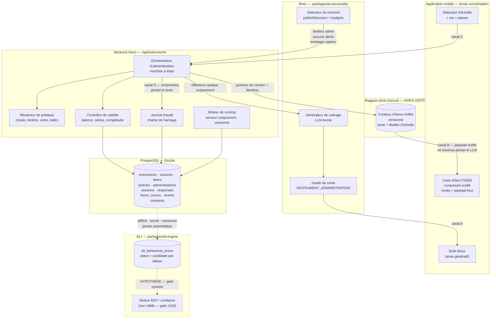
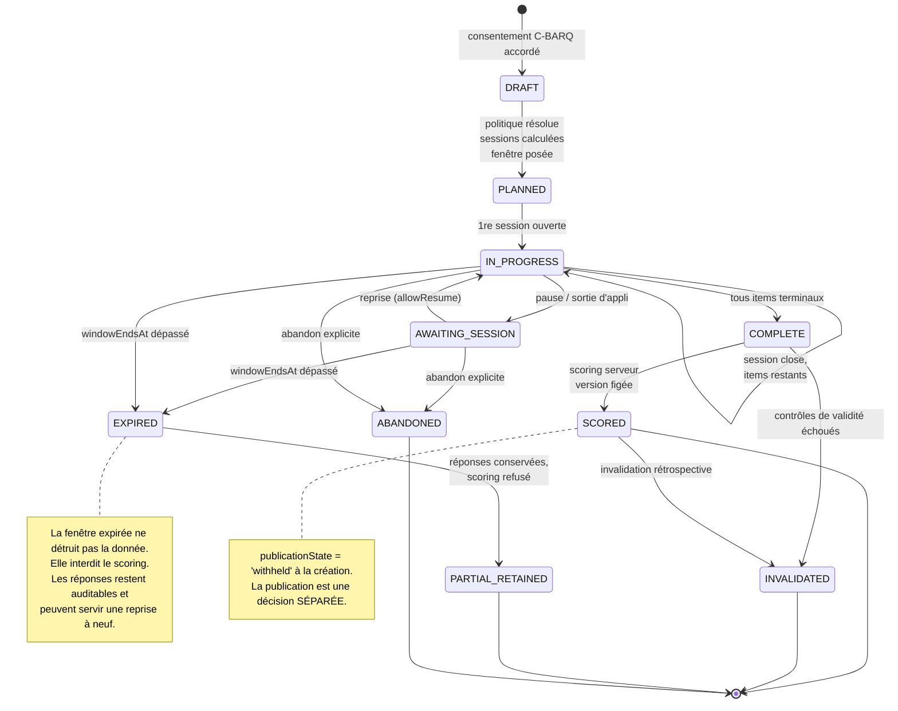
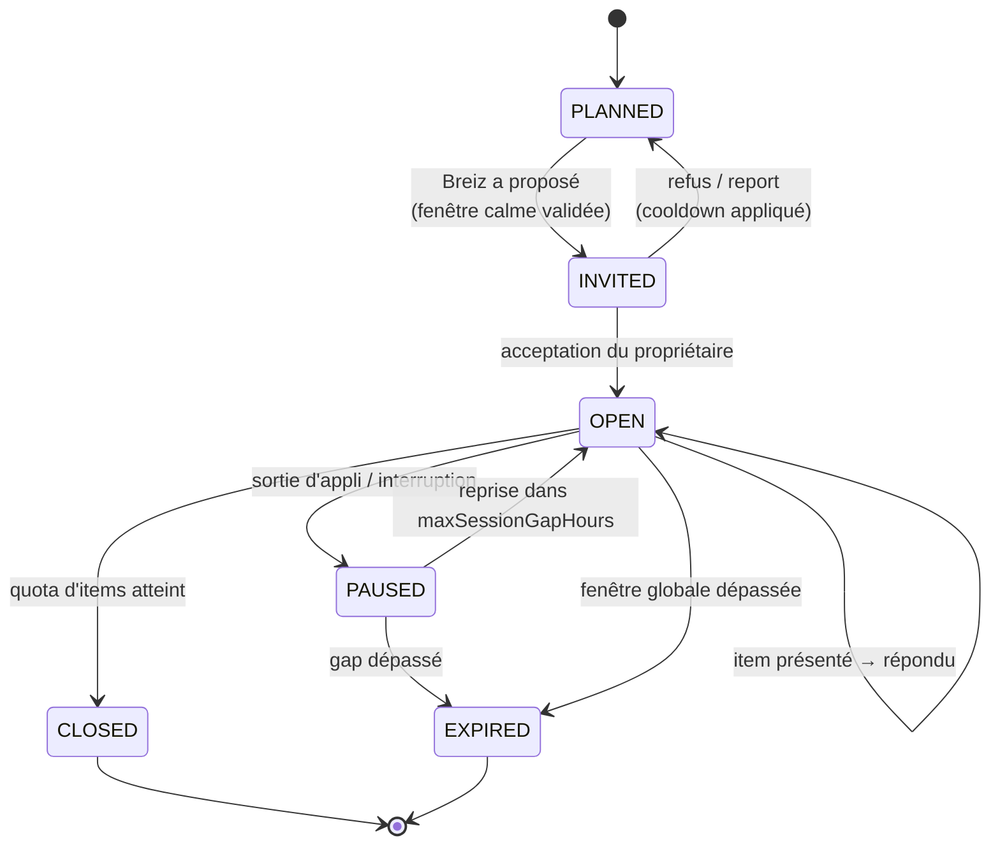
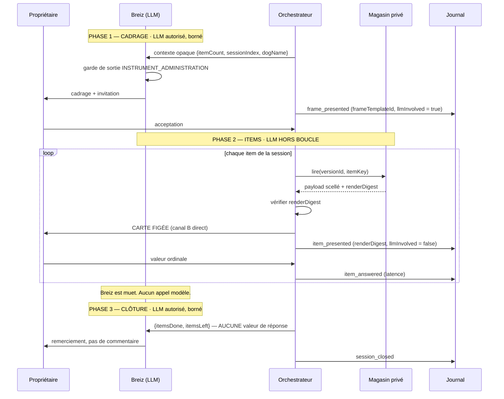
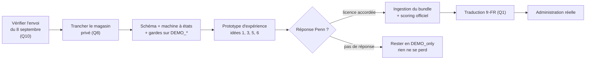

# Intégration du C-BARQ dans le backend EMOPET et dans la conversation Breiz

**Date :** 2026-09-21
**Statut du document :** `CONCEPTION / PROPOSITION` — aucune implémentation, aucun code de production.
**Périmètre :** modèle de données, moteur d'administration, orchestration Breiz, garde-fous, idées d'expérience, plan de tests.
**Autorités appliquées :** `CLAUDE.md`, `docs/product/EMOPET_CARE_PRODUCT_MASTER_v0.1.md`, `docs/research/CBARQ_PROJECT_IMPACT_2026-09-06.md`, `docs/records/communications/science/SERPELL_UPENN_COMMUNICATIONS.md`, `docs/research/SCIENTIFIC_FRAMEWORK_REGISTER.md`, `docs/brand/BRAND-AUTHORITY-001_…_2026-08-25.md`.

### Convention de maturité utilisée dans tout le document

| Marqueur | Signification |
|---|---|
| `[ÉTABLI]` | Vérifié dans le dépôt ou dans un record contrôlé, à la date ci-dessus. |
| `[PROPOSÉ]` | Conception de ce document. Non décidé, non implémenté. |
| `[HYPOTHÈSE]` | Dépend d'une réponse externe (Penn, Serpell) ou d'une validation absente. |
| `[BLOQUÉ-LICENCE]` | Ne peut pas être implémenté avant preuve écrite de licence. |

---

## 1. Résumé

### 1.1 Ce que l'exploration a réellement trouvé

L'exploration en lecture seule du dépôt a produit un résultat qui change la nature de la mission : **une grande partie de la fondation demandée existe déjà** et a été conçue précisément pour ce cas d'usage.

`[ÉTABLI]` `backend/db/schema/behavioral-assessments.ts` (197 lignes, migration `0005_behavioral_assessment_provenance.sql`) contient déjà cinq tables : `behavioral_assessments`, `behavioral_responses`, `behavioral_factor_scores`, `eli_behavioral_priors`, `research_data_consents`. Son en-tête porte déjà la règle centrale de la contrainte 4 :

> *« Do not store licensed questionnaire wording here. `itemKey` is an opaque identifier supplied by the licensed instrument implementation. »*

`[ÉTABLI]` Le champ `administrationMode` accepte déjà `standardized | progressive | research | unknown`, et `scientificUseStatus` accepte déjà `unreviewed | scoring_allowed | research_only | not_equivalent`. La contrainte 3 (modes paramétrables) a donc déjà son point d'ancrage en base — il lui manque la **table de politique** qui la rend configurable sans toucher au code.

`[ÉTABLI]` `packages/ai-personality` dispose déjà d'un pare-feu sémantique de publication : `BleizSemanticAuthority` (`OBSERVATION_ONLY`, `EDUCATION_ONLY`, `CONTEXT_ONLY`, `SUGGESTION_ONLY`, `COMMUNITY_ONLY`), un garde de sortie fail-closed (`bleiz-release-output.ts`) qui rejette les assertions diagnostiques, de certitude, de lecture d'intention et de qualité de lien, et un ordonnanceur avec budgets journaliers par canal, cooldowns et portes de confiance (`publishDecision`).

`[ÉTABLI]` **Contrainte architecturale majeure découverte :** `backend/db/schema/ai.ts` porte `check('chk_ai_messages_no_durable_persistence', sql`false`)`, renforcé au niveau PostgreSQL par `0012_ai_zero_durable_write_guard.sql`. Décision fondateur AI-A / R4 : **aucune écriture durable de contenu conversationnel IA n'est autorisée.** Cette contrainte n'était pas dans l'énoncé de la mission et elle contraint fortement la conception du journal d'audit (voir §5.4).

`[ÉTABLI]` `apps/mobile/src/screens/ChatScreen.tsx` est une maquette : messages en dur, type `Message = { from, text, sources?, disclaimer? }`, aucun appel LLM, aucun backend. Il n'existe donc **aucun flux conversationnel runtime à modifier** — il y a un flux à concevoir. C'est une bonne nouvelle : le canal figé peut être natif plutôt que rétro-ajusté.

`[ÉTABLI]` `packages/eli-engine` n'est importé par aucun module runtime (gate #118, `CLAUDE.md`). Toute conception qui suppose un couplage C-BARQ ↔ ELI vivant est donc aujourd'hui **théorique**.

`[ÉTABLI]` La recommandation « renommer le bloc *C-BARQ simplified* » du document d'impact du 2026-09-06 **a été appliquée** : `backend/db/schema/freemium.ts` porte désormais le commentaire *« Breed-level behavioral context heuristics only. These are NOT C-BARQ scores… »*. Le pare-feu race ↔ instrument est en place.

### 1.2 Ce que ce document ajoute

Sept briques manquantes, toutes `[PROPOSÉ]` :

1. un **registre d'instrument et de version** (aujourd'hui `instrumentCode` est une chaîne libre non contrainte) ;
2. un **registre d'items** référençant du contenu privé par pointeur, jamais par texte ;
3. une **table de politique d'administration** versionnée (contrainte 3, « sans changer le code ») ;
4. une **table de sessions** — aujourd'hui l'administration est monolithique, il n'y a pas de découpage en sessions ni de fenêtre ;
5. un **journal d'audit de fidélité** à chaînage de hachage, compatible avec la règle AI zéro-durable ;
6. un **consentement C-BARQ spécifique** et un **consentement de renvoi à Penn** distinct (`research_data_consents` couvre la recherche, pas la transmission à un tiers nommé) ;
7. l'**autorité sémantique `INSTRUMENT_ADMINISTRATION`** dans le pare-feu Breiz, avec sa règle structurante : *pendant une séquence d'items, le LLM est hors boucle.*

### 1.3 La thèse de conception en une phrase

Les trois contraintes les plus dures — fidélité mot pour mot, neutralité, zéro texte licencié dans le dépôt — ne sont pas des obstacles à l'expérience mémorable : **ce sont les matériaux de l'expérience mémorable**, à condition de déplacer l'émerveillement du *moment de la question* vers le *rituel qui l'entoure* et la *révélation différée* qui la suit.

---

## 2. Architecture

### 2.1 Principe des quatre canaux

La contrainte 1 (fidélité) et la contrainte 2 (neutralité) se ramènent à une seule discipline d'ingénierie : **le texte licencié et le texte génératif ne partagent jamais ni un tuyau, ni un composant de rendu, ni une fenêtre de contexte.**

| Canal | Contenu | Producteur | LLM ? | Persisté ? |
|---|---|---|---|---|
| `A — CONVERSATION` | Cadrage, accueil, transition, remerciement | Breiz (LLM + templates) | Oui, borné | **Non** (AI-A/R4) |
| `B — INSTRUMENT` | Texte d'item + libellés d'échelle | Magasin privé licencié | **Jamais** | Non (jamais dans le dépôt ni dans la base produit) |
| `C — RÉPONSE` | Valeur ordinale, statut, horodatage | Propriétaire | Non | Oui (`behavioral_responses`) |
| `D — AUDIT` | Empreintes, séquence, latences, chaîne | Serveur | Non | Oui (`instrument_administration_events`) |

Le canal B ne traverse jamais le canal A. Concrètement : **le texte d'un item n'entre jamais dans le prompt envoyé au modèle.** Le LLM reçoit au maximum une référence opaque (`itemKey`, `DEMO_ITEM_01`), un compteur de progression et une sous-échelle anonymisée. Un modèle qui n'a jamais vu le texte ne peut pas le reformuler.

### 2.2 Diagramme



**Lecture du diagramme :** la seule flèche entrante de `CARD` vient de `CONTENT`. Aucune flèche ne relie `AI` à `CARD`. C'est la garantie architecturale de la contrainte 1 — elle est topologique, pas comportementale, donc elle ne dépend pas de la bonne volonté d'un modèle.

### 2.3 Où vit le contenu licencié

`[PROPOSÉ]` Trois options, par ordre de préférence :

| Option | Mécanisme | Avantage | Inconvénient |
|---|---|---|---|
| **A — Secret store** | Bundle JSON chiffré en secret managé (AWS Secrets Manager / Vault), chargé en mémoire au démarrage, jamais écrit sur disque | Aucune trace en base, rotation simple, périmètre d'audit minimal | Taille des secrets (~100 items), rechargement = redéploiement |
| **B — Table chiffrée** | Table `instrument_item_content` hors schéma produit, chiffrement applicatif par enveloppe (clé KMS), accès restreint à un rôle SQL dédié | Versionnable, requêtable, rotation de version sans redéploiement | Surface de fuite plus large ; exige une discipline de sauvegarde |
| **C — Hybride** | Métadonnées (clés, ordre, sous-échelle, bornes) en base ; texte en secret store | Sépare structure et propriété intellectuelle | Deux sources à synchroniser |

`[PROPOSÉ]` Recommandation : **option C**. La structure (quel item, quelle sous-échelle, quel ordre, quelle borne) n'est pas le contenu protégé et gagne à être en base pour l'audit ; seul le texte affichable et les libellés d'échelle partent en secret store.

`[ÉTABLI]` Le dépôt ne contient aujourd'hui aucun mécanisme de chiffrement applicatif — seulement des secrets HMAC/JWT (`backend/api/middleware/auth.ts`, `backend/api/services/vet-report.ts`). L'option B exigerait donc une brique nouvelle ; l'option A et la partie « secret » de C réutilisent le pattern existant de résolution de secret à l'appel.

**Dans le dépôt, uniquement des items factices.** Un fichier `packages/shared/src/instruments/demo-items.ts` `[PROPOSÉ]` contenant `DEMO_ITEM_01 … DEMO_ITEM_12`, avec un préfixe `DEMO_` obligatoire et un test qui échoue si une clé d'item de production apparaît dans un fichier versionné.

---

## 3. Schéma de données

### 3.1 Ce qui existe déjà et qu'il ne faut pas réécrire

`[ÉTABLI]` Les cinq tables de `behavioral-assessments.ts` sont conservées telles quelles. Leurs contraintes `CHECK` sont bien construites — notamment `chk_behavioral_response_scale`, qui impose déjà qu'une réponse `answered` ait une valeur dans les bornes et qu'une réponse `not_applicable | skipped | missing` ait une valeur `NULL`. C'est exactement la préservation explicite de la manquance demandée par le document d'impact. Rien à corriger.

La migration `0006_privacy_detachable_provenance.sql` `[ÉTABLI]` rend déjà `respondent_user_id` détachable à la suppression d'un compte (RGPD, droit à l'effacement) tout en préservant la donnée d'instrument. `backend/api/services/subject-discovery.ts` compte déjà les lignes comportementales par sujet, avec séparation produit / recherche.

### 3.2 Tables proposées

Extraits illustratifs, style Drizzle du dépôt (`pgTable`, `check`, `uniqueIndex`).

#### 3.2.1 Registre d'instrument et de version

```ts
// [PROPOSÉ] backend/db/schema/instruments.ts
export const instruments = pgTable('instruments', {
  id: uuid('id').primaryKey().defaultRandom(),
  code: varchar('code', { length: 50 }).notNull().unique(),      // 'CBARQ'
  ownerOrganisation: varchar('owner_organisation', { length: 255 }).notNull(),
  // Texte d'attribution exigé par la licence, affiché tel quel. Ce n'est pas
  // du contenu d'item : c'est la mention légale, elle peut vivre en base.
  attributionText: text('attribution_text'),
  createdAt: timestamp('created_at', { withTimezone: true }).defaultNow().notNull(),
});

export const instrumentVersions = pgTable('instrument_versions', {
  id: uuid('id').primaryKey().defaultRandom(),
  instrumentId: uuid('instrument_id').notNull().references(() => instruments.id),
  version: varchar('version', { length: 100 }).notNull(),
  locale: varchar('locale', { length: 10 }).notNull(),           // 'fr-FR'

  // Pointeur vers le magasin privé. JAMAIS le contenu lui-même.
  contentStoreRef: varchar('content_store_ref', { length: 255 }).notNull(),
  // Empreinte du bundle complet : prouve quelle révision exacte a servi.
  contentDigest: varchar('content_digest', { length: 64 }).notNull(), // sha256 hex

  licenseReference: varchar('license_reference', { length: 255 }),
  licenseStatus: varchar('license_status', { length: 30 }).notNull().default('not_proven'),
  translationStatus: varchar('translation_status', { length: 30 }).notNull().default('unreviewed'),
  expectedItemCount: integer('expected_item_count').notNull(),
  activatedAt: timestamp('activated_at', { withTimezone: true }),
  retiredAt: timestamp('retired_at', { withTimezone: true }),
}, (t) => [
  uniqueIndex('uq_instrument_version_locale').on(t.instrumentId, t.version, t.locale),
  check('chk_instrument_version_license',
    sql`${t.licenseStatus} IN ('not_proven','granted','expired','revoked','demo_only')`),
  check('chk_instrument_version_translation',
    sql`${t.translationStatus} IN ('unreviewed','official','back_translated','not_equivalent')`),
]);
```

**Pourquoi `licenseStatus` en base et pas en config :** une administration doit pouvoir être refusée au runtime si la licence expire, sans redéploiement, et l'audit doit pouvoir répondre à *« sous quelle licence cette réponse a-t-elle été collectée ? »* des années plus tard. Valeur par défaut `not_proven` — le système démarre fermé. `demo_only` est la valeur des versions factices du dépôt.

**`translationStatus` :** point souvent oublié. Serpell a écrit `[ÉTABLI, 2 juillet 2026]` que *changer le libellé d'un item risque d'invalider l'item*. Une traduction française non officielle **est** un changement de libellé. Une version `fr-FR` marquée `back_translated` ou `not_equivalent` ne peut pas produire un score comparable aux normes. Ce champ doit exister avant la première administration francophone.

#### 3.2.2 Registre d'items

```ts
// [PROPOSÉ] Structure uniquement. Aucun texte.
export const instrumentItems = pgTable('instrument_items', {
  id: uuid('id').primaryKey().defaultRandom(),
  versionId: uuid('version_id').notNull().references(() => instrumentVersions.id),

  itemKey: varchar('item_key', { length: 100 }).notNull(),  // opaque : 'DEMO_ITEM_01'
  subscaleKey: varchar('subscale_key', { length: 100 }),    // opaque : 'DEMO_SUBSCALE_A'
  canonicalPosition: integer('canonical_position').notNull(),

  scaleType: varchar('scale_type', { length: 30 }).notNull(),
  scaleMin: integer('scale_min').notNull(),
  scaleMax: integer('scale_max').notNull(),
  allowsNotApplicable: boolean('allows_not_applicable').notNull().default(false),
  reverseScored: boolean('reverse_scored').notNull().default(false),

  // Empreinte du texte rendu + libellés, calculée à l'ingestion du bundle.
  // Permet de prouver la fidélité sans jamais stocker le texte.
  renderDigest: varchar('render_digest', { length: 64 }).notNull(),
}, (t) => [
  uniqueIndex('uq_instrument_item').on(t.versionId, t.itemKey),
  uniqueIndex('uq_instrument_item_position').on(t.versionId, t.canonicalPosition),
  check('chk_instrument_item_scale', sql`${t.scaleMin} < ${t.scaleMax}`),
]);
```

`renderDigest` est la pièce centrale de la preuve de fidélité. Défini comme :

```
sha256( versionId ‖ itemKey ‖ texteItem ‖ "\u001F".join(libellésÉchelle) )
```

Il est calculé **une fois**, à l'ingestion du bundle licencié, puis recalculé à chaque présentation côté serveur juste avant l'envoi. Si les deux diffèrent, la présentation est refusée et l'administration invalidée. On prouve ainsi *« l'item exact de la version X a été affiché »* sans qu'aucun octet de texte licencié ne quitte le magasin privé pour la base produit ou les journaux.

#### 3.2.3 Politique d'administration — la contrainte 3

```ts
// [PROPOSÉ] Contrainte 3 : deux modes, configuration serveur, zéro changement de code.
export const instrumentAdministrationPolicies = pgTable('instrument_administration_policies', {
  id: uuid('id').primaryKey().defaultRandom(),
  versionId: uuid('version_id').notNull().references(() => instrumentVersions.id),
  policyKey: varchar('policy_key', { length: 100 }).notNull(),
  policyVersion: integer('policy_version').notNull().default(1),

  administrationMode: varchar('administration_mode', { length: 30 }).notNull(),
  // ↑ aligné sur l'énumération EXISTANTE de behavioral_assessments :
  //   'standardized' | 'progressive' | 'research' | 'unknown'

  orderStrategy: varchar('order_strategy', { length: 40 }).notNull(),
  // 'canonical' | 'subscale_blocked' | 'licensed_randomized'
  maxSessions: integer('max_sessions').notNull(),
  itemsPerSession: integer('items_per_session').notNull(),
  maxWindowHours: integer('max_window_hours').notNull(),
  maxSessionGapHours: integer('max_session_gap_hours'),
  minInterItemMs: integer('min_inter_item_ms').notNull().default(800),
  allowResume: boolean('allow_resume').notNull().default(true),
  allowRevision: boolean('allow_revision').notNull().default(false),

  // Conséquence scientifique de CETTE politique. Écrit tel quel dans
  // behavioral_assessments.scientificUseStatus à l'ouverture.
  resultingScientificUseStatus: varchar('resulting_scientific_use_status', { length: 30 }).notNull(),

  approvedBy: varchar('approved_by', { length: 255 }),
  approvalReference: varchar('approval_reference', { length: 255 }),
  activatedAt: timestamp('activated_at', { withTimezone: true }),
}, (t) => [
  uniqueIndex('uq_policy_key_version').on(t.versionId, t.policyKey, t.policyVersion),
  check('chk_policy_mode',
    sql`${t.administrationMode} IN ('standardized','progressive','research','unknown')`),
  check('chk_policy_use_status',
    sql`${t.resultingScientificUseStatus} IN ('unreviewed','scoring_allowed','research_only','not_equivalent')`),
  check('chk_policy_window', sql`${t.maxWindowHours} > 0 AND ${t.itemsPerSession} > 0 AND ${t.maxSessions} > 0`),
]);
```

Deux lignes de politique suffisent à couvrir les deux mondes de la contrainte 3 :

| `policyKey` | mode | sessions | items/session | fenêtre | `resultingScientificUseStatus` |
|---|---|---|---|---|---|
| `STANDARD_2S` | `standardized` | 2 | ~50 | 48 h | `scoring_allowed` `[HYPOTHÈSE]` |
| `DISTRIBUTED_12S` | `progressive` | 12 | ~8 | 336 h (14 j) | `research_only` `[HYPOTHÈSE]` |

**Le couplage `policy → resultingScientificUseStatus` est le cœur de la conception scientifique.** Il rend structurellement impossible qu'une administration distribuée produise un score présenté comme équivalent à l'administration validée, **tant que Penn n'a pas dit le contraire**. Changer de mode, c'est insérer une ligne ; requalifier scientifiquement un mode, c'est insérer une ligne avec `approvalReference` pointant vers la réponse écrite de Penn. Aucun déploiement dans les deux cas.

> `[ÉTABLI]` Cette structure respecte la frontière d'attribution exigée par `SERPELL_UPENN_COMMUNICATIONS.md` : la valeur `scoring_allowed` pour `STANDARD_2S` est elle-même une hypothèse tant qu'aucun écrit ne l'établit. Le système ne doit pas partir du principe que le mode standard est automatiquement licencié — il n'est que *le moins discutable des deux*.

#### 3.2.4 Sessions

`behavioral_assessments` est aujourd'hui `[ÉTABLI]` monolithique : un `startedAt`, un `completedAt`, aucun découpage. Une table de sessions est nécessaire.

```ts
// [PROPOSÉ]
export const administrationSessions = pgTable('administration_sessions', {
  id: uuid('id').primaryKey().defaultRandom(),
  assessmentId: uuid('assessment_id').notNull()
    .references(() => behavioralAssessments.id, { onDelete: 'cascade' }),
  sessionIndex: integer('session_index').notNull(),
  state: varchar('state', { length: 30 }).notNull().default('planned'),

  plannedItemKeys: jsonb('planned_item_keys').notNull(),  // clés opaques
  openedAt: timestamp('opened_at', { withTimezone: true }),
  closedAt: timestamp('closed_at', { withTimezone: true }),

  // Preuve d'embargo capteur — contrainte 2. Enregistre que la sélection de
  // moment a vérifié l'absence d'alerte et de donnée capteur saillante récente.
  quietWindowProof: jsonb('quiet_window_proof').default({}),
  invitationChannel: varchar('invitation_channel', { length: 30 }),
}, (t) => [
  uniqueIndex('uq_session_assessment_index').on(t.assessmentId, t.sessionIndex),
  check('chk_session_state',
    sql`${t.state} IN ('planned','invited','open','paused','closed','expired','abandoned')`),
]);
```

`[PROPOSÉ]` Deux colonnes à ajouter à `behavioral_assessments` existante (migration additive, sans réécriture) :

```ts
policyId:   uuid('policy_id').references(() => instrumentAdministrationPolicies.id),
windowEndsAt: timestamp('window_ends_at', { withTimezone: true }),
```

`instrumentCode` / `instrumentVersion` existants restent en place pour compatibilité ; un `versionId` référentiel peut être ajouté en parallèle et les chaînes libres dépréciées progressivement.

#### 3.2.5 Journal d'audit de fidélité

```ts
// [PROPOSÉ] Append-only. Aucun texte d'item. Aucun texte généré par Breiz.
export const instrumentAdministrationEvents = pgTable('instrument_administration_events', {
  id: uuid('id').primaryKey().defaultRandom(),
  assessmentId: uuid('assessment_id').notNull()
    .references(() => behavioralAssessments.id, { onDelete: 'cascade' }),
  sessionId: uuid('session_id').references(() => administrationSessions.id),
  sequenceIndex: integer('sequence_index').notNull(),

  eventType: varchar('event_type', { length: 40 }).notNull(),
  itemKey: varchar('item_key', { length: 100 }),

  // Fidélité : empreinte de ce qui a RÉELLEMENT été rendu au client.
  renderDigest: varchar('render_digest', { length: 64 }),
  // Neutralité : empreinte du cadrage Breiz affiché avant l'item. Le texte
  // lui-même n'est PAS persisté (AI-A / R4 : zéro durable pour le contenu IA).
  frameDigest: varchar('frame_digest', { length: 64 }),
  frameTemplateId: varchar('frame_template_id', { length: 100 }),

  // Preuve de séparation des canaux.
  llmInvolved: boolean('llm_involved').notNull().default(false),

  occurredAt: timestamp('occurred_at', { withTimezone: true }).defaultNow().notNull(),
  clientLatencyMs: integer('client_latency_ms'),

  // Inviolabilité : chaînage.
  prevEventHash: varchar('prev_event_hash', { length: 64 }),
  eventHash: varchar('event_hash', { length: 64 }).notNull(),
}, (t) => [
  uniqueIndex('uq_event_assessment_sequence').on(t.assessmentId, t.sequenceIndex),
  check('chk_event_type', sql`${t.eventType} IN (
    'assessment_opened','session_planned','session_invited','session_opened',
    'frame_presented','item_presented','item_answered','item_revised',
    'session_paused','session_resumed','session_closed','window_expired',
    'validity_flag_raised','assessment_completed','assessment_invalidated','scored'
  )`),
  // Un item présenté prouve toujours sa fidélité et prouve toujours
  // qu'aucun LLM n'était dans la boucle à cet instant.
  check('chk_event_item_presentation', sql`(
    ${t.eventType} <> 'item_presented'
    OR (${t.renderDigest} IS NOT NULL AND ${t.itemKey} IS NOT NULL AND ${t.llmInvolved} = false)
  )`),
]);
```

Le `CHECK` `chk_event_item_presentation` est la contrainte 1 exprimée **au niveau de la base de données**. Il est impossible d'écrire dans le journal une présentation d'item qui aurait impliqué un LLM ou dont l'empreinte de rendu serait absente. C'est le même esprit que `chk_ai_messages_no_durable_persistence` `[ÉTABLI]` : la règle produit devient une contrainte SQL, pas une convention d'équipe.

**Compatibilité avec AI-A / R4.** La règle interdit la persistance durable de contenu conversationnel IA. Le journal n'en persiste aucun : il stocke `frameTemplateId` (identifiant de gabarit, pas de prose) et `frameDigest` (empreinte non réversible). On peut donc prouver *« un cadrage issu du gabarit `FRAME_OPEN_03` a été affiché, et c'était exactement celui-ci »* sans conserver une seule phrase générée. `[PROPOSÉ]` Si même l'empreinte est jugée trop proche d'une persistance de contenu IA, la position de repli est `frameTemplateId` seul — la traçabilité baisse mais la règle fondateur prime.

#### 3.2.6 Scores et consentements

`behavioral_factor_scores` existante `[ÉTABLI]` couvre déjà la contrainte 5 : `scoringMethod`, `scoringVersion`, `eligibleForEliPrior` à `false` par défaut, `provenance` en JSONB. `[PROPOSÉ]` Trois ajouts :

```ts
itemsUsed:        integer('items_used').notNull(),
itemsMissing:     integer('items_missing').notNull(),
publicationState: varchar('publication_state', { length: 30 }).notNull().default('withheld'),
// 'withheld' | 'narrative_only' | 'full' — aligné sur la doctrine Care §4 (point 9)
```

`publicationState` par défaut à `withheld` implémente la contrainte 6 et la règle d'abstention de `CLAUDE.md` §5 : un score calculé n'est pas un score publiable. `narrative_only` est l'état qui autorise la restitution Breiz sans exposer de nombre — c'est l'application directe du **no naked number**.

`[PROPOSÉ]` Consentements — `research_data_consents` existante ne couvre pas les deux consentements demandés par la contrainte 7. Deux valeurs de `scope` supplémentaires plutôt qu'une table nouvelle :

```ts
check('chk_research_consent_scope', sql`${t.scope} IN (
  'aggregate','deidentified','study_specific',
  'instrument_administration',      // [PROPOSÉ] consentement C-BARQ explicite
  'instrument_owner_transmission'   // [PROPOSÉ] renvoi des réponses à Penn
)`),
```

**Les deux sont strictement indépendants.** `instrument_administration` est nécessaire pour ouvrir une administration ; `instrument_owner_transmission` n'est nécessaire que pour un renvoi à Penn et son absence ne bloque rien d'autre. Un refus du second ne doit dégrader ni l'expérience ni le score — sinon le consentement n'est pas libre au sens du RGPD. `[PROPOSÉ]` Un test doit vérifier exactement cette non-dégradation.

### 3.3 Base légale RGPD

`[PROPOSÉ]` Analyse indicative, à valider juridiquement.

| Traitement | Base légale | Note |
|---|---|---|
| Administration + scoring | Consentement explicite (`instrument_administration`) | Donnée comportementale déclarative sur un animal, mais rattachée à une personne identifiée et potentiellement révélatrice d'habitudes de vie du foyer |
| Restitution à Breiz | Même consentement | Pas de base distincte |
| Renvoi à Penn | Consentement distinct (`instrument_owner_transmission`) | Transfert hors UE → clauses contractuelles types à prévoir `[BLOQUÉ-LICENCE]` |
| Alimentation ELI | Consentement + `eligibleForEliPrior = true` | Double verrou déjà présent `[ÉTABLI]` |
| Conservation | Durée alignée sur la licence, pas sur la rétention produit | Une licence révoquée peut imposer une purge que la rétention produit n'anticipe pas `[HYPOTHÈSE]` |

Le retrait du consentement `instrument_administration` doit déclencher l'effacement des `behavioral_responses` **et** des `behavioral_factor_scores`, tout en conservant le journal d'audit dépersonnalisé si la licence exige une preuve de conformité d'administration. Cette tension — droit à l'effacement contre obligation de preuve contractuelle — est une question ouverte (§10, Q7).

---

## 4. Machine à états

### 4.1 Niveau administration



`[ÉTABLI]` Les trois états `status` déjà en base (`in_progress`, `complete`, `abandoned`) restent la projection publique de cette machine ; les états additionnels sont portés par une colonne `lifecycleState` `[PROPOSÉ]`, pour ne pas casser la contrainte `CHECK` existante ni les services de découverte RGPD qui la lisent.

### 4.2 Niveau session



**Règle de non-pénalité :** un refus d'invitation n'est jamais un échec. Il applique un cooldown et replace la session en `PLANNED`. Le système ne doit produire aucun signal de relance insistante — `[ÉTABLI]` les budgets journaliers de `DAILY_CHANNEL_BUDGET` (`push: 1`, `chat_message: 1`) et les `cooldownHours` par gabarit fournissent déjà le mécanisme.

### 4.3 Contrôles de validité

`[PROPOSÉ]` Quatre familles, toutes calculées **côté serveur**, toutes enregistrées comme `validity_flag_raised` dans le journal.

| Contrôle | Signal | Seuil proposé | Effet |
|---|---|---|---|
| **Complétude** | items terminaux < requis par sous-échelle | dépend de la règle officielle `[BLOQUÉ-LICENCE]` | Scoring refusé pour la sous-échelle concernée uniquement |
| **Latence anormalement courte** | `clientLatencyMs < minInterItemMs` | 800 ms par défaut, configurable par politique | Drapeau ; invalidation si > 25 % des items |
| **Réponses en série** | même valeur sur N items consécutifs | N = 10, avec correction sur items inversés | Drapeau ; jamais d'invalidation automatique seule |
| **Incohérence d'items inversés** | corrélation positive entre items censés s'opposer | `[HYPOTHÈSE]` — exige les règles officielles | Drapeau pour revue |

**Trois principes non négociables sur la validité :**

1. **Un drapeau n'est jamais montré au propriétaire pendant l'administration.** Dire « vous répondez trop vite » est une forme de commentaire sur les réponses — cela viole la contrainte 2 et modifie le comportement de réponse.
2. **Aucune invalidation sur un seul signal.** La latence courte est ambiguë : un propriétaire qui connaît très bien son chien répond vite et juste.
3. **L'invalidation ne détruit rien.** Elle fait passer `publicationState` à `withheld` et `scientificUseStatus` à `not_equivalent`. Les réponses restent, l'audit reste.

Le seuil de 800 ms est un point de départ, pas un résultat : `[HYPOTHÈSE]` il faudra le calibrer sur des données réelles, et la calibration elle-même devrait faire partie des questions posées à Penn (§10, Q4).

---

## 5. Orchestration Breiz et garde-fous

### 5.1 Choisir le bon moment

`[ÉTABLI]` La machinerie existe déjà dans `bleiz-content-scheduler.ts` : `publishDecision()` renvoie une `ConfidenceGate`, `DAILY_CHANNEL_BUDGET` plafonne les canaux, `cooldownHours` et `maxPerDay` par gabarit, `evaluateTrigger()` évalue des conditions sur des champs déclarés.

`[PROPOSÉ]` Une invitation d'administration est un cas particulier avec **quatre verrous supplémentaires**, évalués dans cet ordre et tous bloquants :

```ts
// [PROPOSÉ] Illustratif.
interface InvitationGate {
  consentGranted: boolean;        // scope 'instrument_administration' actif
  licenseActive: boolean;         // instrumentVersions.licenseStatus === 'granted'
  noActiveAlert: boolean;         // aucune alerte produit ouverte, quel qu'en soit le type
  sensorEmbargoClear: boolean;    // §5.2
  quietContext: boolean;          // §5.3
  budgetAvailable: boolean;       // DAILY_CHANNEL_BUDGET non consommé
  cooldownElapsed: boolean;       // refus précédent respecté
}
```

### 5.2 L'embargo capteur — contrainte 2 rendue mécanique

La contrainte est : *« ne montre aucune donnée capteur juste avant un item qui pourrait orienter le propriétaire »*. Traduite en règle exécutable :

> `[PROPOSÉ]` **Règle d'embargo.** Aucune invitation ni aucun cadrage d'administration ne peut être émis dans une fenêtre de `E` heures suivant l'affichage à ce propriétaire d'une observation capteur saillante concernant ce chien. Pendant une session ouverte, tout contenu capteur est retiré du fil de conversation et la carte d'item est le seul élément actif.

`E = 6 h` `[PROPOSÉ]`, à calibrer. La preuve du respect de la règle est écrite dans `administrationSessions.quietWindowProof`, qui enregistre l'horodatage de la dernière observation saillante consultée et le délai écoulé — sans enregistrer l'observation elle-même.

**Pourquoi c'est plus fort qu'une consigne de prompt :** un propriétaire à qui l'application vient d'annoncer *« repos plus fragmenté observé cette semaine »* et à qui l'on présente ensuite un item portant sur un comportement lié au repos ne répond plus dans les mêmes conditions qu'un propriétaire non amorcé. L'amorçage n'est pas une question de ton : c'est une question de séquence temporelle. Il se traite donc par un verrou temporel, pas par une instruction au modèle.

**Conséquence assumée :** l'embargo crée une tension réelle avec l'idée n° 4 (§6.4), qui veut relier profil comportemental et contexte ELI. La résolution est l'asymétrie : ELI peut *suivre* le C-BARQ, jamais le *précéder*.

### 5.3 Le contexte calme

`[PROPOSÉ]` Une session ne s'invite que si le contexte est calme. Trois définitions possibles, par ordre d'ambition :

1. **Horaire** — plage déclarée par le propriétaire. Simple, sans capteur, disponible immédiatement.
2. **Comportementale** — aucune interaction applicative fébrile récente, pas de session interrompue dans l'heure.
3. **Ancrée au repos réel** — le MAT indique un repos validé en cours. C'est l'idée n° 5 (§6.5).

Le niveau 3 utilise une donnée capteur pour **choisir un instant**, jamais pour **produire un contenu**. Cette distinction est la clé de sa compatibilité avec la contrainte 2 : le propriétaire ne voit ni n'entend jamais que le MAT a déclenché l'invitation. `[PROPOSÉ]` Un test doit vérifier qu'aucun gabarit de cadrage ne contient de champ `sensor.*` — `[ÉTABLI]` le mécanisme de vérification existe déjà sous la forme de `FORBIDDEN_TRIGGER_FIELD_PATTERNS` et `usesSensorOrComputedEvidence()` dans `bleiz-release-templates.ts`.

### 5.4 Introduire, puis s'effacer

La séquence conversationnelle `[PROPOSÉ]` comporte trois phases dont **une seule** autorise le modèle de langage.



**Phase 2 : le silence de Breiz est la fonctionnalité.** L'intuition naturelle serait de faire commenter chaque réponse par Breiz pour « maintenir la conversation ». C'est précisément ce que la contrainte 2 interdit, et c'est aussi ce qui détruirait le rythme : un questionnaire où l'on est félicité toutes les dix secondes est plus fatigant, pas moins. Le vrai confort d'un instrument long est la **cadence régulière et silencieuse**. Breiz ouvre la porte, tient la porte, referme la porte.

`[PROPOSÉ]` En phase 3, l'orchestrateur ne transmet à Breiz **aucune valeur de réponse** — seulement des compteurs. Breiz ne peut donc pas commenter une réponse même s'il le voulait : il ne la connaît pas.

### 5.5 Les garde-fous techniques, par couche

| # | Couche | Garde-fou | Échoue si | Vérifiable par |
|---|---|---|---|---|
| G1 | Topologie | Le texte d'item n'entre dans aucun appel modèle | — (impossible par construction) | Revue d'architecture + G2 |
| G2 | Constructeur de prompt | `buildInstrumentPrompt()` n'accepte que `{ itemKey, subscaleKey, counters }` — types opaques | Compilation TypeScript | Test de type + test de propriété |
| G3 | Base de données | `chk_event_item_presentation` : `item_presented ⇒ llmInvolved = false` | `INSERT` rejeté par PostgreSQL | Test d'intégration SQL |
| G4 | Intégrité de rendu | `renderDigest` recalculé avant chaque envoi | Présentation refusée, session invalidée | Test avec bundle altéré |
| G5 | Sortie Breiz | Autorité `INSTRUMENT_ADMINISTRATION` : aucune forme interrogative, aucun lexique comportemental, aucun terme d'échelle | Sortie rejetée (fail-closed) | Tests de motifs, comme `UNIVERSAL_PATTERNS` |
| G6 | Collision de contenu | Détecteur de n-grammes : sortie Breiz vs corpus privé | Sortie rejetée + alerte | Test avec paraphrase délibérée |
| G7 | Client | Composant `<InstrumentItemCard>` scellé : rend `payload.text` brut, aucune interpolation, aucun markdown | Test de rendu | Test d'instantané + test de non-interpolation |
| G8 | Dépôt | Aucune clé d'item de production, aucun texte licencié dans un fichier versionné | CI échoue | Test de scan (§9) |

**G5 en détail.** `[PROPOSÉ]` Une nouvelle valeur de `BleizSemanticAuthority`, suivant exactement le pattern `[ÉTABLI]` de `bleiz-release-output.ts` :

```ts
// [PROPOSÉ] Illustratif — motifs fail-closed pendant une administration.
const INSTRUMENT_ADMINISTRATION_PATTERNS: SemanticPattern[] = [
  {
    id: 'instrument-interrogative',
    description: 'Breiz pose une question pendant une administration',
    pattern: /\?|\b(est-ce que|diriez-vous|à quelle fréquence|combien de fois)\b/i,
  },
  {
    id: 'instrument-scale-language',
    description: 'vocabulaire d\'échelle produit par le modèle',
    pattern: /\b(jamais|rarement|parfois|souvent|toujours|note[zr]|sur une échelle)\b/i,
  },
  {
    id: 'instrument-answer-commentary',
    description: 'commentaire sur une réponse fournie',
    pattern: /\b(bonne réponse|c'est normal|rassurant|inquiétant|intéressant que vous)\b/i,
  },
  {
    id: 'instrument-suggestion',
    description: 'suggestion de réponse',
    pattern: /\b(la plupart des (propriétaires|chiens)|généralement on (répond|observe)|à votre place)\b/i,
  },
];
```

`instrument-interrogative` est volontairement brutal : **Breiz n'a pas le droit de poser la moindre question pendant une administration**, même anodine. Un modèle qui ne pose aucune question ne peut pas poser un item déguisé. Le coût est une petite rigidité conversationnelle sur quelques tours ; le bénéfice est qu'une classe entière de violations devient impossible.

`[ÉTABLI]` `GLOBAL_BLACKLIST` contient déjà `stress`, `agressif`, `traumatis`, `maladie` — c'est-à-dire du vocabulaire qui apparaît aussi dans le champ sémantique d'un instrument comportemental. Le filtre lexical existant travaille donc déjà partiellement dans le bon sens ; il faut vérifier `[PROPOSÉ]` qu'il ne s'applique **pas** au canal B, sous peine de censurer un item licencié — ce qui serait une violation de la contrainte 1 par excès de prudence. **Le canal B ne traverse aucun filtre. C'est délibéré et c'est la seule exception.**

---

## 6. Idées innovantes

Sept idées. Pour chacune : l'effet recherché, le risque réel, et ce qui la rend compatible.

### 6.1 Le portrait à révélation différée

**L'idée.** Pendant l'administration, le propriétaire voit une forme se construire — l'**ouverture** de la marque EMOPET `[ÉTABLI, BRAND-AUTHORITY-001]`, dont les segments s'illuminent par territoire exploré. Mais cette forme ne dit **rien du contenu** : elle ne montre que la géométrie de la couverture. Le portrait interprété n'existe pas tant que l'administration n'est pas close et scorée côté serveur. À la clôture, l'ouverture s'ouvre pour de bon, en une seule fois.

**L'effet « waouh ».** L'inversion de l'attente. Tous les questionnaires longs montrent une barre de progression, qui rappelle surtout combien il en reste. Ici, l'effort produit un objet visuel qui se densifie, et la récompense est tenue jusqu'au bout — le ressort narratif du développement photographique.

**Le risque.** Une révélation progressive du **contenu** créerait un effet de retour : un propriétaire qui voit émerger « territoire de la sociabilité : peu marqué » ajustera, consciemment ou non, ses réponses suivantes. C'est une caractéristique de demande classique, et elle contaminerait l'instrument.

**Ce qui la rend compatible.** Le **verrou de neutralité** : pendant l'administration, seule la *couverture* est visible, jamais l'*interprétation*. Implémentation : `publicationState` reste `withheld` jusqu'à `SCORED`, et l'API de progression ne renvoie que `{ subscaleKey, itemsDone, itemsTotal }` — aucune valeur, aucun score. La contrainte scientifique produit ici directement le meilleur design narratif.

### 6.2 La restitution narrative sans nombre

**L'idée.** À la clôture, Breiz raconte le chien en langue non clinique. Pas « score de peur non sociale : 1,8 / 4 », mais une description située, avec contexte, limites et provenance — exactement les neuf éléments de la doctrine d'observation Care `[ÉTABLI, §4]`.

**L'effet « waouh ».** Le propriétaire reconnaît son chien. C'est le critère de réussite et il est exigeant : la restitution doit être assez spécifique pour être reconnaissable, et assez prudente pour ne rien affirmer.

**Le risque.** Triple. *Anthropomorphisation* — la narration est précisément le registre où elle s'infiltre. *Licence* — une restitution dérivée des scores est probablement une œuvre dérivée `[BLOQUÉ-LICENCE]`. *Dérive de validité* — un vocabulaire qui promet plus que la mesure.

**Ce qui la rend compatible.** Trois verrous. (a) **Lexique contrôlé** : la restitution est composée à partir d'un registre de formulations approuvées, indexées par `(subscaleKey, band, version)`, et non générée librement — Breiz assemble et relie, il n'invente pas la caractérisation. (b) **Autorité sémantique** `INSTRUMENT_RESTITUTION`, avec les motifs interdits existants (`latent-emotion`, `causal-claim`, `motivation-mind-reading` `[ÉTABLI]`). (c) **Bandes, pas valeurs** : Breiz reçoit `{ subscaleKey, band, confidence, itemsMissing }` et jamais un nombre — il lui est donc matériellement impossible d'afficher un score nu.

### 6.3 La capsule temporelle en aveugle

**L'idée.** À la réévaluation (12 mois `[HYPOTHÈSE]`), le propriétaire répond **sans voir ses réponses précédentes**. La comparaison n'apparaît qu'après la clôture : « voici ce que vous décriviez il y a un an, voici ce que vous décrivez aujourd'hui ».

**L'effet « waouh ».** Il vient d'une asymétrie émotionnelle réelle. Les gens ne se souviennent pas de ce qu'ils ont répondu il y a un an, et la confrontation à son propre regard passé sur son chien est un moment fort — parfois parce que le chien a changé, souvent parce que le regard a changé.

**Le risque.** Quasi nul. C'est le seul cas où l'exigence psychométrique et l'effet narratif pointent **exactement** dans la même direction : un re-test doit être aveugle pour être interprétable.

**Ce qui la rend compatible.** L'aveuglement n'est pas une contrainte subie, c'est le mécanisme. Implémentation : l'API d'administration ne peut pas lire les `behavioral_responses` d'une administration antérieure — séparation au niveau du service, testée. Réserve : `[HYPOTHÈSE]` l'intervalle acceptable et la comparabilité de deux administrations séparées de douze mois sont des questions pour Penn (§10, Q5), et certaines sous-échelles mesurent des traits stables dont la variation attendue est faible — présenter une variation non significative comme un changement serait une faute.

### 6.4 Le contrepoint : quand le rapport et le tapis divergent

**L'idée.** Le C-BARQ est un rapport du propriétaire. Le MAT est une observation physique. Quand les deux divergent, la plupart des systèmes choisiraient un gagnant. EMOPET fait l'inverse : **la divergence devient l'observation**, présentée comme intéressante et non comme une erreur.

**L'effet « waouh ».** C'est la promesse la plus singulière du produit. « Vous décrivez un chien qui dort paisiblement ; le tapis observe un repos plus fragmenté que vos références. Les deux peuvent être vrais — vous n'êtes pas là quand il dort le plus. » Aucun questionnaire seul, aucun capteur seul ne peut dire cela.

**Le risque.** Le plus élevé des sept. Un « vous vous trompez sur votre chien » est destructeur de confiance et scientifiquement indéfendable : le rapport du propriétaire n'est pas un bruit à corriger. Et la tentation d'en faire une *conclusion* est forte.

**Ce qui la rend compatible.** Quatre conditions strictes. (a) **Asymétrie temporelle** : ELI peut commenter le C-BARQ, jamais l'inverse — c'est la règle d'embargo §5.2. (b) **Aucune résolution** : le système n'arbitre pas, il juxtapose. `[ÉTABLI]` le document d'impact l'exige déjà : *« disagreement does not get silently resolved by forcing one source to become truth »*. (c) **Portes de confiance** : la divergence ne s'affiche que si l'évidence capteur est `CONF_PUBLISH` `[ÉTABLI, ≥ 0,70]` — une divergence entre un rapport et un signal dégradé n'est pas une divergence, c'est du bruit. (d) **Aucun prior automatique** : `eligibleForEliPrior` reste `false` `[ÉTABLI]`, le couplage reste `candidate` dans `eli_behavioral_priors`. **Statut réel : `[HYPOTHÈSE]` forte** — `packages/eli-engine` n'est câblé à rien `[ÉTABLI, gate #118]`, donc cette idée n'est pas implémentable aujourd'hui.

### 6.5 Le rituel du seuil

**L'idée.** Breiz ne propose une session que lorsque le chien est réellement au repos sur le MAT. L'invitation arrive à l'instant précis où le propriétaire est disponible — parce que son chien est posé.

**L'effet « waouh ».** La justesse du timing, jamais expliquée. L'application semble savoir quand c'est le bon moment. Et elle crée un rituel : *pendant qu'il dort, on parle de lui.* Le questionnaire cesse d'être une interruption pour devenir un moment associé à un état calme du foyer.

**Le risque.** Utiliser une donnée capteur autour d'une administration, ce qui heurte frontalement la contrainte 2.

**Ce qui la rend compatible.** La distinction entre **déclencher** et **dire**. Le signal MAT entre dans la porte d'invitation ; il ne produit aucun mot, n'apparaît dans aucun cadrage, et n'est jamais affiché. Le propriétaire ne peut pas être orienté par une information qu'il ne reçoit pas. Garde-fou : `[PROPOSÉ]` aucun gabarit de cadrage ne déclare de champ `sensor.*` — vérifié par le mécanisme `[ÉTABLI]` `usesSensorOrComputedEvidence()`. Chemin de repli : le niveau 1 (horaire déclaré) donne 70 % de l'effet sans aucun capteur, et fonctionne dès aujourd'hui.

### 6.6 Le générique — l'attribution comme objet de design

**L'idée.** La licence exigera une attribution. Plutôt que de la reléguer en petits caractères, en faire une **carte de provenance** composée : instrument, version, auteurs, institution, version de scoring, date d'administration, mode, statut d'usage scientifique — en JetBrains Mono `[ÉTABLI, BRAND-AUTHORITY-001 : typographie technique/données/métadonnées]`, sur fond sable, traitée comme un générique de fin.

**L'effet « waouh ».** Il est de nature morale et il est rare. Dans un marché saturé de « scores IA » opaques, montrer *d'où vient exactement cette mesure et qui l'a construite* est un signal de sérieux que presque personne n'émet. Cela transforme une obligation contractuelle en preuve de rigueur.

**Le risque.** Aucun, à une nuance près : la formulation d'attribution devra être **exactement** celle imposée par la licence, ni embellie ni raccourcie. D'où `instruments.attributionText` stocké et rendu tel quel, jamais recomposé par un modèle.

**Ce qui la rend compatible.** C'est la contrainte 5 (« avec l'attribution exigée par la licence ») et la doctrine Care (« provenance, modèle/version, état de publication ») rendues visibles au lieu d'être cachées.

### 6.7 Le paysage de référence, jamais le classement

**L'idée.** `[BLOQUÉ-LICENCE]` Si la licence donne accès aux données de référence du C-BARQ, ne jamais afficher de rang ni de percentile. Afficher un **paysage** : une distribution comme un relief, où le chien occupe une position, sans axe gradué, sans « mieux » ni « moins bien ».

**L'effet « waouh ».** Situer sans juger. Le propriétaire comprend que son chien est peu commun sur une dimension, sans recevoir de note.

**Le risque.** Double et sérieux. *Licence* : l'accès aux données de référence est un droit distinct de celui d'administrer l'instrument, et rien n'indique aujourd'hui qu'il serait accordé. *Doctrine* : Care §6 `[ÉTABLI]` dit que le produit compare le chien **à ses propres références** et ne classe pas contre un percentile de race ou un « chien normal » universel. Une comparaison normative est donc en tension directe avec l'autorité produit actuelle.

**Ce qui la rend compatible.** Honnêtement : **rien, pour l'instant**. C'est la seule des sept idées qui nécessite à la fois une clause de licence non acquise et une révision de la doctrine Care. Elle est listée parce qu'elle est tentante et qu'il vaut mieux l'avoir explicitement cadrée que la voir réapparaître sans cadre. `[PROPOSÉ]` Si elle est un jour reprise : derrière un drapeau désactivé par défaut, en positionnement qualitatif sans nombre, et après décision Care explicite.

### 6.8 Récapitulatif

| # | Idée | Effet | Risque dominant | Implémentable aujourd'hui ? |
|---|---|---|---|---|
| 1 | Portrait à révélation différée | Attente inversée | Contamination si révélé trop tôt | Oui |
| 2 | Restitution narrative | Reconnaissance | Anthropomorphisation + œuvre dérivée | Partiellement `[BLOQUÉ-LICENCE]` |
| 3 | Capsule temporelle en aveugle | Confrontation à soi | Quasi nul | Oui, effet différé de 12 mois |
| 4 | Contrepoint rapport ↔ tapis | Singularité produit | Confiance + validité | Non — gate #118 |
| 5 | Rituel du seuil | Justesse du timing | Contrainte 2 si mal cadré | Oui, niveau 1 |
| 6 | Générique d'attribution | Rigueur visible | Aucun | Oui |
| 7 | Paysage de référence | Situer sans juger | Licence + doctrine Care | Non |

---

## 7. Avantages et inconvénients

### 7.1 Avantages

**La fondation existe.** `[ÉTABLI]` Cinq tables, une migration appliquée, les bonnes énumérations, le bon commentaire d'en-tête, le pare-feu race ↔ instrument déjà posé. Ce document ajoute des briques à une architecture qui a déjà pris les bonnes décisions.

**Les contraintes sont mécaniques, pas comportementales.** La fidélité tient à une topologie (le texte ne traverse pas le modèle) et à une contrainte `CHECK` PostgreSQL, pas à une consigne de prompt. C'est la différence entre un système sûr et un système qui se comporte bien tant que rien ne change.

**Les contraintes scientifiques produisent le meilleur design.** Le verrou de neutralité donne la révélation différée. L'aveuglement psychométrique donne la capsule temporelle. L'obligation d'attribution donne le générique. Ce n'est pas un hasard : le sérieux est ici une ressource narrative.

**Le couplage politique → statut scientifique.** Une seule colonne rend impossible de présenter une administration distribuée comme équivalente à la validée sans acte explicite et tracé.

**Compatibilité avec les décisions fondateur existantes.** La conception respecte AI-A/R4 (zéro durable IA) sans renoncer à l'audit, en séparant preuve structurelle et contenu conversationnel.

### 7.2 Inconvénients

**Le chemin critique est externe.** Rien de licencié ne peut être implémenté avant la réponse de Penn. Le risque réel est le travail conçu pour une réponse qui n'arrive pas, ou qui arrive différente. Atténuation : tout construire contre les items `DEMO_*`, ce qui est de toute façon exigé par la contrainte 4.

**La traduction française est un angle mort.** `[ÉTABLI]` Serpell a écrit que changer un libellé risque d'invalider l'item. Une version `fr-FR` est un changement de libellé. Si une traduction officielle validée n'existe pas, ou n'est pas incluse dans la licence, le produit francophone est devant un choix difficile : administrer en anglais, ou administrer une traduction dont la comparabilité aux normes n'est pas établie. **C'est le point le plus sous-estimé de tout ce dossier.**

**Un instrument d'une centaine d'items reste long.** Aucun design ne supprime cela. Les idées de ce document rendent l'expérience mémorable et bien cadencée ; elles ne la rendent pas courte. Prétendre le contraire serait malhonnête — et la voie de la réduction est fermée comme direction produit actuelle `[ÉTABLI]`.

**Le mode distribué est probablement `research_only`.** `[HYPOTHÈSE]` Si Penn ne se prononce pas favorablement, le mode le plus agréable produit des scores non équivalents. Il faudra alors soit assumer une expérience moins fluide, soit assumer des scores explicitement non comparables — et le dire.

**Le double consentement ajoute de la friction.** Deux demandes distinctes avant un questionnaire long. C'est la conséquence directe et non contournable de la contrainte 7.

**Coût de maintenance du magasin privé.** Rotation de clés, versionnement du bundle, ingestion, vérification d'empreintes, accès d'urgence. `[ÉTABLI]` Aucune brique de chiffrement applicatif n'existe dans le dépôt : c'est du travail neuf.

**Dette de maquette côté mobile.** `[ÉTABLI]` `ChatScreen.tsx` est statique, sans backend ni LLM. Le type `Message` doit devenir une union discriminée (`{kind: 'breiz'} | {kind: 'user'} | {kind: 'instrument_item'}`) où seule la variante `instrument_item` rend le payload brut. Simple, mais à faire avant toute administration réelle.

---

## 8. Dépendances licence

### 8.1 État factuel au 2026-09-21

`[ÉTABLI]` Dernier point de contrôle documenté : **2026-09-07**. À cette date :

- deux messages étaient **programmés** au 2026-09-08 15:00 Europe/Paris — le suivi à Prof. Serpell (`1a0811a9de2fe45c`) et la demande de licence commerciale à `neetusa@upenn.edu` (`1a0811a9c1fa0ba0`) — avec le statut `SCHEDULED_NOT_SENT` ;
- statut de licence : `NOT_PROVEN`.

**Le dépôt ne contient aucun record postérieur au 2026-09-07.** La porte d'évidence définie dans `SERPELL_UPENN_COMMUNICATIONS.md` — vérifier la transmission effective, consigner les horodatages, consigner toute réponse — **n'a pas encore été franchie dans le dépôt**, alors que la date programmée est passée depuis treize jours.

> **Action recommandée, indépendante de ce document `[PROPOSÉ]` :** vérifier dans Gmail que les deux messages sont bien passés à `SENT`, consigner les horodatages et pièces jointes exacts, et mettre à jour `SERPELL_UPENN_COMMUNICATIONS.md` et `SCIENTIFIC_FRAMEWORK_REGISTER.md`. Tant que ce n'est pas fait, le statut contrôlé reste `NOT_PROVEN` et aucune ligne de ce document marquée `[BLOQUÉ-LICENCE]` n'est implémentable.

### 8.2 Frontière d'attribution à ne pas franchir

`[ÉTABLI]` Rappel explicite des records contrôlés. Ce document ne doit jamais être cité comme établissant que :

- Serpell aurait exigé le C-BARQ complet — il a formulé un retour méthodologique ; la direction conservatrice « instrument complet » est une **décision EMOPET postérieure** ;
- une discussion de licence serait en cours — la demande était programmée, non prouvée envoyée ;
- il existerait un partenariat, une validation ou un soutien UPenn.

### 8.3 Matrice de dépendance

| Élément de conception | Dépend de | Sans réponse Penn |
|---|---|---|
| Schéma (tables, contraintes, audit) | Rien | **Implémentable** avec items `DEMO_*` |
| Machine à états + contrôles de validité | Rien | **Implémentable** |
| Séparation des canaux + gardes G1–G8 | Rien | **Implémentable** |
| Politique `STANDARD_2S` | Licence + confirmation du mode | Bloqué |
| Politique `DISTRIBUTED_12S` | Réponse explicite sur l'administration progressive | Bloqué, `resultingScientificUseStatus` non déterminable |
| Règles de scoring officielles | Licence | Bloqué — aucune approximation ne doit être écrite |
| Texte d'attribution | Licence | Bloqué |
| Version `fr-FR` | Traduction officielle ou accord sur back-translation | Bloqué — **risque majeur** |
| Données de référence (idée 7) | Clause distincte | Bloqué, et en tension avec Care §6 |
| Renvoi des réponses à Penn | Clause + consentement + clauses contractuelles types | Bloqué |
| Idées 1, 3, 5, 6 (expérience) | Rien de licencié | **Prototypables** sur `DEMO_*` |

**Lecture utile :** environ 70 % de la conception est implémentable dès maintenant contre des items factices. Le chemin critique n'est pas l'ingénierie, c'est la réponse de Penn — ce qui plaide pour construire la mécanique complète sur `DEMO_*` et n'attendre que l'ingestion du bundle réel.

---

## 9. Plan de tests

### 9.1 Fidélité — contrainte 1

| Test | Nature | Assertion |
|---|---|---|
| `item_text_never_reaches_llm` | Propriété | Sur 500 administrations simulées, aucun texte `DEMO_*` n'apparaît dans un payload d'appel modèle capturé |
| `prompt_builder_rejects_content` | Type + runtime | `buildInstrumentPrompt()` refuse toute structure portant un champ texte |
| `render_digest_mismatch_aborts` | Intégration | Bundle altéré d'un caractère → présentation refusée, administration invalidée |
| `card_renders_payload_verbatim` | Instantané | Le rendu est identique octet pour octet au payload ; pas de markdown, pas d'interpolation, pas de troncature |
| `db_rejects_llm_item_presentation` | SQL | `INSERT` d'un `item_presented` avec `llm_involved = true` rejeté par `chk_event_item_presentation` |
| `audit_chain_is_tamper_evident` | Unitaire | Modifier un événement passé casse la chaîne de hachage |

### 9.2 Neutralité — contrainte 2

| Test | Nature | Assertion |
|---|---|---|
| `no_invitation_after_sensor_display` | Intégration | Observation saillante à T → aucune invitation avant T + E |
| `frame_templates_declare_no_sensor_fields` | Statique | Aucun gabarit de cadrage ne déclare de champ `sensor.*` ou `computed.*` |
| `breiz_asks_no_question_during_session` | Adversarial | 1 000 générations sous `INSTRUMENT_ADMINISTRATION` : zéro forme interrogative |
| `breiz_never_receives_response_values` | Unitaire | Le payload de clôture ne contient que des compteurs |
| `validity_flags_invisible_to_owner` | Intégration | Aucune réponse d'API destinée au client n'expose un drapeau de validité |
| `ngram_collision_detector` | Adversarial | Une sortie contenant une paraphrase proche d'un item `DEMO_*` est rejetée (G6) |

### 9.3 Modes d'administration — contrainte 3

| Test | Assertion |
|---|---|
| `policy_change_requires_no_code_change` | Bascule `STANDARD_2S` → `DISTRIBUTED_12S` par insertion de ligne uniquement |
| `policy_determines_scientific_use_status` | `resultingScientificUseStatus` de la politique est écrit tel quel dans l'administration |
| `window_expiry_blocks_scoring_not_data` | Après expiration : scoring refusé, réponses intactes, audit intact |
| `resume_respects_session_gap` | Reprise au-delà de `maxSessionGapHours` → `EXPIRED` |
| `order_strategy_is_honoured` | `canonical` produit exactement `canonicalPosition` croissant |

### 9.4 Droit d'auteur — contrainte 4

| Test | Nature | Assertion |
|---|---|---|
| `repo_contains_no_licensed_content` | CI, bloquant | Scan de l'arbre : aucune clé d'item de production, aucune chaîne du corpus licencié |
| `demo_items_are_labelled` | CI | Toute clé d'item versionnée porte le préfixe `DEMO_` |
| `logs_never_contain_item_text` | Intégration | Journaux applicatifs et journal d'audit ne contiennent que des empreintes |
| `error_payloads_are_redacted` | Intégration | Une exception pendant une présentation ne fait pas fuir le payload dans la trace |
| `db_dump_contains_no_item_text` | Intégration | Un export de la base produit ne contient aucun texte d'item |

`repo_contains_no_licensed_content` doit s'exécuter **avant** toute ingestion du bundle réel, sinon il n'a pas d'objet de comparaison. `[PROPOSÉ]` Le scan compare contre le corpus chargé depuis le magasin privé en CI, jamais contre une liste versionnée — sinon le test lui-même deviendrait la fuite.

### 9.5 Scoring, garde-fous et RGPD

| Test | Assertion |
|---|---|
| `scoring_is_server_side_only` | Aucun coefficient de scoring dans un bundle client |
| `scoring_version_is_recorded` | Tout score porte `scoringMethod` + `scoringVersion` |
| `missing_items_are_not_imputed` | Une sous-échelle incomplète est refusée, pas complétée |
| `publication_state_defaults_withheld` | Un score créé n'est jamais publiable par défaut |
| `no_naked_number_in_restitution` | Aucune sortie de restitution ne contient de valeur numérique de score |
| `eli_prior_requires_double_unlock` | `eligibleForEliPrior = true` **et** statut `active` requis |
| `consents_are_independent` | Refuser `instrument_owner_transmission` ne dégrade ni l'administration, ni le scoring, ni la restitution |
| `consent_withdrawal_erases_responses` | Retrait → réponses et scores effacés, audit dépersonnalisé conservé |
| `expired_license_blocks_new_administration` | `licenseStatus ≠ 'granted'` → ouverture refusée |

### 9.6 Ce que les tests ne couvrent pas

Aucun test ne peut établir que l'administration distribuée préserve l'interprétation psychométrique. Cela relève de la revue scientifique, pas de la CI. `[PROPOSÉ]` Les tests doivent donc vérifier que le système **se déclare** correctement (`research_only` tant que rien ne l'autorise), jamais qu'il est valide.

---

## 10. Questions ouvertes

### 10.1 Pour Penn / Prof. Serpell

`[ÉTABLI]` `CBARQ_PROJECT_IMPACT_2026-09-06.md` §10 contient déjà dix questions scientifiques. Elles restent valides. Quatre questions **spécifiquement soulevées par cette conception** s'y ajoutent :

- **Q1 — Traduction.** Existe-t-il une version française officiellement validée ? Si non, quelle procédure de traduction et quel statut de comparabilité aux normes ? *(Bloquant pour tout produit francophone. Probablement la question la plus urgente du dossier.)*
- **Q2 — Empreintes comme preuve.** Un journal d'audit à empreintes cryptographiques, sans conservation du texte, est-il acceptable comme preuve contractuelle de fidélité d'administration ?
- **Q3 — Ordre des items.** L'ordre canonique fait-il partie de l'instrument validé, ou un regroupement par sous-échelle est-il acceptable ? *(Détermine `orderStrategy`.)*
- **Q4 — Contrôles de validité.** Des seuils officiels existent-ils pour la latence minimale, les réponses en série et la complétude par sous-échelle, ou faut-il les calibrer et les publier comme propres à EMOPET ?

### 10.2 Internes EMOPET

- **Q5 — Care.** La restitution narrative (idée 2) et le paysage de référence (idée 7) nécessitent-ils une décision Care explicite ? L'idée 7 est en tension directe avec Care §6.
- **Q6 — AI-A / R4.** `frameDigest` (empreinte d'un cadrage généré) est-il acceptable au regard de la règle zéro durable, ou faut-il se limiter à `frameTemplateId` ?
- **Q7 — Effacement contre preuve.** Que fait-on si la licence exige de conserver une preuve d'administration que le RGPD impose d'effacer ? Question juridique, pas technique.
- **Q8 — Magasin privé.** Option A, B ou C (§2.3) ? Décision d'infrastructure à prendre avant toute implémentation.
- **Q9 — Gate #118.** L'idée 4 suppose un ELI câblé. Faut-il l'inscrire comme dépendance de la levée de #118, ou la traiter séparément ?
- **Q10 — Porte d'évidence.** Qui met à jour `SERPELL_UPENN_COMMUNICATIONS.md` avec le statut réel des messages du 8 septembre ? *(§8.1 — c'est le préalable à tout le reste.)*

### 10.3 Séquence recommandée



Les étapes B, C et D ne dépendent d'aucune réponse externe et représentent l'essentiel du travail d'ingénierie. Les construire d'abord signifie que l'arrivée de la licence ne déclenche qu'une ingestion de contenu, pas un chantier.

---

## Annexe — Traçabilité des sources

| Affirmation | Source | Statut |
|---|---|---|
| Cinq tables comportementales existent | `backend/db/schema/behavioral-assessments.ts` | `[ÉTABLI]` |
| Migration appliquée | `backend/db/migrations/0005_behavioral_assessment_provenance.sql` | `[ÉTABLI]` |
| `administrationMode` a déjà 4 valeurs | idem, `chk_behavioral_assessment_mode` | `[ÉTABLI]` |
| Persistance durable IA interdite | `backend/db/schema/ai.ts`, `0012_ai_zero_durable_write_guard.sql` | `[ÉTABLI]` |
| Pare-feu sémantique Breiz | `packages/ai-personality/src/bleiz/bleiz-release-output.ts` | `[ÉTABLI]` |
| Budgets, cooldowns, portes | `bleiz-content-scheduler.ts` | `[ÉTABLI]` |
| `ChatScreen` est une maquette statique | `apps/mobile/src/screens/ChatScreen.tsx` | `[ÉTABLI]` |
| ELI non câblé au runtime | `CLAUDE.md`, gate #118 | `[ÉTABLI]` |
| Seuils de confiance 0,70 / 0,40 | `packages/eli-engine/src/confidence/index.ts` | `[ÉTABLI]` |
| Doctrine d'observation en 9 points | `docs/product/EMOPET_CARE_PRODUCT_MASTER_v0.1.md` §4 | `[ÉTABLI]` |
| Comparaison aux références propres | idem §6 | `[ÉTABLI]` |
| Retour Serpell du 2 juillet 2026 | `SERPELL_UPENN_COMMUNICATIONS.md` | `[ÉTABLI]` |
| Licence `NOT_PROVEN`, envoi programmé | idem, point de contrôle 2026-09-07 | `[ÉTABLI]` |
| Renommage « C-BARQ simplified » appliqué | `backend/db/schema/freemium.ts` L37-39 | `[ÉTABLI]` |
| Typographies et palette de marque | `BRAND-AUTHORITY-001`, 2026-08-25 | `[ÉTABLI]` |
| ADR-0001 | **Introuvable dans le dépôt.** La règle équivalente contrôlée est Care v0.1 §2 : arousal seul publiable, valence interne/gated | `[HYPOTHÈSE]` — référence de la mission à réconcilier |

---

**Fin du document.** Aucun fichier de code n'a été modifié. Aucun texte d'item licencié ne figure dans ce document ni dans le dépôt.
