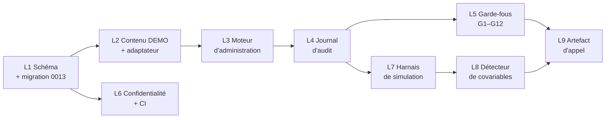

# Démonstration `P` — spécification de construction

**Date :** 2026-09-28
**Statut :** `SPÉCIFICATION / PRÊTE À EXÉCUTER` — aucune ligne de code écrite à ce stade.
**Objet :** l'étape `P` de la séquence recommandée de `docs/research/cbarq-breiz-integration.md` §10.3 — une mécanique d'administration complète sur items factices, à présenter à l'appel Penn d'octobre 2026.
**Dépend de :** `docs/research/cbarq-breiz-integration.md` (conception), décisions produit du 2026-09-22 (`D.1` à `D.3`).

Conventions de maturité identiques au document de conception : `[ÉTABLI]`, `[DÉCIDÉ 22/09]`, `[PROPOSÉ]`, `[HYPOTHÈSE]`, `[BLOQUÉ-LICENCE]`.

---

## 1. Ce que `P` doit prouver, et rien d'autre

`P` n'est pas la version 1 du produit. C'est un artefact d'argumentation, construit pour répondre à trois questions que Penn posera, avec du code qui tourne plutôt qu'avec des intentions décrites.

| Question de l'appel | Ce que `P` montre |
|---|---|
| **Q1.d** — accepteriez-vous le séquentiel **à condition** que son effet soit mesuré ? | Le dispositif de covariables de segmentation, **et** la preuve qu'il détecte réellement un effet de position quand il y en a un (§7) |
| **Q7** — des empreintes suffisent-elles comme preuve de fidélité ? | Un journal chaîné réel, une altération détectée en direct |
| **Contrainte 4** — que faites-vous du contenu licencié ? | Une mécanique complète qui n'a jamais manipulé un seul item réel |

**Le critère de réussite de `P` :** à la fin de l'appel, Penn doit avoir vu une administration séquentielle complète se dérouler, être coupée, reprise, expirée, auditée et analysée — sur un instrument factice de 24 items — et comprendre que brancher le vrai instrument consiste à remplacer un fichier de contenu, pas à écrire un système.

### 1.1 Hors périmètre, explicitement

Ces exclusions ne sont pas des reports par manque de temps : ce sont des refus de principe, à énoncer devant Penn.

| Exclu | Raison |
|---|---|
| Texte d'item réel, intitulés de section réels, échelles réelles | `[BLOQUÉ-LICENCE]` — et c'est précisément la démonstration |
| Règles de scoring officielles | `[BLOQUÉ-LICENCE]` — `P` utilise un scoring factice nommé `DEMO_SUM_V0`, jamais présenté comme un score C-BARQ |
| Intégration LLM de Breiz | `[ÉTABLI]` Aucun runtime LLM n'existe dans le dépôt. `P` n'utilise que des gabarits fixes — ce qui **démontre mieux** la séparation des canaux qu'un LLM ne le ferait |
| Interface mobile | `[ÉTABLI]` `ChatScreen.tsx` est une maquette statique. `P` est piloté par un harnais en ligne de commande |
| Couplage ELI | `[ÉTABLI]` Gate #118 — `eli-engine` n'est câblé à rien |
| Consentement en interface, portrait, restitution narrative | Hors argument de l'appel |
| Traduction française | Q3, bloquant produit mais pas bloquant `P` |

### 1.2 Aucun conflit ne bloque `P`

Vérification faite sur les onze conflits `C1` à `C11` du document de conception : **aucun n'empêche de construire `P`**, à condition d'expédier les valeurs par défaut conservatrices.

| Conflit | Effet sur `P` |
|---|---|
| `C1` fatigue | `fatigueResponseMode = 'silent_flag'` par défaut → le drapeau est calculé et journalisé, rien n'atteint le client. `P` démontre les trois modes par configuration, sans en imposer un |
| `C2` intitulés de section | `titleIsPartOfInstrument = false` par défaut → `P` montre le mécanisme sur un intitulé `DEMO_SECTION_A`, drapeau activable |
| `C3` contrôles de séance | Correction déjà spécifiée → `P` implémente le registre figé |
| `C4` rituel du seuil | Déjà tranché, niveau 3 retiré → `P` n'a aucun accès capteur, ce qui est aussi le test G9 |
| `C5` segmentation | C'est l'objet de `P` |
| `C6` statut scientifique | Correction déjà spécifiée → `P` implémente plafond + calcul à la clôture |
| `C7` relances | Sous-budget ; `P` journalise, n'envoie rien (pas de canal de notification dans le harnais) |
| `C8` échéance | `P` implémente l'alerte avec le gabarit factuel et le test de lexique de perte |
| `C9` portrait | Hors périmètre de `P` |
| `C10` télémétrie | Liste fermée par défaut ; `P` simule les trois signaux |
| `C11` points de coupure | `authority = 'emopet_proposed'` sur la totalité du jeu `DEMO_` → c'est justement la question à poser |

**Conséquence utile :** les cinq arbitrages qui vous reviennent (`C1`, `C7`, `C8`, `C9`, `C10`) peuvent être rendus **après** `P`, en connaissance de cause, en regardant le comportement réel plutôt qu'une description. `P` transforme cinq décisions abstraites en cinq décisions informées.

---

## 2. Portes du dépôt à franchir

Section la plus importante de cette spécification. Le dépôt impose des invariants déclaratifs et des tests statiques qu'une implémentation naïve casserait. Tous sont `[ÉTABLI]` par lecture du code.

### 2.1 Numérotation de migration — contrainte dure

`backend/test/migration-baseline-static.test.mjs` impose que les préfixes de migration soient **uniques et contigus depuis `0001`**. La dernière migration active est `0012_ai_zero_durable_write_guard.sql`.

> La migration de `P` **doit** s'appeler `0013_<nom>.sql`. Pas `0013b`, pas de saut, pas deux fichiers `0013`.

Si un autre travail en cours prend `0013`, `P` prend le numéro suivant — mais un seul.

### 2.2 Toute table Drizzle doit avoir un `CREATE TABLE`

Le même test vérifie que **chaque** nom passé à `pgTable()` dans `backend/db/schema/*.ts` possède un `CREATE TABLE` quelque part dans `backend/db/baseline-draft/` + `backend/db/migrations/`, et que tout `ALTER TABLE` cible une table créée **plus tôt** dans la séquence.

Conséquences pour `P` :
- les huit nouvelles tables doivent être créées dans `0013`, avec des noms identiques à ceux des `pgTable()` ;
- les colonnes ajoutées à `behavioral_assessments` passent par `ALTER TABLE` dans `0013` — licite, la table est créée en `0005` `[ÉTABLI]` ;
- rien ne va dans `baseline-draft/`, réservé au socle historique.

### 2.3 Registres de confidentialité déclaratifs

`config/privacy/` contient quatorze fichiers JSON qui décrivent la topologie de données et sont contre-vérifiés par des tests. Les nouvelles tables doivent y être déclarées, sinon la couverture RGPD devient fausse en silence.

| Fichier | Ce qu'il faut ajouter |
|---|---|
| `retention-schedule.json` | `[ÉTABLI]` 22 catégories, dont `behavioral_assessment_product`. **Une catégorie nouvelle** `instrument_administration_audit` est nécessaire : le journal d'audit a une durée de vie différente des réponses — il peut devoir survivre à l'effacement des réponses pour prouver la conformité d'administration (question ouverte Q12) |
| `dog-erasure-topology.json` | `[ÉTABLI]` déclare déjà `behavioral_assessments.dog_id`, `behavioral_responses`, `behavioral_factor_scores`, `eli_behavioral_priors`. Ajouter `administration_sessions` et `instrument_administration_events` par transitivité `assessment_id` |
| `data-inventory.json` | Ajouter la catégorie correspondante |
| `dog-export-coverage.json` | `[ÉTABLI]` `claimsCompleteDogExport: false`. Les nouvelles tables entrent en `notProjected` ou en exclusion justifiée — ne pas dégrader la promesse d'export |
| `account-erasure-topology.json`, `subject-persistence-privacy-coverage.json` | Vérifier et compléter |

Les **registres d'instrument** (`instruments`, `instrument_versions`, `instrument_items`, `instrument_sections`, `instrument_breakpoints`, `instrument_administration_policies`) ne contiennent **aucune donnée personnelle** : ce sont des métadonnées de contenu licencié. Ils doivent être déclarés comme telles, explicitement, pour qu'un audit futur ne les traite pas comme des données sujet.

### 2.4 Découverte de sujet RGPD

`backend/api/services/subject-discovery.ts` `[ÉTABLI]` compte déjà les lignes `behavioralAssessments`, `behavioralResponses`, `behavioralFactorScores` par sujet, avec séparation produit/recherche. `administration_sessions` et `instrument_administration_events` doivent y être ajoutés, sinon une demande d'accès sous-déclare les données détenues.

### 2.5 Déclenchement CI

`.github/workflows/p0-db-baseline.yml` `[ÉTABLI]` est **déclenché par chemin** — une longue liste explicite de `paths:`. Un nouveau fichier hors de cette liste ne fait tourner aucune validation.

> Ajouter à `paths:` : `backend/db/schema/instruments.ts`, `backend/api/services/instrument-*.ts`, `backend/test/instrument-*.test.mjs`, `config/instruments/**`.

C'est le genre d'oubli qui donne une CI verte sans avoir rien vérifié.

### 2.6 Conventions de test

`[ÉTABLI]` Le dépôt a un style très caractéristique, à imiter sans le réinventer :

- `backend/test/*.test.mjs`, lancés par `node --test test/*.test.mjs` (pas de vitest côté backend) ;
- `node:test` + `node:assert/strict` ;
- **les invariants de schéma sont testés par assertion sur le texte source** — le test lit `backend/db/schema/*.ts` et la migration `.sql`, puis vérifie des motifs. Exemple `[ÉTABLI]` : `ai-zero-durable-retention-db-guard.test.mjs` fait `assert.match(schema, /check\('chk_ai_messages_no_durable_persistence', sql`false`\)/)` ;
- suffixe `.integration.test.mjs` pour ce qui exige PostgreSQL ;
- les tests vérifient aussi que les registres JSON de `config/privacy/` sont cohérents avec le code.

Ce style est un cadeau pour `P` : la majorité des garde-fous G1 à G12 se testent **sans base de données**, par lecture du source.

---

## 3. Lots de travail

Neuf lots. Chacun porte ses fichiers, sa définition de terminé, ses dépendances. Les tailles sont relatives (S/M/L), pas des estimations horaires.

### Lot 1 — Schéma et migration · `M` · sans dépendance

> **État : `FAIT` (2026-09-28).** Magasin privé : **option C** retenue par le fondateur — structure en base, texte licencié dans le magasin privé. Vérifié : typecheck backend propre ; 304 tests backend, 0 échec ; séquence complète socle + 13 migrations appliquée sur PostgreSQL 16 jetable ; `0013` réappliquée sans erreur (idempotente) ; 20 cas de contrainte testés, dont 14 rejets tous imputés à la contrainte visée.
>
> **Écart connu, à combler par L6 :** `administration_sessions` et `instrument_administration_events` sont des descendantes transitives de `dogs` via `behavioral_assessments.dog_id`, et ne sont pas encore déclarées dans `config/privacy/dog-erasure-topology.json` (`transitiveDescendants`) ni dans la matrice de disposition. Aucun test n'échoue — ces listes sont comparées config contre config, sans introspection de PostgreSQL — mais la topologie déclarée est donc **incomplète** tant que L6 n'est pas fait. À ne pas laisser passer en production.

**Fichiers**
- `backend/db/schema/instruments.ts` *(nouveau)* — les six tables de registre
- `backend/db/schema/instrument-administration.ts` *(nouveau)* — `administration_sessions` + `instrument_administration_events`. **Écart assumé par rapport à la spec initiale**, qui prévoyait un seul fichier : les registres sont référencés par `behavioral_assessments` (version, politique), qui est elle-même référencée par les tables de runtime. Un fichier unique aurait créé un import circulaire ; la séparation garde chaque import unidirectionnel.
- `backend/db/schema/behavioral-assessments.ts` — colonnes additives `version_id`, `policy_id`, `lifecycle_state`, `window_ends_at`
- `backend/db/schema/index.ts` — exports des deux nouveaux fichiers
- `backend/db/migrations/0013_instrument_administration.sql` *(nouveau)*

**Contenu** — tel que spécifié dans le document de conception §3.2.1, §3.2.2, §3.2.2 bis, §3.2.3, §3.2.4, §3.2.5. Les contraintes `CHECK` sont la substance, pas de la décoration :

| Contrainte | Ce qu'elle rend impossible |
|---|---|
| `chk_event_item_presentation` | Journaliser une présentation d'item impliquant un LLM ou sans empreinte de rendu |
| `chk_event_section_title` | Idem pour un intitulé de section |
| `chk_session_reminder_cap` | Une troisième relance (`D.1.5`) |
| `chk_breakpoint_authority` | Un point de coupure sans autorité déclarée |
| `chk_policy_fatigue_mode` | Un mode de fatigue hors des trois valeurs |
| `chk_instrument_version_license` | Un statut de licence inventé |

**Terminé quand** : `pnpm --filter @emopet/api typecheck` passe ; `node --test test/migration-baseline-static.test.mjs` passe (contiguïté `0013`, toutes tables créées, aucun `ALTER` prématuré) ; la migration s'applique sur une base vide **et** sur une base déjà migrée jusqu'à `0012`.

> **Piège à éviter.** Ne pas régénérer les migrations avec `drizzle-kit generate`. `[ÉTABLI]` Les douze migrations existantes sont écrites à la main et le test statique vérifie leur forme. Écrire `0013` à la main, dans le même style.

### Lot 2 — Contenu factice et adaptateur de magasin · `M` · dépend de L1

> **État : `FAIT` (2026-09-28).** Vérifié : 12 tests dédiés, tous verts ; 316 tests backend, 0 échec ; `shared`, `eli-engine`, `ai-personality`, `ble-protocol` et `privileged-auth` passent après modification du paquet `shared`. Scan du dépôt : **toute** clé d'item versionnée est `DEMO_ITEM_*`, toute clé de section `DEMO_SECTION_*`.
>
> *(`@emopet/web` échoue au build dans ce conteneur faute de pouvoir télécharger Fraunces, Instrument Sans et JetBrains Mono depuis Google Fonts — restriction réseau, sans lien avec ce lot.)*
>
> **Quatre écarts par rapport à la spec initiale, tous assumés :**
>
> 1. **Empreinte calculée contre un `versionRef` stable** (`code:version:locale`) et non contre l'`uuid` de la ligne en base, comme l'indiquait le document de conception. Un `uuid` rendrait l'empreinte incalculable avant l'existence de la ligne et différente après un réamorçage de la base. Le triplet stable permet de la calculer à l'ingestion, de la recalculer avant chaque présentation et de la comparer entre environnements.
> 2. **Pas de second fichier de fixture invalide.** `validateBundle()` est exporté, donc n'importe quel défaut s'exerce sur une copie mutée en mémoire. Treize cas de rejet sont testés, dont celui du « point de coupure mal placé » : une coupure déclarée `section_boundary` là où aucune section ne finit laisserait le moteur scinder une section en rapportant le contraire. Un fichier cassé de moins à maintenir, et une couverture plus large.
> 3. **Les méthodes de `SecretStoreContentStore` sont `async`.** Une méthode dont la signature promet une `Promise` doit rejeter, pas lever de façon synchrone — sinon chaque appelant a besoin d'un `try/catch` *et* d'un `.catch`.
> 4. **Les sous-échelles traversent délibérément les frontières de section** dans le contenu factice (4 sous-échelles de 6 items, 3 sections de 8). Une sous-échelle est un regroupement de scoring, une section un regroupement de présentation : le contenu factice rend impossible de confondre les deux par accident, et un test le vérifie.
>
> **Ce que le magasin refuse**, en plus des treize cas de validation : servir un contenu dont la licence n'est pas `demo_only` depuis le dépôt (la seule erreur qui mettrait du contenu licencié dans git), et servir quoi que ce soit sous `not_proven`, `expired` ou `revoked`. Une licence `granted` route vers le magasin réel non implémenté — donc **échoue bruyamment** plutôt que de servir du contenu factice comme s'il était l'instrument.

**Fichiers**
- `config/instruments/demo-instrument-v0.json` *(nouveau)* — l'instrument factice, versionné dans le dépôt parce qu'il est **factice**
- `packages/shared/src/instruments/types.ts` *(nouveau)* — types opaques `ItemKey`, `SectionKey`, `InstrumentReference`
- `backend/api/services/instrument-content-store.ts` *(nouveau)* — l'adaptateur

**L'adaptateur est le cœur de la démonstration.** Une interface, deux implémentations :

```ts
// [PROPOSÉ] Illustratif.
interface InstrumentContentStore {
  readItem(versionId: string, itemKey: ItemKey): Promise<SealedItemPayload>;
  readSectionTitle(versionId: string, sectionKey: SectionKey): Promise<SealedTitlePayload>;
  bundleDigest(versionId: string): Promise<string>;
}

// P n'implémente que celui-ci. Lit config/instruments/demo-instrument-v0.json.
class DemoContentStore implements InstrumentContentStore { /* … */ }

// Signature présente, corps jetant NotLicensedError. C'est volontaire :
// la forme du branchement est montrée, le branchement n'est pas fait.
class SecretStoreContentStore implements InstrumentContentStore { /* … */ }
```

`SecretStoreContentStore` doit exister **en signature seulement**, avec un corps qui échoue. Montrer à Penn que la place du contenu licencié est déjà découpée, vide, et qu'elle attend un contrat.

**L'instrument factice** : 24 items, 3 sections de 8, échelle ordinale 0–4, 2 items marqués `reverseScored`, 1 item avec `allowsNotApplicable`. Clés `DEMO_ITEM_01` à `DEMO_ITEM_24`, sections `DEMO_SECTION_A/B/C`. Les textes sont délibérément absurdes et non comportementaux — par exemple *« DEMO — quelle est la couleur de la porte ? »* — pour qu'aucun lecteur ne puisse les confondre avec un instrument réel, même hors contexte.

Points de coupure : 2 frontières de section (après 08 et 16) + 4 intra-section (après 04, 12, 20, et un cinquième mal placé volontairement rejeté par le test du Lot 5).

**Terminé quand** : le store lit les 24 items, `renderDigest` calculé à l'ingestion correspond au recalcul, `bundleDigest` est stable entre deux lectures.

### Lot 3 — Moteur d'administration · `L` · dépend de L1, L2

**Fichiers**
- `backend/api/services/instrument-administration.ts` — machine à états
- `backend/api/services/instrument-session-sizing.ts` — dimensionnement `D.1.1`/`D.2.1`
- `backend/api/services/instrument-breakpoints.ts` — sélection en liste blanche `D.2.2`
- `backend/api/services/instrument-validity.ts` — contrôles §4.3 + fatigue §4.3 bis

**Machine à états** : les deux niveaux du document de conception §4.1 et §4.2, états additionnels portés par `lifecycleState` pour ne pas casser la contrainte `CHECK` existante sur `status` `[ÉTABLI]`.

Le dimensionnement doit refuser toute clé absente de `adaptiveSignals` — **échec bruyant, jamais repli silencieux**. C'est la moitié du garde-fou `C10`.

**Terminé quand** : une administration de 24 items peut être ouverte, coupée à chaque point de coupure légal, mise en pause en milieu de séance, reprise à l'item exact, enchaînée, et menée à `SCORED` ; une reprise au-delà de `maxSessionGapHours` mène à `EXPIRED` ; une fenêtre dépassée mène à `PARTIAL_RETAINED` avec réponses intactes.

### Lot 4 — Journal d'audit · `M` · dépend de L1, L3

**Fichier** : `backend/api/services/instrument-audit-journal.ts`

Deux mécanismes, tous deux démontrables devant Penn :

1. **Chaînage** — `eventHash = sha256(prevEventHash ‖ sequenceIndex ‖ eventType ‖ itemKey ‖ renderDigest ‖ occurredAt)`. Écriture strictement append-only, `sequenceIndex` unique par administration.
2. **Covariables** — `positionInSession`, `itemsSinceResume`, `hoursSincePreviousItem`, `crossedSectionBoundary`, `isFirstItemAfterPause`, calculées au moment de la présentation et non reconstituées après coup.

**Terminé quand** : un vérificateur `verifyChain(assessmentId)` renvoie `VALID` sur une administration intacte et pointe l'index exact du premier événement altéré sinon. Ce vérificateur est un livrable de l'appel, pas un utilitaire interne.

### Lot 5 — Garde-fous · `L` · dépend de L1 à L4

Les tests sont le produit, pas la vérification du produit. Répartition selon les conventions du dépôt §2.6 :

| Test | Fichier | Base ? | Couvre |
|---|---|---|---|
| `instrument-fidelity-guard.test.mjs` | source | non | G2, G3, G4 — assertions sur le texte du schéma et de la migration |
| `instrument-sensor-embargo.test.mjs` | source + graphe | non | **G9** — aucun `import` du module d'administration n'atteint un module capteur/ELI |
| `instrument-breakpoint-whitelist.test.mjs` | unitaire | non | G10 — le cinquième point de coupure mal placé du Lot 2 est refusé |
| `instrument-order-invariance.test.mjs` | propriété | non | G11 — 100 profils d'engagement, séquence de positions identique |
| `instrument-session-controls.test.mjs` | unitaire | non | G12 — registre figé exhaustif, aucun lexique d'échelle |
| `instrument-no-licensed-content.test.mjs` | CI bloquant | non | G8 — toute clé d'item versionnée porte le préfixe `DEMO_` |
| `instrument-reminder-cap.integration.test.mjs` | intégration | **oui** | `D.1.5` — la 3ᵉ relance est rejetée par PostgreSQL |
| `instrument-audit-chain.integration.test.mjs` | intégration | **oui** | Chaînage et détection d'altération |
| `instrument-deadline-lexicon.test.mjs` | source | non | `C8` — aucun gabarit d'alerte ne contient de lexique de perte |

**G9 mérite un mot.** Le test le plus fort n'est pas celui qui vérifie les noms de champs, mais celui qui **fait varier toute la donnée capteur et constate que la segmentation produite est identique** — il prouve l'indépendance même si un chemin d'influence avait été introduit sous un nom non suspect. C'est le test à montrer à Penn pour `D.2.4`.

**Terminé quand** : `pnpm --filter @emopet/api test` passe en entier, y compris les 85 fichiers de test existants `[ÉTABLI]`, sans régression.

### Lot 6 — Registres de confidentialité et CI · ~~`S`~~ `M` · dépend de L1

> **État : `FAIT` (2026-09-28).** L'écart de topologie déclarée laissé par L1 est refermé. Vérifié : 304 tests backend, 0 échec ; topologie, résidu d'effacement et découverte de sujet passent contre la base **générée** (voir l'avertissement ci-dessous). `p0-generated-baseline` et le cluster jetable ont été supprimés.
>
> **Le lot s'est révélé plus gros que prévu (`S` → `M`).** Déclarer deux tables oblige à traverser toute la chaîne de registres, parce qu'ils sont vérifiés les uns contre les autres : `dog-erasure-topology` → `dog-subject-lineage` → `erasure-disposition-matrix` → `erasure-disposition-decision-packet` → `erasure-conditional-semantics`, plus quatre tests qui encodent des compteurs exacts. C'est la chaîne qui fait la valeur du dispositif, mais il faut la budgéter : deux lignes de schéma coûtent cinq registres et quatre tests.
>
> **Décision de classification prise, à faire valider.** Les deux tables sont classées `POLICY_CONDITIONAL_EXECUTION_REQUIRED`, comme leurs sœurs `behavioral_responses` et `behavioral_factor_scores`, et inscrites en `authorityDecisionsRemaining` :
> - `administration_sessions` → autorité `RESEARCH_LEGAL_GOVERNANCE`, parce qu'une séance hérite du partage produit/recherche de son administration parente ;
> - `instrument_administration_events` → autorité `INSTRUMENT_LICENCE_PRIVACY_LEGAL`, parce que le droit à l'effacement et une obligation contractuelle de preuve de conformité peuvent pointer en sens inverse. C'est la question ouverte sur la survie du journal, laissée ouverte et non tranchée.
>
> Rien ne devient exécutable : toutes les lignes restent `TO_CONFIRM` / `NOT_IMPLEMENTED` / `promotionAuthorized: false`. Je n'ai **pas** classé le journal en `LEGAL_AUTHORITY_BLOCKED` : un test impose que les bloqueurs légaux soient exactement trois entrées nommées, et y toucher serait un acte de gouvernance, pas de tenue de registre.

Application de §2.3, §2.4, §2.5.

**Terminé quand** : les tests de confidentialité existants passent ; `p0-db-baseline.yml` se déclenche effectivement sur une modification d'un fichier `instrument-*`.

#### Défaut préexistant trouvé au passage, non corrigé

`[ÉTABLI]` La CI expose l'étape « PRIV-ERASURE-TOPOLOGY generated database parity » avec `PRIVACY_ERASURE_TOPOLOGY_DB_INTEGRATION: '1'`, mais `backend/test/privacy-erasure-topology.integration.test.mjs` lit `PRIVACY_TOPOLOGY_DB_INTEGRATION`. **Les noms diffèrent, donc la moitié « base de données » de ce test ne s'exécute jamais en CI** : l'étape passe au vert en ne comparant que des fichiers JSON entre eux.

Ce n'est pas corrigé ici, et délibérément. En activant la variable localement contre la base construite **par les migrations**, le test échoue sur une dérive préexistante : `auth_refresh_sessions`, `behavioral_assessments`, `communities`, `community_events` et `community_reports` portent chacune **deux** FK sur la même colonne (une `NO_ACTION` héritée du socle, une `SET_NULL` ajoutée par `0006`/`0008`/`0009`), et `user_config.user_id` manque. Cause : les `DROP CONSTRAINT IF EXISTS` de ces migrations nomment des contraintes que le socle n'avait pas créées sous ce nom.

La même suite passe contre la base **générée** par Drizzle, qui est celle que la CI teste réellement. Le défaut est donc latent, pas actif — mais renommer la variable rendrait la CI rouge pour des raisons antérieures à ce chantier. **C'est un arbitrage à prendre séparément**, avec deux options : réconcilier les migrations pour que les deux chemins convergent, ou acter que seule la base générée fait foi et retirer l'étape trompeuse.

### Lot 7 — Harnais de simulation · `M` · dépend de L1 à L4

**Fichier** : `scripts/instruments/simulate-administration.mjs`

Style aligné sur les scripts existants `[ÉTABLI]` (`scripts/content/legacy-freemium-authority-audit.mjs`, invoqué par un script `package.json`).

```
node scripts/instruments/simulate-administration.mjs \
  --policy SEQUENTIAL_OWNER_PACED \
  --owners 400 \
  --profile mixed \
  --inject-position-effect 0.0 \
  --seed 42 \
  --out .data/demo-p/
```

Profils de propriétaire simulés : `sprinter` (enchaîne tout), `grazer` (une séance par jour), `abandoner` (s'arrête à mi-parcours), `mixed`. Sorties : réponses, journal d'audit complet, statut scientifique calculé par administration.

**Terminé quand** : 400 administrations simulées produisent des journaux dont la chaîne vérifie, et une distribution de `scientificUseStatus` cohérente avec les profils — les `sprinter` atteignant `scoring_allowed` si le plafond de politique l'autorise.

### Lot 8 — Détecteur de covariables · `M` · dépend de L7

**Fichier** : `scripts/instruments/analyse-segmentation-effect.mjs`

C'est la pièce qui répond à `Q1.d`. Détail en §7, parce que sa conception est l'idée centrale de `P`.

### Lot 9 — Assemblage de l'artefact d'appel · `S` · dépend de tout

Voir §8.

---

## 4. Ordre d'exécution



Chemin critique : `L1 → L2 → L3 → L4 → L7 → L8 → L9`. `L5` et `L6` sont parallélisables et ne bloquent que l'assemblage final.

**Si le temps manque avant octobre**, l'ordre de sacrifice est : `L9` (montrer les sorties brutes plutôt qu'un artefact soigné), puis la partie intégration de `L5`, puis `L6` — qui devient alors une dette à inscrire explicitement, jamais un oubli. `L1` à `L4`, `L7` et `L8` sont irréductibles : sans eux il n'y a pas d'argument.

---

## 5. Le scoring factice, et pourquoi il doit être laid

`P` a besoin d'atteindre l'état `SCORED` pour démontrer la machine à états complète. Il ne peut pas utiliser les règles officielles `[BLOQUÉ-LICENCE]`.

`[PROPOSÉ]` Méthode `DEMO_SUM_V0` : moyenne arithmétique par section, items inversés inversés, sous-échelle refusée si plus de 25 % d'items manquants. Aucune prétention psychométrique.

Trois précautions, à tenir fermement :

1. `scoringMethod = 'DEMO_SUM_V0'` et `scoringVersion = 'not-a-cbarq-scoring-rule'` — le nom lui-même refuse la confusion ;
2. `publicationState` reste `'withheld'` en permanence dans `P`. Aucun score, même factice, ne traverse une surface de présentation ;
3. un test vérifie qu'aucune constante de scoring réel n'existe dans le dépôt.

La tentation, en construisant `P`, sera d'écrire un scoring « plausible » pour que la démonstration soit plus jolie. Il faut y résister : un scoring plausible dans le dépôt est un scoring qui ressemble à du contenu licencié, et c'est exactement ce que la contrainte 4 interdit. **Un scoring visiblement faux est une garantie, pas une faiblesse.**

---

## 6. Ce que `P` ne peut pas prouver

À dire avant que Penn ne le demande.

- **Aucune validité psychométrique.** `P` montre un dispositif, pas un résultat. Les données sont synthétiques, donc le seul fait démontrable est que l'appareil de mesure fonctionne.
- **Aucune preuve que la segmentation est sans effet.** Cette question ne peut se trancher que sur données réelles, sous licence, avec un volume suffisant `[HYPOTHÈSE]`.
- **Aucune validation de la traduction.** Q3 reste entièrement ouverte ; `P` est en français factice.
- **Aucune démonstration de l'expérience réelle.** Sans interface mobile, `P` ne montre pas si les micro-séances sont agréables. C'est une question d'utilisabilité, à traiter séparément.

---

## 7. Le détecteur de covariables — cœur de `P`

C'est la partie qui mérite le plus de soin, parce que c'est celle qui répond à `Q1.d`, et parce qu'elle contient un piège méthodologique facile à manquer.

### 7.1 Le piège

L'approche naïve consisterait à simuler 400 administrations séquentielles, lancer l'analyse, constater qu'aucun effet de position n'apparaît, et le présenter comme rassurant.

**Ce serait vide de sens, et Penn le verra immédiatement.** Les données sont synthétiques : si le générateur n'injecte aucun effet de position, l'analyse n'en trouvera aucun. On n'aurait démontré que la cohérence du simulateur avec lui-même.

### 7.2 Ce qu'il faut démontrer à la place

Non pas *« notre administration n'a pas d'effet de position »* — indémontrable ici — mais :

> **« Voici un détecteur d'effet de position. Voici la preuve qu'il en trouve un quand il y en a un, et qu'il n'en invente pas quand il n'y en a pas. Sous licence, nous le braquerons sur les données réelles et nous vous transmettrons le résultat, quel qu'il soit. »**

C'est une promesse vérifiable plutôt qu'une assurance, et c'est ce qui rend `Q1.d` répondable.

### 7.3 Protocole en trois passes

Le paramètre `--inject-position-effect δ` du harnais L7 ajoute un biais δ aux réponses selon la position de l'item dans la séance.

| Passe | δ injecté | Ce qui doit sortir |
|---|---|---|
| **A — puissance** | `0.4` | Le détecteur trouve l'effet, estime δ̂ ≈ 0,4, intervalle excluant zéro |
| **B — spécificité** | `0.0` | Le détecteur ne trouve rien, intervalle contenant zéro |
| **C — sensibilité** | `0.1`, `0.2`, `0.3` | Courbe : à partir de quel δ et de quel nombre d'administrations l'effet devient détectable |

La passe C est la plus précieuse des trois pour la négociation : elle répond à *« combien d'administrations vous faut-il avant de pouvoir dire quelque chose ? »* — par un nombre, pas par une intention. Elle transforme aussi une conversation de principe en conversation de protocole.

### 7.4 Forme de l'analyse

`[PROPOSÉ]` Modèle à effets mixtes : réponse ~ position dans la séance + items depuis la reprise + franchissement de frontière, avec effet aléatoire par propriétaire simulé et par item. L'ordre étant fixe `D.2.3`, la position canonique de l'item est une constante et non une covariable — c'est exactement ce qui rend le modèle identifiable, et c'est l'argument technique de `D.2.3`.

`[HYPOTHÈSE]` La spécification exacte du modèle devrait être soumise à Penn plutôt que décidée seule. Proposer le modèle, pas l'imposer, fait partie de l'argument : une équipe qui arrive avec une méthode d'analyse ouverte à la critique est plus crédible qu'une équipe qui arrive avec un résultat.

**Contrainte de dépendances :** `[ÉTABLI]` le dépôt a une politique de dépendances stricte — `minimumReleaseAge`, `trustPolicy: no-downgrade`, `blockExoticSubdeps` dans `pnpm-workspace.yaml`. N'ajouter aucune bibliothèque statistique sans revue. Un modèle mixte simple s'implémente en JavaScript sans dépendance, ou l'analyse s'exécute hors dépôt sur les données exportées par L7. **Recommandé** : export CSV par L7, analyse hors dépôt, script d'export versionné. Cela évite d'introduire une dépendance lourde pour un artefact de démonstration.

---

## 8. L'artefact d'appel

Ce que vous ouvrez réellement devant Penn. Quatre pièces, pas plus.

1. **Une administration filmée, 90 secondes.** Le harnais déroulant une administration séquentielle complète : micro-séance, coupure à une frontière, pause en milieu de séance, reprise à l'item exact, enchaînement, clôture. Les items visibles sont `DEMO — quelle est la couleur de la porte ?`. Le fait que l'instrument soit visiblement faux est le message.

2. **Une altération détectée en direct.** Modifier un octet du contenu factice, relancer, montrer le refus de présentation et l'invalidation. Puis altérer un événement passé du journal et montrer `verifyChain` pointant l'index exact. Réponse à `Q7`, en trente secondes.

3. **Les trois passes du détecteur.** Un tableau et une courbe : effet injecté vs effet retrouvé, et le seuil de détectabilité par volume. Réponse à `Q1.d`.

4. **Une page de provenance.** Instrument `DEMO_V0`, version, statut de licence `demo_only`, méthode de scoring `DEMO_SUM_V0`, statut scientifique `not_equivalent`, jeu de points de coupure `emopet_proposed`. En JetBrains Mono `[ÉTABLI, BRAND-AUTHORITY-001]`. C'est l'idée 6.6 du document de conception, utilisée pour la première fois — et elle montre que chaque champ que la licence exigera a déjà sa place.

**Ce qu'il ne faut pas montrer** : ni maquette d'interface léchée, ni restitution narrative, ni portrait. `P` est un argument d'ingénierie et de méthode. Ajouter du produit dilue le message et invite des questions hors sujet.

---

## 9. Risques

| Risque | Probabilité | Atténuation |
|---|---|---|
| L'appel avance ou glisse | Moyenne | Le chemin critique `L1→L4, L7, L8` est irréductible ; le reste est sacrifiable dans l'ordre de §4 |
| Régression sur les 85 fichiers de test existants | Moyenne | `L1` touche `schema/index.ts`, lu par les services de confidentialité. Lancer la suite complète à chaque lot, pas seulement à la fin |
| Migration `0013` prise par un autre travail | Faible | Vérifier juste avant d'écrire ; un seul numéro, contigu |
| Dérive de périmètre vers le produit | **Élevée** | C'est le risque principal. `P` est un artefact d'appel. Toute demande d'interface, de portrait ou de restitution est un autre chantier |
| Tentation d'un scoring plausible | Moyenne | §5 — un scoring visiblement faux est une garantie |
| Penn refuse le séquentiel malgré `P` | Réelle | §10.3 du document de conception : la bascule sur `STANDARD_2S` conserve tout sauf les micro-séances |

Le risque de dérive de périmètre mérite d'être pris au sérieux. Une démonstration qui tourne donne envie de la montrer à des investisseurs, puis de l'enjoliver, puis de la brancher sur l'application. `P` n'est pas conçue pour ça et n'y résisterait pas : pas d'authentification, pas de consentement, pas d'interface. Il vaut mieux l'assumer comme un banc d'essai jetable.

---

## 10. Autorisation requise avant exécution

Cette spécification s'arrête ici volontairement. Les missions précédentes portaient la contrainte **« aucun code de production »**, et les neuf lots ci-dessus sont du code de production dans `backend/` : schéma, migration, services, tests, configuration de confidentialité, workflow CI.

Pour exécuter, il faut lever cette contrainte, explicitement, et de préférence par lots — `L1` seul est un bon premier pas, il est autonome, vérifiable par les tests statiques existants, et il ne touche à aucun comportement runtime.

Deux questions à trancher avant la première ligne :

- **`Q13` du document de conception** — magasin privé option A, B ou C ? `P` n'a besoin que du `DemoContentStore`, donc la question peut être différée, mais la signature de `SecretStoreContentStore` dépend du choix.
- **Périmètre `P` confirmé ?** Notamment : `P` sans interface mobile et sans LLM est-il acceptable comme artefact d'appel, ou attendez-vous quelque chose de montrable à un public non technique ?

---

**Fin du document.** Aucun fichier de code n'a été modifié. Aucun texte d'item licencié ne figure dans ce document ni dans le dépôt.
