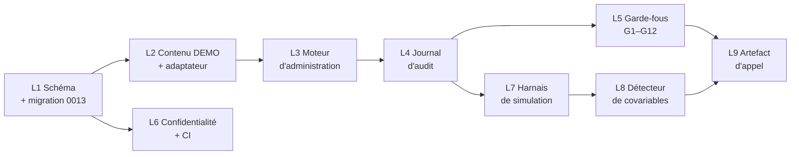

# Démonstration `P` — spécification de construction

**Date :** 2026-09-28
**Statut :** `SPÉCIFICATION / PRÊTE À EXÉCUTER` — aucune ligne de code écrite à ce stade.
**Objet :** l'étape `P` de la séquence recommandée de `docs/research/cbarq-breiz-integration.md` §10.3 — une mécanique d'administration complète sur items factices, à présenter à l'appel Penn d'octobre 2026.
**Dépend de :** `docs/research/cbarq-breiz-integration.md` (conception), décisions produit du 2026-09-22 (`D.1` à `D.3`).

Conventions de maturité identiques au document de conception : `[ÉTABLI]`, `[DÉCIDÉ 22/09]`, `[PROPOSÉ]`, `[HYPOTHÈSE]`, `[BLOQUÉ-LICENCE]`.

---

## 1. Ce que `P` doit prouver, et rien d'autre

`P` n'est pas la version 1 du produit. C'est un artefact d'argumentation, construit pour répondre à trois questions que Penn posera, avec du code qui tourne plutôt qu'avec des intentions décrites.

| Question de l'appel | Ce que `P` montre |
|---|---|
| **Q1.d** — accepteriez-vous le séquentiel **à condition** que son effet soit mesuré ? | Le dispositif de covariables de segmentation, **et** la preuve qu'il détecte réellement un effet de position quand il y en a un (§7) |
| **Q7** — des empreintes suffisent-elles comme preuve de fidélité ? | Un journal chaîné réel, une altération détectée en direct |
| **Contrainte 4** — que faites-vous du contenu licencié ? | Une mécanique complète qui n'a jamais manipulé un seul item réel |

**Le critère de réussite de `P` :** à la fin de l'appel, Penn doit avoir vu une administration séquentielle complète se dérouler, être coupée, reprise, expirée, auditée et analysée — sur un instrument factice de 24 items — et comprendre que brancher le vrai instrument consiste à remplacer un fichier de contenu, pas à écrire un système.

### 1.1 Hors périmètre, explicitement

Ces exclusions ne sont pas des reports par manque de temps : ce sont des refus de principe, à énoncer devant Penn.

| Exclu | Raison |
|---|---|
| Texte d'item réel, intitulés de section réels, échelles réelles | `[BLOQUÉ-LICENCE]` — et c'est précisément la démonstration |
| Règles de scoring officielles | `[BLOQUÉ-LICENCE]` — `P` utilise un scoring factice nommé `DEMO_SUM_V0`, jamais présenté comme un score C-BARQ |
| Intégration LLM de Breiz | `[ÉTABLI]` Aucun runtime LLM n'existe dans le dépôt. `P` n'utilise que des gabarits fixes — ce qui **démontre mieux** la séparation des canaux qu'un LLM ne le ferait |
| Interface mobile | `[ÉTABLI]` `ChatScreen.tsx` est une maquette statique. `P` est piloté par un harnais en ligne de commande |
| Couplage ELI | `[ÉTABLI]` Gate #118 — `eli-engine` n'est câblé à rien |
| Consentement en interface, portrait, restitution narrative | Hors argument de l'appel |
| Traduction française | Q3, bloquant produit mais pas bloquant `P` |

### 1.2 Aucun conflit ne bloque `P`

Vérification faite sur les onze conflits `C1` à `C11` du document de conception : **aucun n'empêche de construire `P`**, à condition d'expédier les valeurs par défaut conservatrices.

| Conflit | Effet sur `P` |
|---|---|
| `C1` fatigue | `fatigueResponseMode = 'silent_flag'` par défaut → le drapeau est calculé et journalisé, rien n'atteint le client. `P` démontre les trois modes par configuration, sans en imposer un |
| `C2` intitulés de section | `titleIsPartOfInstrument = false` par défaut → `P` montre le mécanisme sur un intitulé `DEMO_SECTION_A`, drapeau activable |
| `C3` contrôles de séance | Correction déjà spécifiée → `P` implémente le registre figé |
| `C4` rituel du seuil | Déjà tranché, niveau 3 retiré → `P` n'a aucun accès capteur, ce qui est aussi le test G9 |
| `C5` segmentation | C'est l'objet de `P` |
| `C6` statut scientifique | Correction déjà spécifiée → `P` implémente plafond + calcul à la clôture |
| `C7` relances | Sous-budget ; `P` journalise, n'envoie rien (pas de canal de notification dans le harnais) |
| `C8` échéance | `P` implémente l'alerte avec le gabarit factuel et le test de lexique de perte |
| `C9` portrait | Hors périmètre de `P` |
| `C10` télémétrie | Liste fermée par défaut ; `P` simule les trois signaux |
| `C11` points de coupure | `authority = 'emopet_proposed'` sur la totalité du jeu `DEMO_` → c'est justement la question à poser |

**Conséquence utile :** les cinq arbitrages qui vous reviennent (`C1`, `C7`, `C8`, `C9`, `C10`) peuvent être rendus **après** `P`, en connaissance de cause, en regardant le comportement réel plutôt qu'une description. `P` transforme cinq décisions abstraites en cinq décisions informées.

---

## 2. Portes du dépôt à franchir

Section la plus importante de cette spécification. Le dépôt impose des invariants déclaratifs et des tests statiques qu'une implémentation naïve casserait. Tous sont `[ÉTABLI]` par lecture du code.

### 2.1 Numérotation de migration — contrainte dure

`backend/test/migration-baseline-static.test.mjs` impose que les préfixes de migration soient **uniques et contigus depuis `0001`**. À la rédaction, la dernière migration active était `0012_ai_zero_durable_write_guard.sql`.

> La migration de `P` **doit** porter le numéro suivant, en un seul fichier. Pas de suffixe, pas de saut, pas deux fichiers du même numéro.

`[CORRIGÉ 28/09]` C'est précisément ce qui est arrivé : écrite en `0013`, elle est devenue **`0025_instrument_administration.sql`** à la fusion, `main` ayant pris `0013` à `0024` entre-temps. Le contenu n'a pas changé et n'entre en collision avec aucune d'elles. Leçon à retenir pour la prochaine branche longue : **relire le numéro juste avant de pousser**, le test de contiguïté ne voyant que la branche locale.

### 2.2 Toute table Drizzle doit avoir un `CREATE TABLE`

Le même test vérifie que **chaque** nom passé à `pgTable()` dans `backend/db/schema/*.ts` possède un `CREATE TABLE` quelque part dans `backend/db/baseline-draft/` + `backend/db/migrations/`, et que tout `ALTER TABLE` cible une table créée **plus tôt** dans la séquence.

Conséquences pour `P` :
- les huit nouvelles tables doivent être créées dans la migration de `P` (`0025` après fusion), avec des noms identiques à ceux des `pgTable()` ;
- les colonnes ajoutées à `behavioral_assessments` passent par `ALTER TABLE` dans cette même migration — licite, la table est créée en `0005` `[ÉTABLI]`, et sans collision avec les colonnes `household_*` que `main` y ajoute en `0014` ;
- rien ne va dans `baseline-draft/`, réservé au socle historique.

### 2.3 Registres de confidentialité déclaratifs

`config/privacy/` contient quatorze fichiers JSON qui décrivent la topologie de données et sont contre-vérifiés par des tests. Les nouvelles tables doivent y être déclarées, sinon la couverture RGPD devient fausse en silence.

| Fichier | Ce qu'il faut ajouter |
|---|---|
| `retention-schedule.json` | `[ÉTABLI]` 22 catégories, dont `behavioral_assessment_product`. **Une catégorie nouvelle** `instrument_administration_audit` est nécessaire : le journal d'audit a une durée de vie différente des réponses — il peut devoir survivre à l'effacement des réponses pour prouver la conformité d'administration (question ouverte Q12) |
| `dog-erasure-topology.json` | `[ÉTABLI]` déclare déjà `behavioral_assessments.dog_id`, `behavioral_responses`, `behavioral_factor_scores`, `eli_behavioral_priors`. Ajouter `administration_sessions` et `instrument_administration_events` par transitivité `assessment_id` |
| `data-inventory.json` | Ajouter la catégorie correspondante |
| `dog-export-coverage.json` | `[ÉTABLI]` `claimsCompleteDogExport: false`. Les nouvelles tables entrent en `notProjected` ou en exclusion justifiée — ne pas dégrader la promesse d'export |
| `account-erasure-topology.json`, `subject-persistence-privacy-coverage.json` | Vérifier et compléter |

Les **registres d'instrument** (`instruments`, `instrument_versions`, `instrument_items`, `instrument_sections`, `instrument_breakpoints`, `instrument_administration_policies`) ne contiennent **aucune donnée personnelle** : ce sont des métadonnées de contenu licencié. Ils doivent être déclarés comme telles, explicitement, pour qu'un audit futur ne les traite pas comme des données sujet.

### 2.4 Découverte de sujet RGPD

`backend/api/services/subject-discovery.ts` `[ÉTABLI]` compte déjà les lignes `behavioralAssessments`, `behavioralResponses`, `behavioralFactorScores` par sujet, avec séparation produit/recherche. `administration_sessions` et `instrument_administration_events` doivent y être ajoutés, sinon une demande d'accès sous-déclare les données détenues.

### 2.5 Déclenchement CI

`.github/workflows/p0-db-baseline.yml` `[ÉTABLI]` est **déclenché par chemin** — une longue liste explicite de `paths:`. Un nouveau fichier hors de cette liste ne fait tourner aucune validation.

> Ajouter à `paths:` : `backend/db/schema/instruments.ts`, `backend/api/services/instrument-*.ts`, `backend/test/instrument-*.test.mjs`, `config/instruments/**`.

C'est le genre d'oubli qui donne une CI verte sans avoir rien vérifié.

### 2.6 Conventions de test

`[ÉTABLI]` Le dépôt a un style très caractéristique, à imiter sans le réinventer :

- `backend/test/*.test.mjs`, lancés par `node --test test/*.test.mjs` (pas de vitest côté backend) ;
- `node:test` + `node:assert/strict` ;
- **les invariants de schéma sont testés par assertion sur le texte source** — le test lit `backend/db/schema/*.ts` et la migration `.sql`, puis vérifie des motifs. Exemple `[ÉTABLI]` : `ai-zero-durable-retention-db-guard.test.mjs` fait `assert.match(schema, /check\('chk_ai_messages_no_durable_persistence', sql`false`\)/)` ;
- suffixe `.integration.test.mjs` pour ce qui exige PostgreSQL ;
- les tests vérifient aussi que les registres JSON de `config/privacy/` sont cohérents avec le code.

Ce style est un cadeau pour `P` : la majorité des garde-fous G1 à G12 se testent **sans base de données**, par lecture du source.

---

## 3. Lots de travail

Neuf lots. Chacun porte ses fichiers, sa définition de terminé, ses dépendances. Les tailles sont relatives (S/M/L), pas des estimations horaires.

### Lot 1 — Schéma et migration · `M` · sans dépendance

> **État : `FAIT` (2026-09-28).** Magasin privé : **option C** retenue par le fondateur — structure en base, texte licencié dans le magasin privé. Vérifié : typecheck backend propre ; 304 tests backend, 0 échec ; séquence complète socle + migrations appliquée sur PostgreSQL 16 jetable (25 migrations après fusion, 56 tables, identiques au schéma généré) ; la migration réappliquée sans erreur (idempotente) ; 20 cas de contrainte testés, dont 14 rejets tous imputés à la contrainte visée.
>
> **Écart connu, à combler par L6 :** `administration_sessions` et `instrument_administration_events` sont des descendantes transitives de `dogs` via `behavioral_assessments.dog_id`, et ne sont pas encore déclarées dans `config/privacy/dog-erasure-topology.json` (`transitiveDescendants`) ni dans la matrice de disposition. Aucun test n'échoue — ces listes sont comparées config contre config, sans introspection de PostgreSQL — mais la topologie déclarée est donc **incomplète** tant que L6 n'est pas fait. À ne pas laisser passer en production.

**Fichiers**
- `backend/db/schema/instruments.ts` *(nouveau)* — les six tables de registre
- `backend/db/schema/instrument-administration.ts` *(nouveau)* — `administration_sessions` + `instrument_administration_events`. **Écart assumé par rapport à la spec initiale**, qui prévoyait un seul fichier : les registres sont référencés par `behavioral_assessments` (version, politique), qui est elle-même référencée par les tables de runtime. Un fichier unique aurait créé un import circulaire ; la séparation garde chaque import unidirectionnel.
- `backend/db/schema/behavioral-assessments.ts` — colonnes additives `version_id`, `policy_id`, `lifecycle_state`, `window_ends_at`
- `backend/db/schema/index.ts` — exports des deux nouveaux fichiers
- `backend/db/migrations/0013_instrument_administration.sql` *(nouveau)*

**Contenu** — tel que spécifié dans le document de conception §3.2.1, §3.2.2, §3.2.2 bis, §3.2.3, §3.2.4, §3.2.5. Les contraintes `CHECK` sont la substance, pas de la décoration :

| Contrainte | Ce qu'elle rend impossible |
|---|---|
| `chk_event_item_presentation` | Journaliser une présentation d'item impliquant un LLM ou sans empreinte de rendu |
| `chk_event_section_title` | Idem pour un intitulé de section |
| `chk_session_reminder_cap` | Une troisième relance (`D.1.5`) |
| `chk_breakpoint_authority` | Un point de coupure sans autorité déclarée |
| `chk_policy_fatigue_mode` | Un mode de fatigue hors des trois valeurs |
| `chk_instrument_version_license` | Un statut de licence inventé |

**Terminé quand** : `pnpm --filter @emopet/api typecheck` passe ; `node --test test/migration-baseline-static.test.mjs` passe (contiguïté `0013`, toutes tables créées, aucun `ALTER` prématuré) ; la migration s'applique sur une base vide **et** sur une base déjà migrée jusqu'à `0012`.

> **Piège à éviter.** Ne pas régénérer les migrations avec `drizzle-kit generate`. `[ÉTABLI]` Les douze migrations existantes sont écrites à la main et le test statique vérifie leur forme. Écrire `0013` à la main, dans le même style.

### Lot 2 — Contenu factice et adaptateur de magasin · `M` · dépend de L1

> **État : `FAIT` (2026-09-28).** Vérifié : 12 tests dédiés, tous verts ; 316 tests backend, 0 échec ; `shared`, `eli-engine`, `ai-personality`, `ble-protocol` et `privileged-auth` passent après modification du paquet `shared`. Scan du dépôt : **toute** clé d'item versionnée est `DEMO_ITEM_*`, toute clé de section `DEMO_SECTION_*`.
>
> *(`@emopet/web` échoue au build dans ce conteneur faute de pouvoir télécharger Fraunces, Instrument Sans et JetBrains Mono depuis Google Fonts — restriction réseau, sans lien avec ce lot.)*
>
> **Quatre écarts par rapport à la spec initiale, tous assumés :**
>
> 1. **Empreinte calculée contre un `versionRef` stable** (`code:version:locale`) et non contre l'`uuid` de la ligne en base, comme l'indiquait le document de conception. Un `uuid` rendrait l'empreinte incalculable avant l'existence de la ligne et différente après un réamorçage de la base. Le triplet stable permet de la calculer à l'ingestion, de la recalculer avant chaque présentation et de la comparer entre environnements.
> 2. **Pas de second fichier de fixture invalide.** `validateBundle()` est exporté, donc n'importe quel défaut s'exerce sur une copie mutée en mémoire. Treize cas de rejet sont testés, dont celui du « point de coupure mal placé » : une coupure déclarée `section_boundary` là où aucune section ne finit laisserait le moteur scinder une section en rapportant le contraire. Un fichier cassé de moins à maintenir, et une couverture plus large.
> 3. **Les méthodes de `SecretStoreContentStore` sont `async`.** Une méthode dont la signature promet une `Promise` doit rejeter, pas lever de façon synchrone — sinon chaque appelant a besoin d'un `try/catch` *et* d'un `.catch`.
> 4. **Les sous-échelles traversent délibérément les frontières de section** dans le contenu factice (4 sous-échelles de 6 items, 3 sections de 8). Une sous-échelle est un regroupement de scoring, une section un regroupement de présentation : le contenu factice rend impossible de confondre les deux par accident, et un test le vérifie.
>
> **Ce que le magasin refuse**, en plus des treize cas de validation : servir un contenu dont la licence n'est pas `demo_only` depuis le dépôt (la seule erreur qui mettrait du contenu licencié dans git), et servir quoi que ce soit sous `not_proven`, `expired` ou `revoked`. Une licence `granted` route vers le magasin réel non implémenté — donc **échoue bruyamment** plutôt que de servir du contenu factice comme s'il était l'instrument.

**Fichiers**
- `config/instruments/demo-instrument-v0.json` *(nouveau)* — l'instrument factice, versionné dans le dépôt parce qu'il est **factice**
- `packages/shared/src/instruments/types.ts` *(nouveau)* — types opaques `ItemKey`, `SectionKey`, `InstrumentReference`
- `backend/api/services/instrument-content-store.ts` *(nouveau)* — l'adaptateur

**L'adaptateur est le cœur de la démonstration.** Une interface, deux implémentations :

```ts
// [PROPOSÉ] Illustratif.
interface InstrumentContentStore {
  readItem(versionId: string, itemKey: ItemKey): Promise<SealedItemPayload>;
  readSectionTitle(versionId: string, sectionKey: SectionKey): Promise<SealedTitlePayload>;
  bundleDigest(versionId: string): Promise<string>;
}

// P n'implémente que celui-ci. Lit config/instruments/demo-instrument-v0.json.
class DemoContentStore implements InstrumentContentStore { /* … */ }

// Signature présente, corps jetant NotLicensedError. C'est volontaire :
// la forme du branchement est montrée, le branchement n'est pas fait.
class SecretStoreContentStore implements InstrumentContentStore { /* … */ }
```

`SecretStoreContentStore` doit exister **en signature seulement**, avec un corps qui échoue. Montrer à Penn que la place du contenu licencié est déjà découpée, vide, et qu'elle attend un contrat.

**L'instrument factice** : 24 items, 3 sections de 8, échelle ordinale 0–4, 2 items marqués `reverseScored`, 1 item avec `allowsNotApplicable`. Clés `DEMO_ITEM_01` à `DEMO_ITEM_24`, sections `DEMO_SECTION_A/B/C`. Les textes sont délibérément absurdes et non comportementaux — par exemple *« DEMO — quelle est la couleur de la porte ? »* — pour qu'aucun lecteur ne puisse les confondre avec un instrument réel, même hors contexte.

Points de coupure : 2 frontières de section (après 08 et 16) + 4 intra-section (après 04, 12, 20, et un cinquième mal placé volontairement rejeté par le test du Lot 5).

**Terminé quand** : le store lit les 24 items, `renderDigest` calculé à l'ingestion correspond au recalcul, `bundleDigest` est stable entre deux lectures.

### Lot 3 — Moteur d'administration · `L` · dépend de L1, L2

> **État : `FAIT` (2026-09-28).** Vérifié : 15 tests dédiés ; 331 tests backend, 0 échec ; les quatre paquets dépendants passent. Le moteur est **pur** — aucune fonction ne lit d'horloge, de base, de capteur ni d'aléatoire : l'appelant fournit `now`, ce qui rend une fenêtre de quatorze jours testable en une milliseconde et interdit par construction les entrées que le moteur ne doit pas consulter.
>
> **Constat remonté par la démonstration, à porter à l'appel d'octobre.** La règle conservatrice tient : tant qu'aucun point de coupure intra-section n'est `licensed` ou `emopet_approved`, seules les frontières de section sont utilisables. Conséquence mesurée sur le contenu factice : la cible de 3 minutes souhaite **12 items**, mais le moteur ne peut couper qu'à 8 et 16, donc les séances font **8 items**. Les trois coupures intra-section proposées sont ignorées, et un test le prouve dans les deux sens — approuver celle de la position 12 fait passer les positions utilisables de `[8, 16]` à `[8, 12, 16]`.
>
> C'est exactement ce qu'il faut montrer à Penn : la question des points de coupure (`C11`, `Q1.c`) n'est pas théorique, elle change la forme de l'administration de façon observable. Et le défaut est du bon côté : sans approbation, le système est plus rigide, pas plus permissif.
>
> **Deux corrections faites en cours de route.** `planNextSession` avance désormais l'horloge avant de planifier — planifier dans une fenêtre expirée réussissait silencieusement et produisait des items que personne ne pourrait scorer. Et `validitySnapshot` n'expose que des compteurs et une décision de fatigue, jamais les drapeaux eux-mêmes, pour qu'un appelant distrait ne puisse pas les transmettre à un client.
>
> **Non implémenté, délibérément :** le contrôle d'incohérence des items inversés (§4.3) exige les règles officielles de l'instrument. L'inventer serait fabriquer de la psychométrie. Les trois autres contrôles sont en place.

**Fichiers**
- `backend/api/services/instrument-administration.ts` — machine à états
- `backend/api/services/instrument-session-sizing.ts` — dimensionnement `D.1.1`/`D.2.1`
- `backend/api/services/instrument-breakpoints.ts` — sélection en liste blanche `D.2.2`
- `backend/api/services/instrument-validity.ts` — contrôles §4.3 + fatigue §4.3 bis

**Machine à états** : les deux niveaux du document de conception §4.1 et §4.2, états additionnels portés par `lifecycleState` pour ne pas casser la contrainte `CHECK` existante sur `status` `[ÉTABLI]`.

Le dimensionnement doit refuser toute clé absente de `adaptiveSignals` — **échec bruyant, jamais repli silencieux**. C'est la moitié du garde-fou `C10`.

**Terminé quand** : une administration de 24 items peut être ouverte, coupée à chaque point de coupure légal, mise en pause en milieu de séance, reprise à l'item exact, enchaînée, et menée à `SCORED` ; une reprise au-delà de `maxSessionGapHours` mène à `EXPIRED` ; une fenêtre dépassée mène à `PARTIAL_RETAINED` avec réponses intactes.

### Lot 4 — Journal d'audit · `M` · dépend de L1, L3

> **État : `FAIT` (2026-09-28).** Vérifié : 10 tests dédiés ; 341 tests backend, 0 échec ; paquets dépendants inchangés. Le journal est pur et append-only, refuse un horodatage qui reculerait, et rend ses entrées par copie pour qu'on ne puisse pas l'éditer depuis l'extérieur.
>
> **Le test le plus utile est celui de parité SQL.** Les 26 types d'événements sont déclarés une fois dans le code et comparés au texte de la contrainte `chk_event_type` de la migration `0013`. Une dérive laisserait le code fabriquer un événement que PostgreSQL refuse, ou refuser un événement qu'il accepte — les deux couches cesseraient d'être la même règle. Les invariants `chk_event_item_presentation` et `chk_event_section_title` sont également rejoués côté code, et les messages d'erreur **citent le nom de la contrainte SQL**, pour qu'un échec en développement pointe visiblement la même règle que celle qui aurait rejeté la ligne en base.
>
> **Correction de la spec : les covariables sont dans le hachage.** La formule que ce document proposait (`prevHash ‖ sequenceIndex ‖ eventType ‖ itemKey ‖ renderDigest ‖ occurredAt`) laissait les covariables **hors** de l'empreinte. Quelqu'un aurait pu réécrire `positionInSession` après coup et la chaîne aurait continué de vérifier — ce qui aurait rendu les covariables sans valeur probante, alors qu'elles sont précisément l'argument à porter devant Penn. Le hachage couvre maintenant chaque champ sémantique, et cinq tests vérifient qu'altérer n'importe quelle covariable casse la chaîne.
>
> **Le vérificateur distingue quatre ruptures** plutôt que de répondre « invalide » : `content_altered` (ligne réécrite), `sequence_gap` (ligne retirée), `link_broken` (lignes réordonnées ou lien repointé), `bad_genesis` (première entrée revendiquant un prédécesseur). C'est ce qui permet de dire à un lecteur s'il regarde une falsification ou une troncature. `verifyChain` est une fonction libre sur un tableau, pas une méthode : la vérification doit fonctionner sur des lignes relues depuis la base par quelqu'un qui ne fait pas confiance au processus qui les a écrites — la seule situation où elle compte.
>
> **`fidelityReport` est le livrable d'appel.** Sur une administration complète des 24 items : chaîne `VALID`, 24 présentations, **24 présentations prouvées** (empreinte présente et attestation qu'aucun modèle n'était en boucle), et `llmInvolvedEventTypes` qui ne contient que `frame_presented`. Cette dernière ligne est la démonstration en une valeur : le modèle n'apparaît que dans le cadrage, jamais autour d'un item.

**Fichier** : `backend/api/services/instrument-audit-journal.ts`

Deux mécanismes, tous deux démontrables devant Penn :

1. **Chaînage** — `eventHash = sha256(prevEventHash ‖ sequenceIndex ‖ eventType ‖ itemKey ‖ renderDigest ‖ occurredAt)`. Écriture strictement append-only, `sequenceIndex` unique par administration.
2. **Covariables** — `positionInSession`, `itemsSinceResume`, `hoursSincePreviousItem`, `crossedSectionBoundary`, `isFirstItemAfterPause`, calculées au moment de la présentation et non reconstituées après coup.

**Terminé quand** : un vérificateur `verifyChain(assessmentId)` renvoie `VALID` sur une administration intacte et pointe l'index exact du premier événement altéré sinon. Ce vérificateur est un livrable de l'appel, pas un utilitaire interne.

### Lot 5 — Garde-fous · `L` · dépend de L1 à L4

> **État : `FAIT` (2026-09-28).** 368 tests backend, 0 échec (dont 9 tests d'intégration exécutés contre un PostgreSQL 16 jetable, portant la base **générée**). Étape CI ajoutée : `Instrument administration database guards`.
>
> #### Un manque réel comblé : G12 n'existait pas
>
> En L3 j'avais **conçu** le canal des contrôles de séance — la phase 2 bis, les chaînes figées qui permettent de continuer, s'arrêter, faire une pause — sans jamais écrire le registre. La seule chaîne visible par le propriétaire vivait en dur dans le moteur. `backend/api/services/instrument-session-controls.ts` existe maintenant : sept contrôles versionnés, et `validateRegistry()` les passe exhaustivement contre sept motifs interdits (lexique d'échelle, commentaire de réponse, suggestion, **retour sur le rythme ou la régularité**, lexique comportemental, cadrage de perte, série ou récompense). L'alerte d'échéance du moteur est désormais servie par le registre — un test vérifie l'identité des chaînes, pas leur ressemblance, pour qu'elle ne puisse pas dériver hors de portée des contrôles.
>
> La règle qui rend un interrogatif acceptable est ainsi rendue explicite : elle contraint le **producteur**, pas la surface. Un modèle qui ne pose aucune question ne peut pas glisser un item en contrebande ; un bouton qui propose de continuer n'est pas un item déguisé. Seul un contrôle de type `prompt` peut contenir un `?`, et le registre le vérifie.
>
> #### G9 — éprouvé, pas seulement écrit
>
> Un garde-fou non éprouvé ne prouve rien. J'ai donc injecté temporairement `import { CONF_PUBLISH } from '@emopet/eli-engine'` dans `instrument-validity.ts` : le test a échoué en **nommant le chemin exact** (`instrument-validity.ts -> @emopet/eli-engine`), puis le fichier a été restauré à l'identique. Le test résout les imports de façon transitive, statiques et dynamiques, et **épingle la liste complète des dépendances externes du moteur** à quatre entrées (`@emopet/shared`, `node:crypto`, `node:fs/promises`, `node:path`) — une entrée nouvelle est une décision qui mérite un relecteur, pas quelque chose qui passe avec une fonctionnalité.
>
> #### Ce que les tests ont trouvé dans mes propres tests
>
> Deux défauts, tous deux instructifs. Ma regex d'import capturait `from '${…}'` dans un littéral de gabarit — corrigé en exigeant qu'un spécificateur de module n'ait ni interpolation ni espace. Et les tests d'intégration ne rapportaient que la **première** contrainte violée : PostgreSQL abandonne la transaction dès la première erreur, donc les refus suivants remontaient « transaction is aborted ». Corrigé par un `SAVEPOINT` autour de chaque refus attendu, ce qui permet à chaque test de nommer sa contrainte.
>
> #### La carte de couverture
>
> `instrument-guardrails.test.mjs` porte une table des douze garde-fous, chacun avec **son fichier et son marqueur d'application**. Douze garde-fous sont faciles à décrire et faciles à perdre : un est refactorisé, la description reste, personne ne s'en aperçoit. Le test vérifie que chaque point d'application existe encore, et que la liste couvre `G1` à `G12` sans trou.
>
> | | Garde-fou | Appliqué dans |
> |---|---|---|
> | G1 | Le libellé n'entre dans aucun appel modèle | `instrument-content-store.ts` |
> | G2 | Types opaques en entrée de prompt | `shared/instruments/types.ts` |
> | G3 | La base refuse une présentation impliquant un modèle | migration `0013` |
> | G4 | Empreintes recalculées avant présentation | `instrument-content-store.ts` |
> | G5 | Le journal rejoue les invariants de la base | `instrument-audit-journal.ts` |
> | G6 | Validation de bundle fail-closed | `instrument-content-store.ts` |
> | G7 | Payloads scellés rendus mot pour mot | `shared/instruments/types.ts` |
> | G8 | Aucun contenu licencié versionné | `instrument-no-licensed-content.test.mjs` |
> | G9 | Aucun chemin d'import vers capteur ou ELI | `instrument-sensor-embargo.test.mjs` |
> | G10 | Une coupure n'est légale que si listée | `instrument-breakpoints.ts` |
> | G11 | L'ordre ne dépend jamais du répondant | `instrument-administration.ts` |
> | G12 | Contrôles de séance figés et versionnés | `instrument-session-controls.ts` |
>
> **G8 scanne les fichiers suivis par git**, pas l'arbre de travail : ce qui compte est ce que git peut emporter, et l'historique reste exposé même après passage en privé. Il vérifie aussi que la CI surveille bien les chemins `instrument-*` — un fichier hors de la liste de chemins ne déclenche **aucune** validation, ce qui est la façon la plus discrète pour un garde-fou de cesser de garder.
>
> **Consolidation assumée :** la spec listait `instrument-reminder-cap.integration` et `instrument-audit-chain.integration` séparément ; ils sont réunis dans `instrument-database-guards.integration.test.mjs`, car ils partagent les mêmes fixtures et se lisent mieux côte à côte. Chaque test roule dans une transaction systématiquement annulée, donc la base jetable est laissée exactement telle qu'elle a été trouvée.

Les tests sont le produit, pas la vérification du produit. Répartition selon les conventions du dépôt §2.6 :

| Test | Fichier | Base ? | Couvre |
|---|---|---|---|
| `instrument-fidelity-guard.test.mjs` | source | non | G2, G3, G4 — assertions sur le texte du schéma et de la migration |
| `instrument-sensor-embargo.test.mjs` | source + graphe | non | **G9** — aucun `import` du module d'administration n'atteint un module capteur/ELI |
| `instrument-breakpoint-whitelist.test.mjs` | unitaire | non | G10 — le cinquième point de coupure mal placé du Lot 2 est refusé |
| `instrument-order-invariance.test.mjs` | propriété | non | G11 — 100 profils d'engagement, séquence de positions identique |
| `instrument-session-controls.test.mjs` | unitaire | non | G12 — registre figé exhaustif, aucun lexique d'échelle |
| `instrument-no-licensed-content.test.mjs` | CI bloquant | non | G8 — toute clé d'item versionnée porte le préfixe `DEMO_` |
| `instrument-reminder-cap.integration.test.mjs` | intégration | **oui** | `D.1.5` — la 3ᵉ relance est rejetée par PostgreSQL |
| `instrument-audit-chain.integration.test.mjs` | intégration | **oui** | Chaînage et détection d'altération |
| `instrument-deadline-lexicon.test.mjs` | source | non | `C8` — aucun gabarit d'alerte ne contient de lexique de perte |

**G9 mérite un mot.** Le test le plus fort n'est pas celui qui vérifie les noms de champs, mais celui qui **fait varier toute la donnée capteur et constate que la segmentation produite est identique** — il prouve l'indépendance même si un chemin d'influence avait été introduit sous un nom non suspect. C'est le test à montrer à Penn pour `D.2.4`.

**Terminé quand** : `pnpm --filter @emopet/api test` passe en entier, y compris les 85 fichiers de test existants `[ÉTABLI]`, sans régression.

### Lot 6 — Registres de confidentialité et CI · ~~`S`~~ `M` · dépend de L1

> **État : `FAIT` (2026-09-28).** L'écart de topologie déclarée laissé par L1 est refermé. Vérifié : 304 tests backend, 0 échec ; topologie, résidu d'effacement et découverte de sujet passent contre la base **générée** (voir l'avertissement ci-dessous). `p0-generated-baseline` et le cluster jetable ont été supprimés.
>
> **Le lot s'est révélé plus gros que prévu (`S` → `M`).** Déclarer deux tables oblige à traverser toute la chaîne de registres, parce qu'ils sont vérifiés les uns contre les autres : `dog-erasure-topology` → `dog-subject-lineage` → `erasure-disposition-matrix` → `erasure-disposition-decision-packet` → `erasure-conditional-semantics`, plus quatre tests qui encodent des compteurs exacts. C'est la chaîne qui fait la valeur du dispositif, mais il faut la budgéter : deux lignes de schéma coûtent cinq registres et quatre tests.
>
> **Décision de classification prise, à faire valider.** Les deux tables sont classées `POLICY_CONDITIONAL_EXECUTION_REQUIRED`, comme leurs sœurs `behavioral_responses` et `behavioral_factor_scores`, et inscrites en `authorityDecisionsRemaining` :
> - `administration_sessions` → autorité `RESEARCH_LEGAL_GOVERNANCE`, parce qu'une séance hérite du partage produit/recherche de son administration parente ;
> - `instrument_administration_events` → autorité `INSTRUMENT_LICENCE_PRIVACY_LEGAL`, parce que le droit à l'effacement et une obligation contractuelle de preuve de conformité peuvent pointer en sens inverse. C'est la question ouverte sur la survie du journal, laissée ouverte et non tranchée.
>
> Rien ne devient exécutable : toutes les lignes restent `TO_CONFIRM` / `NOT_IMPLEMENTED` / `promotionAuthorized: false`. Je n'ai **pas** classé le journal en `LEGAL_AUTHORITY_BLOCKED` : un test impose que les bloqueurs légaux soient exactement trois entrées nommées, et y toucher serait un acte de gouvernance, pas de tenue de registre.

Application de §2.3, §2.4, §2.5.

**Terminé quand** : les tests de confidentialité existants passent ; `p0-db-baseline.yml` se déclenche effectivement sur une modification d'un fichier `instrument-*`.

#### Défaut préexistant trouvé au passage — **corrigé le 2026-09-28**

`[ÉTABLI]` La CI exposait l'étape « PRIV-ERASURE-TOPOLOGY generated database parity » avec `PRIVACY_ERASURE_TOPOLOGY_DB_INTEGRATION: '1'`, alors que `backend/test/privacy-erasure-topology.integration.test.mjs` lit `PRIVACY_TOPOLOGY_DB_INTEGRATION`. Les noms différaient, donc **la moitié « base de données » de ce test ne s'exécutait jamais** : l'étape passait au vert en ne comparant que des fichiers JSON entre eux.

> **Correction d'une affirmation de ce document.** J'avais écrit que renommer la variable « rendrait la CI rouge pour des raisons antérieures à ce chantier ». **C'était faux**, et la conclusion venait d'une erreur de méthode : j'avais testé contre la base construite **par les migrations**, alors que cette étape de CI tourne contre `emopet_qa_generated`, la base **générée par Drizzle**. Vérifié en reproduisant le chemin exact de la CI : avec le nom actuel le test passe en `SKIP`, avec le bon nom il **passe**. Le renommage était donc sûr, et il est fait.
>
> La dérive de FK sur le chemin des migrations existe bel et bien — `auth_refresh_sessions`, `behavioral_assessments`, `communities`, `community_events` et `community_reports` portent chacune deux FK sur la même colonne, et `user_config.user_id` manque, parce que les `DROP CONSTRAINT IF EXISTS` de `0006`/`0008`/`0009` nomment des contraintes que le socle n'avait pas créées sous ce nom. Mais elle est **hors du périmètre de cette étape**, qui ne teste que la base générée. Elle reste un arbitrage à part.

#### Une classe de défaut, pas un cas isolé

En cherchant d'autres décalages, j'ai trouvé que **les six fichiers de tests statiques d'instrument ne s'exécutaient dans aucune étape de CI**. Les chemins ajoutés en L6 déclenchaient bien le job, mais rien ne lançait `instrument-content-store`, `instrument-administration`, `instrument-audit-journal`, `instrument-sensor-embargo`, `instrument-no-licensed-content` ni `instrument-guardrails` — donc G8, G9, G10, G11 et G12 étaient présents dans le dépôt et vérifiés nulle part.

Même défaut de fond dans les deux cas : **un garde-fou présent mais jamais exécuté**, et un mode de défaillance invisible par construction. Un test gaté qui s'auto-ignore ne se plaint pas ; une étape mal nommée affiche son nom rassurant.

Trois corrections, toutes vérifiées :

1. le drapeau de l'étape de topologie est renommé — la moitié base s'exécute désormais ;
2. deux étapes ajoutées, « Instrument repository-only guards » et « CI integration flag parity », placées juste après la construction du backend dont elles dépendent ;
3. `backend/test/ci-integration-flag-parity.test.mjs` empêche la récidive. Il compare, pour chaque étape, le drapeau que pose la CI et celui que lit le test ; vérifie qu'aucun test gaté n'est orphelin ; vérifie que les tests de garde-fous d'instrument sont lancés ; et vérifie **qu'il est lui-même lancé**, sans quoi il serait un garde-fou de plus que personne n'exécute.

Éprouvé dans les deux sens : en réintroduisant le mauvais nom de drapeau, le test échoue en nommant l'étape et les deux noms ; en retirant l'étape des garde-fous, il nomme le fichier orphelin.

**Une leçon de méthode, notée parce qu'elle a failli produire un faux rapport.** Mon premier scan annonçait onze décalages. Dix étaient les miens : ma regex, ancrée sur `_DB_INTEGRATION` sans fermer l'identifiant, capturait un préfixe de `EMOPET_DB_INTEGRATION_TEST`. Il n'y avait qu'un décalage réel. Le test livré porte la regex corrigée et un commentaire expliquant pourquoi l'ancrage de fin compte.

#### La dérive de FK : mesurée ici, **déjà corrigée sur `main`** · corrigé le 2026-09-28

`[ÉTABLI]` Ce que le paragraphe ci-dessus qualifiait d'« arbitrage à part » était un vrai défaut, et j'ai eu tort de croire que je le découvrais.

**Ce que j'ai mesuré, sur ma base de branche.** `0006`/`0008`/`0009` appliquent la décision approuvée D1–D4 — une référence d'identité **se détache** à l'effacement du compte — avec `DROP CONSTRAINT IF EXISTS "x_col_users_id_fk"` puis un `ADD ... ON DELETE SET NULL`. Le socle brouillon avait créé ces FK sous le nom généré par PostgreSQL, `x_col_fkey`. Le `DROP` ne correspondait à rien, l'`ADD` créait une **seconde** contrainte, les deux survivaient : une `NO ACTION`, une `SET NULL`. PostgreSQL applique les deux, donc la résiduelle refusait exactement la suppression que `SET NULL` autorisait :

```
chemin MIGRATIONS : suppression du répondant BLOQUÉE par
                    « behavioral_assessments_respondent_user_id_fkey »   (D1 défait)
chemin GÉNÉRÉ     : suppression ACCEPTÉE, respondent_user_id = NULL      (D1 respecté)
```

En poursuivant les dix FK manquantes, j'ai trouvé pire : `dog-erasure-topology` déclare 18 FK chien canoniques et **neuf** existaient ; `dog-subject-lineage` déclare zéro identifiant chien non contraint et **neuf** l'étaient. Le résultat côté chien était masqué derrière l'assertion côté compte, qui échoue d'abord. Diagnostic réel : `0003`/`0004` créent `dog_id TEXT` alors que le schéma Drizzle déclare `uuid(...).references(...)` — une FK `text` → `uuid` ne peut pas exister, la contrainte absente n'est que le symptôme.

**Correction de ce que j'ai écrit.** J'ai écrit deux migrations, `0014_retire_superseded_detach_foreign_keys.sql` et `0015_reconcile_missing_identity_foreign_keys.sql`, et j'ai dit que la conversion `text` → `uuid` « n'appartenait pas à `P` ». **`main` avait déjà tout corrigé**, la veille, et plus complètement :

| Sur `main` | Ce qu'elle fait | Ce qu'elle remplace chez moi |
|---|---|---|
| `0021_path_a_constraint_index_parity` (27/09) | retire les cinq FK `_fkey` périmées — même diagnostic, même correctif, **plus** `device_identity_credentials` et un index | mon `0014`, intégralement |
| `0023_path_a_integrity_and_index_parity` | ajoute les deux FK `copresence_events` | la moitié tenable de mon `0015` |
| `0024_path_a_eli_canonical_identity` | `ALTER COLUMN ... TYPE uuid USING ...::uuid` sur les huit colonnes, **puis** ajoute leurs FK | l'arbitrage que je disais ouvert — il est tranché |

Ma branche partait d'un `main` antérieur à ces commits, donc ma mesure était juste **pour ma base** et fausse comme description de l'état du dépôt. Mes deux migrations sont donc **supprimées à la fusion**, pas renumérotées : les garder n'ajouterait que deux no-ops. `0013_instrument_administration.sql` devient `0025`, `main` ayant pris `0013` à `0024`.

**Ce qui survit, et qui vaut d'être gardé.** Le constat était juste ; ce qui manquait au dépôt, c'est qu'aucun garde-fou n'empêche la récidive. `0021` retire les doublons mais rien n'interdit qu'un prochain `ADD CONSTRAINT` sous un nom non conventionnel en recrée un ; `0024` convertit les colonnes mais rien n'interdit qu'une nouvelle colonne d'identité naisse en `text`. Deux tests, lancés par la CI **sur les deux chemins de construction** — le point étant que la divergence n'était possible que parce qu'un seul des deux était interrogé :

1. `privacy-duplicate-foreign-key-detach.integration.test.mjs` — au plus une FK par couple (colonnes enfant → colonnes parent), et action effective `SET NULL` sur les cinq relations D1–D4. Un doublon ne produit ni erreur, ni avertissement, ni bruit au diff de schéma ; il ne se manifeste que le jour où un effacement est refusé. Les tests de registre ne l'attrapent pas non plus : une contrainte correcte **plus** une mauvaise se lit comme correcte si l'on ne cherche que la correcte.
2. `privacy-identity-column-type-divergence.integration.test.mjs` — aucune colonne d'identité ne diverge en type de la clé qu'elle référence ; et toute colonne au bon type est contrainte **ou déclarée non contrainte dans `config/privacy`**.

**Ma première version de la règle 2 était trop forte, et le dépôt me l'a montré.** Je l'avais écrite « toute colonne au bon type porte une FK ». Elle échouait sur `professional_share_access_audits.dog_id`, uuid sans FK sur les deux chemins — parce que c'est **délibéré et déclaré** : les registres le portent en `unconstrainedDogIdentifiers`. Le test lit donc maintenant la déclaration dans `config/privacy` au lieu de la réécrire : une exception doit être **inscrite** pour passer. Le garde-fou s'aligne sur le registre qui gouverne, pas sur ma supposition.

**Résultat après fusion, vérifié :** le test de parité de topologie passe **sur le chemin des migrations**, ce qui n'était jamais arrivé. 493 tests backend, 0 échec. Les quatre gardes de base passent sur les deux chemins (56 tables de chaque côté).

**Deux faux positifs de scanner corrigés, tous deux les miens.**

1. `migration-baseline-static.test.mjs` scannait le texte brut des fichiers SQL, commentaires inclus, et comptait une citation d'`ALTER TABLE` dans un en-tête explicatif comme une vraie instruction. Les commentaires sont blanchis avant scan, en conservant les positions de caractères pour ne pas changer l'ordre des événements. Noté dans le code : le scanner ne voit **pas** le DDL construit dynamiquement (`EXECUTE format(...)`) — ce sont les tests adossés à une base qui couvrent ce cas.
2. `ci-integration-flag-parity.test.mjs` ne reconnaissait que les noms de fichiers littéraux. L'étape `node --test test/professional-share-*.test.mjs` en lance cinq ; mon scan les déclarait « lancées par aucune étape ». **Un garde-fou qui invente des défauts est pire que pas de garde-fou** : le glob est désormais développé contre le répertoire. Éprouvé dans les deux sens — il passe, et il échoue encore en nommant l'étape si l'on remet un mauvais nom de drapeau.

### Lot 7 — Harnais de simulation · `M` · dépend de L1 à L4

> **État : `FAIT` (2026-09-28).** `pnpm instruments:simulate -- --owners 400 --profile mixed --seed 42`. Déterministe (même graine → sortie identique au bit près), sans dépendance ajoutée. Sorties dans `.data/` (déjà ignoré par git) : `administrations.csv`, `responses.csv`, `summary.json`.
>
> **Le harnais vérifie ses propres invariants et sort en échec s'ils cassent.** Sur 400 administrations : chaîne d'audit valide partout, chaque présentation prouvée, modèle présent uniquement sur `frame_presented`, et **ordre des items identique pour les 400 répondants** — l'invariance sur laquelle repose toute la conception séquentielle, vérifiée sur chaque répondant simulé plutôt qu'affirmée une fois.
>
> #### Deux découvertes, dont un défaut réel corrigé
>
> **1. Le calage sur les points de coupure violait le plafond de la politique.** Le profil `grazer` souhaite 13 items, se calait sur la coupure de la position 16, et produisait une séance de **16 items sous un plafond de 15** — donc 2 séances au lieu de 3, donc un `scoring_allowed` indu quand le plafond était relevé. J'avais énoncé le principe dans le code (« une séance trop longue ne peut plus être raccourcie ») sans l'appliquer. Corrigé : les candidats au-delà du plafond sont écartés, la fin d'instrument devient un candidat comme un autre, et quand aucune fin légale ne tient dans le plafond le moteur prend la plus précoce — le plus petit dépassement possible — et le signale par `exceedsPolicyMaximum`. La fidélité prime sur le confort, mais le fait est enregistré. Deux tests couvrent la régression.
>
> **2. L'identifiabilité de l'effet de position dépend de la variabilité du découpage.** C'est l'argument le plus fort pour `Q1.d`, et il était contre-intuitif.
>
> Quand tous les répondants ont le même découpage, la position dans la séance est une **fonction déterministe** de la position canonique : item et position sont parfaitement confondus, et aucune quantité de données ne les sépare. Mesuré : `--profile grazer` seul donne **0/24 items identifiables**. Profils mixtes : **22/24**.
>
> Autrement dit, **c'est le découpage adaptatif qui rend l'effet de position mesurable**. La variabilité que Penn pourrait redouter est précisément ce qui permet de l'auditer. Le harnais publie ce diagnostic (`positionIdentifiability`) dans chaque `summary.json`, avec un avertissement explicite quand il vaut zéro.
>
> Recouvrement vérifié sur 600 répondants mixtes, avec un estimateur intra-item normalisé par la longueur de séance :
>
> | δ injecté | δ estimé |
> |---:|---:|
> | 0 | −0,005 |
> | 0,2 | +0,062 |
> | 0,4 | +0,294 |
>
> Monotone, nul quand rien n'est injecté, atténué par l'arrondi sur l'échelle entière — ce qui est attendu. L'estimateur propre, avec effets item et répondant, est le travail de L8 ; ce tableau établit seulement que le signal est présent et séparable.
>
> **Correction apportée aux sorties :** `responses.csv` exporte aussi `session_index` et `session_item_count`. L'effet est défini *par séance*, donc sans la longueur de séance aucun estimateur ne peut normaliser — la table aurait paru complète tout en étant inutilisable.

**Fichier** : `scripts/instruments/simulate-administration.mjs`

Style aligné sur les scripts existants `[ÉTABLI]` (`scripts/content/legacy-freemium-authority-audit.mjs`, invoqué par un script `package.json`).

```
node scripts/instruments/simulate-administration.mjs \
  --policy SEQUENTIAL_OWNER_PACED \
  --owners 400 \
  --profile mixed \
  --inject-position-effect 0.0 \
  --seed 42 \
  --out .data/demo-p/
```

Profils de propriétaire simulés : `sprinter` (enchaîne tout), `grazer` (une séance par jour), `abandoner` (s'arrête à mi-parcours), `mixed`. Sorties : réponses, journal d'audit complet, statut scientifique calculé par administration.

**Terminé quand** : 400 administrations simulées produisent des journaux dont la chaîne vérifie, et une distribution de `scientificUseStatus` cohérente avec les profils — les `sprinter` atteignant `scoring_allowed` si le plafond de politique l'autorise.

### Lot 8 — Détecteur de covariables · `M` · dépend de L7

**Fichier** : `scripts/instruments/analyse-segmentation-effect.mjs`

C'est la pièce qui répond à `Q1.d`. Détail en §7, parce que sa conception est l'idée centrale de `P`.

> **État : `FAIT` (2026-09-28).** `pnpm instruments:analyse` (ou `-- --quick`). Six contrôles, tous verts, exécution complète en ~8 s.
>
> **Écart assumé par rapport à §7.4 :** j'avais recommandé d'exporter en CSV et d'analyser **hors dépôt**, pour éviter d'ajouter une bibliothèque statistique sous la politique de dépendances strictes. C'était une précaution inutile : l'estimateur dont on a besoin — **effets fixes à deux facteurs** (item et répondant) par démoyennage itératif, plus **erreurs-types groupées par répondant** — s'écrit en une soixantaine de lignes sans aucune dépendance. L'avoir dans le dépôt vaut mieux pour une démonstration : une seule commande, reproductible, relisible par un tiers.
>
> #### Ce que l'estimateur contrôle, et pourquoi
>
> Démoyenner par item est **indispensable**, pas une raffinerie. Les items ne sont pas répondus de la même façon, et dans une administration à ordre fixe l'item et sa position sont corrélés : comparer brutalement les premières réponses aux dernières mesure surtout *quels items* ce sont. Le groupement des erreurs-types par répondant est tout aussi nécessaire — traiter les réponses d'une même personne comme indépendantes resserrerait l'intervalle et **fabriquerait** de la significativité.
>
> #### Résultats des trois passes
>
> **A — puissance** (δ = 0,40 ; 800 répondants) : δ̂ = 0,214, IC 95 % [0,177 ; 0,250], **détecté**.
> **B — spécificité** (δ = 0 ; 800 répondants) : δ̂ = 0,003, IC [−0,031 ; 0,037], **rien détecté**. Le détecteur n'invente pas d'effet.
> **C — sensibilité** : frontière de détectabilité, qui répond par un nombre à « combien d'administrations vous faut-il ? »
>
> | δ | 100 | 200 | 400 | 800 |
> |---:|:---:|:---:|:---:|:---:|
> | 0,10 | non | non | non | **oui** |
> | 0,20 | non | non | **oui** | **oui** |
> | 0,30 | **oui** | **oui** | **oui** | **oui** |
>
> #### Deux propriétés à énoncer avant qu'on ne les découvre
>
> **L'estimation est atténuée d'environ moitié** (42 à 55 % de l'effet injecté recouvré, dose-réponse monotone). Cause : les réponses sont des entiers sur une échelle à cinq points et sont bornées aux extrémités, donc l'arrondi et la saturation tirent l'estimation vers zéro. Conséquence à dire clairement : **δ̂ est une borne inférieure de l'effet latent, pas son estimation.** Et le biais va dans le bon sens — le détecteur sous-estime, il ne surestime pas.
>
> **Le détecteur refuse de répondre quand l'effet n'est pas identifiable.** Avec un profil unique pour tous, `0/24` items sont identifiables et aucune estimation n'est produite. C'est le garde-fou contre la pire erreur possible : conclure « aucun effet » depuis des données où il était indétectable par construction.

### Lot 9 — Assemblage de l'artefact d'appel · `S` · dépend de tout

Voir §8.

> **État : `FAIT` (2026-09-28).** `pnpm instruments:artifact` (ou `-- --quick`), ~7 s. Sorties : `.data/demo-p/call-artifact.txt` (le transcript à projeter) et `call-artifact.json` (les mêmes faits, exploitables).
>
> Forme retenue : un script reproductible, versionné, sans dépendance — cohérent avec la discipline des huit lots précédents. Chaque pièce est produite en **exécutant** le code, pas en le décrivant.
>
> #### Les quatre pièces
>
> **1. Une administration séquentielle.** Transcript horodaté : cadrage Breiz (modèle autorisé, et seulement là), huit cartes figées avec leur empreinte et la mention « aucun modèle en boucle », pause en un geste, reprise à l'item exact, contrôle de séance issu du registre figé, puis le lendemain soir un enchaînement jusqu'au bout. Les items affichés demandent la couleur d'une porte : que l'instrument soit **visiblement factice est le propos**, pas une excuse.
>
> **2. L'altération détectée, deux fois.** Le contenu modifié après coup (empreinte enregistrée à la présentation ≠ empreinte actuelle, l'item est nommé) ; puis la piste d'audit elle-même — ligne réécrite, ligne retirée, covariable réécrite — chacune donnant son motif et son index.
>
> **3. Le détecteur**, ses trois passes, la grille de détectabilité et le tableau d'atténuation, avec la garde d'identifiabilité qui refuse de produire une estimation quand un profil unique rend l'effet non identifiable.
>
> **4. La provenance**, quinze champs — dont `licenseStatus: demo_only`, `DEMO_SUM_V0 / not-a-cbarq-scoring-rule`, `publicationState: withheld`, jeu de coupures `emopet_proposed`. Chaque champ qu'une licence exigera a déjà sa place.
>
> Le transcript se termine par **ce que la démonstration n'établit pas** : aucune validité psychométrique, aucune preuve d'absence d'effet, aucune validation de traduction, aucune licence.
>
> #### L'artefact refuse de se produire si ses propres affirmations tombent
>
> Douze contrôles, et un `exit 1` si l'un échoue. Deux défauts réels ont été trouvés par ce mécanisme pendant la construction :
>
> 1. **La démonstration de covariable était un faux positif silencieux.** Je réécrivais `positionInSession` vers `1` sur le *premier* item répondu — qui valait déjà `1`. La mutation était un no-op, la chaîne restait valide à juste titre, et le transcript affichait « motif undefined ». Corrigé en ciblant une entrée dont la position est supérieure à 1, et le transcript affiche désormais la transition réelle (`position 2 → 1`).
> 2. **L'artefact n'attrapait pas un item non factice.** En injectant un item sans préfixe `DEMO — `, **G8 a échoué mais l'artefact s'est produit sans broncher** — alors que c'est lui qu'on projette. Il vérifie maintenant que chaque chaîne réellement affichée est visiblement un factice, et refuse sinon. Éprouvé dans les deux sens.
>
> #### ~~Réserve mineure~~ — **corrigée le 2026-09-28**
>
> ~~À l'exécution, Node émet `MODULE_TYPELESS_PACKAGE_JSON` parce que `packages/shared/package.json` ne déclare pas `"type": "module"`.~~ Corrigé, après avoir levé l'incertitude qui m'avait fait m'abstenir.
>
> **Ce que c'était.** `packages/shared` compile en `module: ESNext`, donc `dist/*.js` contient de la syntaxe ESM, mais sans `"type": "module"` Node classe ces fichiers en CommonJS. Le chargement ne réussissait que grâce au repli de détection de syntaxe de Node : parse CJS en échec, **reparse** en ESM, avertissement sur `stderr`. Cela marchait, au prix d'un double parse et d'une dépendance à un comportement de repli.
>
> **Pourquoi je m'étais abstenu, et ce qui a changé.** Je ne peux pas construire le web dans ce conteneur (faute d'accès à Google Fonts) ni exécuter Metro. Mais la question se règle sans ces builds :
>
> - `@emopet/shared` était le **seul** paquet du dépôt sans `"type": "module"` : `ai-personality`, `ble-protocol`, `eli-engine`, `privileged-auth` et `backend` le déclarent tous. `apps/web` et `apps/mobile` ne le déclarent pas, mais ce sont des applications empaquetées par leur propre chaîne, où le défaut CJS est normal ;
> - `apps/web` liste `@emopet/shared` dans `transpilePackages`, aux côtés de `@emopet/ai-personality` et `@emopet/eli-engine` **qui déclarent déjà `type: module`** — Next consomme donc déjà ce cas dans ce dépôt ;
> - `apps/mobile` importe déjà `@emopet/ai-personality` et `@emopet/ble-protocol`, **tous deux `type: module`** — Metro aussi ;
> - aucun `require('@emopet/shared')` n'existe dans le dépôt : aucun consommateur CJS à casser.
>
> **Vérifié.** `tsc --noEmit` sur le web : 0 erreur avant, 0 après. Sur le mobile : 157 erreurs avant, 157 après, **sortie identique au diff** (ces 157 sont un décalage préexistant de types React, sans rapport, et aucune ne mentionne `@emopet/shared`). Construction de la fermeture `@emopet/api...` : succès. 374 tests backend, 0 échec. Les trois scripts `instruments:*` s'exécutent avec `stderr` **vide**.
>
> **Ce que ça ne prouve toujours pas** : ni le bundle Metro, ni le build Next complet, qui ne sont pas exécutables ici. Le différentiel de typecheck et les quatre points ci-dessus sont ce sur quoi la décision repose.

---

## 4. Ordre d'exécution



Chemin critique : `L1 → L2 → L3 → L4 → L7 → L8 → L9`. `L5` et `L6` sont parallélisables et ne bloquent que l'assemblage final.

**Si le temps manque avant octobre**, l'ordre de sacrifice est : `L9` (montrer les sorties brutes plutôt qu'un artefact soigné), puis la partie intégration de `L5`, puis `L6` — qui devient alors une dette à inscrire explicitement, jamais un oubli. `L1` à `L4`, `L7` et `L8` sont irréductibles : sans eux il n'y a pas d'argument.

---

## 5. Le scoring factice, et pourquoi il doit être laid

`P` a besoin d'atteindre l'état `SCORED` pour démontrer la machine à états complète. Il ne peut pas utiliser les règles officielles `[BLOQUÉ-LICENCE]`.

`[PROPOSÉ]` Méthode `DEMO_SUM_V0` : moyenne arithmétique par section, items inversés inversés, sous-échelle refusée si plus de 25 % d'items manquants. Aucune prétention psychométrique.

Trois précautions, à tenir fermement :

1. `scoringMethod = 'DEMO_SUM_V0'` et `scoringVersion = 'not-a-cbarq-scoring-rule'` — le nom lui-même refuse la confusion ;
2. `publicationState` reste `'withheld'` en permanence dans `P`. Aucun score, même factice, ne traverse une surface de présentation ;
3. un test vérifie qu'aucune constante de scoring réel n'existe dans le dépôt.

La tentation, en construisant `P`, sera d'écrire un scoring « plausible » pour que la démonstration soit plus jolie. Il faut y résister : un scoring plausible dans le dépôt est un scoring qui ressemble à du contenu licencié, et c'est exactement ce que la contrainte 4 interdit. **Un scoring visiblement faux est une garantie, pas une faiblesse.**

---

## 6. Ce que `P` ne peut pas prouver

À dire avant que Penn ne le demande.

- **Aucune validité psychométrique.** `P` montre un dispositif, pas un résultat. Les données sont synthétiques, donc le seul fait démontrable est que l'appareil de mesure fonctionne.
- **Aucune preuve que la segmentation est sans effet.** Cette question ne peut se trancher que sur données réelles, sous licence, avec un volume suffisant `[HYPOTHÈSE]`.
- **Aucune validation de la traduction.** Q3 reste entièrement ouverte ; `P` est en français factice.
- **Aucune démonstration de l'expérience réelle.** Sans interface mobile, `P` ne montre pas si les micro-séances sont agréables. C'est une question d'utilisabilité, à traiter séparément.

---

## 7. Le détecteur de covariables — cœur de `P`

C'est la partie qui mérite le plus de soin, parce que c'est celle qui répond à `Q1.d`, et parce qu'elle contient un piège méthodologique facile à manquer.

### 7.1 Le piège

L'approche naïve consisterait à simuler 400 administrations séquentielles, lancer l'analyse, constater qu'aucun effet de position n'apparaît, et le présenter comme rassurant.

**Ce serait vide de sens, et Penn le verra immédiatement.** Les données sont synthétiques : si le générateur n'injecte aucun effet de position, l'analyse n'en trouvera aucun. On n'aurait démontré que la cohérence du simulateur avec lui-même.

### 7.2 Ce qu'il faut démontrer à la place

Non pas *« notre administration n'a pas d'effet de position »* — indémontrable ici — mais :

> **« Voici un détecteur d'effet de position. Voici la preuve qu'il en trouve un quand il y en a un, et qu'il n'en invente pas quand il n'y en a pas. Sous licence, nous le braquerons sur les données réelles et nous vous transmettrons le résultat, quel qu'il soit. »**

C'est une promesse vérifiable plutôt qu'une assurance, et c'est ce qui rend `Q1.d` répondable.

### 7.3 Protocole en trois passes

Le paramètre `--inject-position-effect δ` du harnais L7 ajoute un biais δ aux réponses selon la position de l'item dans la séance.

| Passe | δ injecté | Ce qui doit sortir |
|---|---|---|
| **A — puissance** | `0.4` | Le détecteur trouve l'effet, estime δ̂ ≈ 0,4, intervalle excluant zéro |
| **B — spécificité** | `0.0` | Le détecteur ne trouve rien, intervalle contenant zéro |
| **C — sensibilité** | `0.1`, `0.2`, `0.3` | Courbe : à partir de quel δ et de quel nombre d'administrations l'effet devient détectable |

La passe C est la plus précieuse des trois pour la négociation : elle répond à *« combien d'administrations vous faut-il avant de pouvoir dire quelque chose ? »* — par un nombre, pas par une intention. Elle transforme aussi une conversation de principe en conversation de protocole.

### 7.4 Forme de l'analyse

`[PROPOSÉ]` Modèle à effets mixtes : réponse ~ position dans la séance + items depuis la reprise + franchissement de frontière, avec effet aléatoire par propriétaire simulé et par item. L'ordre étant fixe `D.2.3`, la position canonique de l'item est une constante et non une covariable — c'est exactement ce qui rend le modèle identifiable, et c'est l'argument technique de `D.2.3`.

`[HYPOTHÈSE]` La spécification exacte du modèle devrait être soumise à Penn plutôt que décidée seule. Proposer le modèle, pas l'imposer, fait partie de l'argument : une équipe qui arrive avec une méthode d'analyse ouverte à la critique est plus crédible qu'une équipe qui arrive avec un résultat.

**Contrainte de dépendances :** `[ÉTABLI]` le dépôt a une politique de dépendances stricte — `minimumReleaseAge`, `trustPolicy: no-downgrade`, `blockExoticSubdeps` dans `pnpm-workspace.yaml`. N'ajouter aucune bibliothèque statistique sans revue. Un modèle mixte simple s'implémente en JavaScript sans dépendance, ou l'analyse s'exécute hors dépôt sur les données exportées par L7. **Recommandé** : export CSV par L7, analyse hors dépôt, script d'export versionné. Cela évite d'introduire une dépendance lourde pour un artefact de démonstration.

---

## 8. L'artefact d'appel

Ce que vous ouvrez réellement devant Penn. Quatre pièces, pas plus.

1. **Une administration filmée, 90 secondes.** Le harnais déroulant une administration séquentielle complète : micro-séance, coupure à une frontière, pause en milieu de séance, reprise à l'item exact, enchaînement, clôture. Les items visibles sont `DEMO — quelle est la couleur de la porte ?`. Le fait que l'instrument soit visiblement faux est le message.

2. **Une altération détectée en direct.** Modifier un octet du contenu factice, relancer, montrer le refus de présentation et l'invalidation. Puis altérer un événement passé du journal et montrer `verifyChain` pointant l'index exact. Réponse à `Q7`, en trente secondes.

3. **Les trois passes du détecteur.** Un tableau et une courbe : effet injecté vs effet retrouvé, et le seuil de détectabilité par volume. Réponse à `Q1.d`.

4. **Une page de provenance.** Instrument `DEMO_V0`, version, statut de licence `demo_only`, méthode de scoring `DEMO_SUM_V0`, statut scientifique `not_equivalent`, jeu de points de coupure `emopet_proposed`. En JetBrains Mono `[ÉTABLI, BRAND-AUTHORITY-001]`. C'est l'idée 6.6 du document de conception, utilisée pour la première fois — et elle montre que chaque champ que la licence exigera a déjà sa place.

**Ce qu'il ne faut pas montrer** : ni maquette d'interface léchée, ni restitution narrative, ni portrait. `P` est un argument d'ingénierie et de méthode. Ajouter du produit dilue le message et invite des questions hors sujet.

---

## 9. Risques

| Risque | Probabilité | Atténuation |
|---|---|---|
| L'appel avance ou glisse | Moyenne | Le chemin critique `L1→L4, L7, L8` est irréductible ; le reste est sacrifiable dans l'ordre de §4 |
| Régression sur les 85 fichiers de test existants | Moyenne | `L1` touche `schema/index.ts`, lu par les services de confidentialité. Lancer la suite complète à chaque lot, pas seulement à la fin |
| Migration `0013` prise par un autre travail | Faible | Vérifier juste avant d'écrire ; un seul numéro, contigu |
| Dérive de périmètre vers le produit | **Élevée** | C'est le risque principal. `P` est un artefact d'appel. Toute demande d'interface, de portrait ou de restitution est un autre chantier |
| Tentation d'un scoring plausible | Moyenne | §5 — un scoring visiblement faux est une garantie |
| Penn refuse le séquentiel malgré `P` | Réelle | §10.3 du document de conception : la bascule sur `STANDARD_2S` conserve tout sauf les micro-séances |

Le risque de dérive de périmètre mérite d'être pris au sérieux. Une démonstration qui tourne donne envie de la montrer à des investisseurs, puis de l'enjoliver, puis de la brancher sur l'application. `P` n'est pas conçue pour ça et n'y résisterait pas : pas d'authentification, pas de consentement, pas d'interface. Il vaut mieux l'assumer comme un banc d'essai jetable.

---

## 10. Autorisation requise avant exécution

Cette spécification s'arrête ici volontairement. Les missions précédentes portaient la contrainte **« aucun code de production »**, et les neuf lots ci-dessus sont du code de production dans `backend/` : schéma, migration, services, tests, configuration de confidentialité, workflow CI.

Pour exécuter, il faut lever cette contrainte, explicitement, et de préférence par lots — `L1` seul est un bon premier pas, il est autonome, vérifiable par les tests statiques existants, et il ne touche à aucun comportement runtime.

Deux questions à trancher avant la première ligne :

- **`Q13` du document de conception** — magasin privé option A, B ou C ? `P` n'a besoin que du `DemoContentStore`, donc la question peut être différée, mais la signature de `SecretStoreContentStore` dépend du choix.
- **Périmètre `P` confirmé ?** Notamment : `P` sans interface mobile et sans LLM est-il acceptable comme artefact d'appel, ou attendez-vous quelque chose de montrable à un public non technique ?

---

**Fin du document.** Aucun fichier de code n'a été modifié. Aucun texte d'item licencié ne figure dans ce document ni dans le dépôt.
